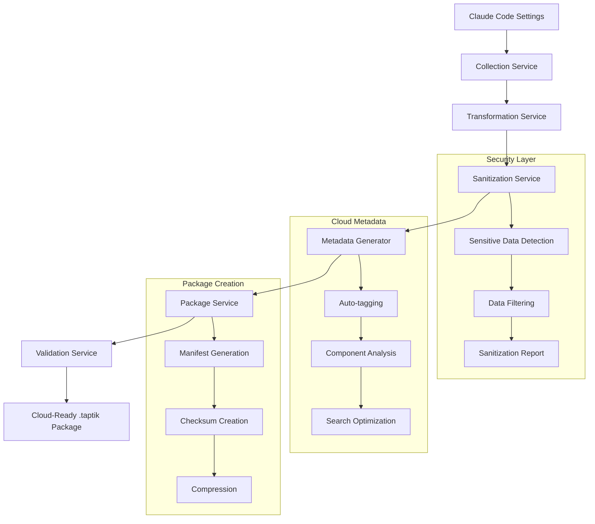
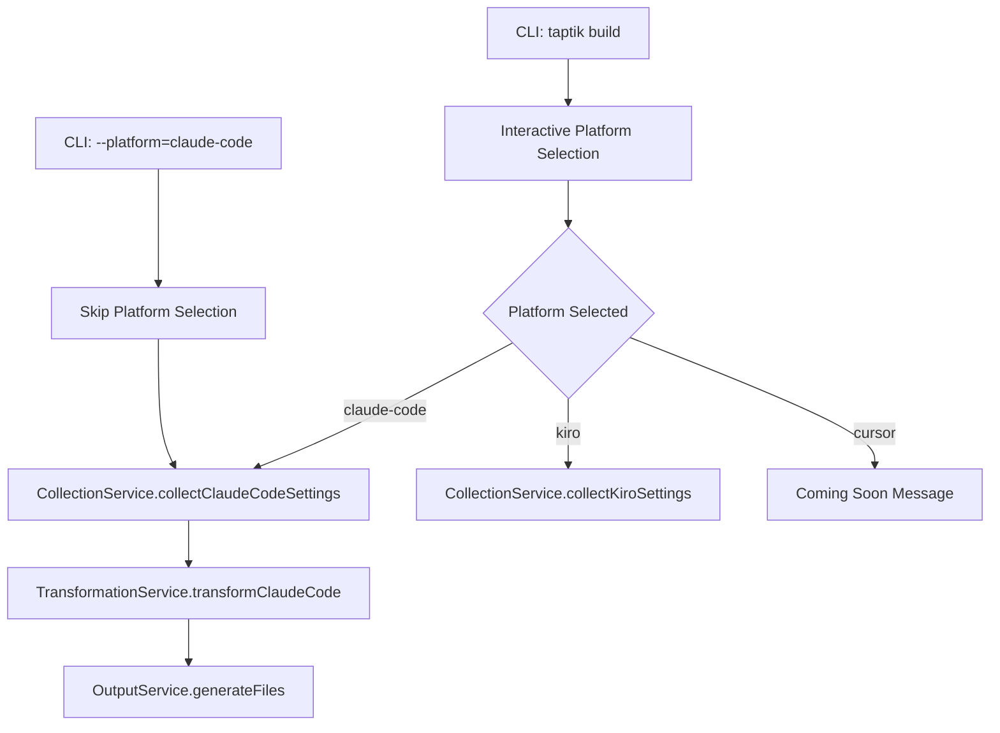
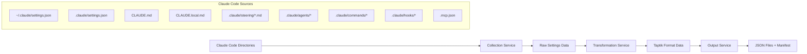

# Design Document

## Overview

This design document outlines the architecture for implementing Claude Code platform support in the Taptik build system with a cloud-first approach. The implementation extends the current build architecture by adding Claude Code specific collection, transformation, sanitization, and packaging logic to prepare configurations for cloud upload and sharing.

The design follows the established patterns from the Kiro build implementation while adding new cloud-oriented services for security, metadata generation, and package creation. The core principle is to create a complete pipeline from local Claude Code settings to cloud-ready Taptik packages that can be safely shared and discovered in the Taptik platform.

## Architecture

### High-Level Architecture

The Claude Code build feature integrates into the existing build system with cloud-first architecture:

```
CLI Command (build.command.ts)
    ↓
Interactive Service (platform selection)
    ↓
Collection Service (extended with Claude Code methods)
    ↓
Transformation Service (extended with Claude Code transformers)
    ↓
Sanitization Service (NEW - security filtering)
    ↓
Metadata Generator Service (NEW - cloud metadata)
    ↓
Package Service (NEW - .taptik package creation)
    ↓
Validation Service (NEW - cloud compatibility validation)
    ↓
Output Service (extended for cloud packages)
    ↓
Progress Service (reused without changes)
```

### Cloud-First Data Pipeline



### Platform Detection Flow



### Data Flow Architecture



## Components and Interfaces

### New Cloud-Oriented Services

#### Sanitization Service

```typescript
export interface SanitizationResult {
  sanitizedData: any;
  removedItems: SanitizedItem[];
  securityLevel: 'safe' | 'warning' | 'blocked';
  sanitizationReport: SanitizationReport;
}

export interface SanitizedItem {
  type: 'api_key' | 'token' | 'password' | 'url' | 'email' | 'path';
  location: string;
  originalValue?: string; // For debugging only
  reason: string;
}

export interface SanitizationReport {
  totalItemsProcessed: number;
  itemsRemoved: number;
  securityIssuesFound: SanitizedItem[];
  recommendations: string[];
}

@Injectable()
export class SanitizationService {
  async sanitizeForCloudUpload(data: any): Promise<SanitizationResult>;
  private detectSensitiveData(content: string): SanitizedItem[];
  private applySanitizationRules(data: any, rules: SanitizationRule[]): any;
}
```

#### Metadata Generator Service

```typescript
export interface CloudMetadata {
  title: string;
  description: string;
  tags: string[];
  source_ide: 'claude-code' | 'kiro' | 'cursor';
  target_ides: string[];
  component_summary: ComponentSummary;
  schema_version: string;
  version_info: VersionInfo;
  search_keywords: string[];
  auto_generated_tags: string[];
}

export interface ComponentSummary {
  agents: number;
  commands: number;
  steering_rules: number;
  mcp_servers: string[];
  settings_categories: string[];
  estimated_size: number;
}

export interface VersionInfo {
  schema_version: string; // Taptik schema version
  source_version: string; // Claude Code version
  build_version: string; // CLI version
  compatibility: string[]; // Compatible IDE list
}

@Injectable()
export class MetadataGeneratorService {
  async generateCloudMetadata(transformedData: any, sanitizationResult: SanitizationResult): Promise<CloudMetadata>;

  private extractAutoTags(data: any): string[];
  private analyzeComponents(data: any): ComponentSummary;
  private generateSearchKeywords(data: any): string[];
}
```

#### Package Service

```typescript
export interface TaptikPackage {
  manifest: PackageManifest;
  files: PackageFile[];
  checksums: Record<string, string>;
  metadata: CloudMetadata;
}

export interface PackageManifest {
  package_id: string;
  name: string;
  version: string;
  created_at: string;
  source_platform: string;
  files: PackageFileInfo[];
  dependencies: string[];
  cloud_metadata: CloudMetadata;
  sanitization_info: SanitizationSummary;
}

export interface PackageFile {
  filename: string;
  content: string | Buffer;
  type: 'json' | 'markdown' | 'binary';
  size: number;
  checksum: string;
}

export interface SanitizationSummary {
  items_removed: number;
  security_level: string;
  safe_for_sharing: boolean;
  sanitization_timestamp: string;
}

@Injectable()
export class PackageService {
  async createTaptikPackage(transformedData: any, metadata: CloudMetadata, sanitizationResult: SanitizationResult): Promise<TaptikPackage>;

  async writePackageToFile(package: TaptikPackage, outputPath: string): Promise<string>;
  private generateChecksums(files: PackageFile[]): Record<string, string>;
  private compressPackage(package: TaptikPackage): Buffer;
}
```

#### Validation Service

```typescript
export interface ValidationResult {
  isValid: boolean;
  errors: ValidationError[];
  warnings: ValidationWarning[];
  cloudCompatibility: CloudCompatibilityCheck;
}

export interface CloudCompatibilityCheck {
  canUpload: boolean;
  estimatedUploadSize: number;
  supportedFeatures: string[];
  unsupportedFeatures: string[];
  recommendations: string[];
}

@Injectable()
export class ValidationService {
  async validateForCloudUpload(package: TaptikPackage): Promise<ValidationResult>;
  private validateSchemaCompliance(data: any): ValidationError[];
  private checkCloudCompatibility(package: TaptikPackage): CloudCompatibilityCheck;
}
```

### Extended Collection Service

The `CollectionService` will be extended with Claude Code specific methods:

```typescript
// New interfaces for Claude Code data structures
export interface ClaudeCodeSettings {
  theme?: string;
  fontSize?: number;
  keyboardShortcuts?: Record<string, string>;
  extensions?: string[];
  preferences?: Record<string, unknown>;
}

export interface ClaudeAgent {
  name: string;
  description: string;
  instructions: string;
  tools?: string[];
  metadata?: Record<string, unknown>;
}

export interface ClaudeCommand {
  name: string;
  description: string;
  command: string;
  args?: string[];
  metadata?: Record<string, unknown>;
}

export interface McpServerConfig {
  mcpServers: Record<string, McpServer>;
}

export interface McpServer {
  command: string;
  args: string[];
  env?: Record<string, string>;
  disabled?: boolean;
  autoApprove?: string[];
}

// Extended collection interfaces
export interface ClaudeCodeLocalSettingsData {
  settings?: ClaudeCodeSettings;
  claudeMd?: string;
  claudeLocalMd?: string;
  steeringFiles: Array<{
    filename: string;
    content: string;
    path: string;
  }>;
  agents: Array<{
    filename: string;
    content: string;
    path: string;
    parsed?: ClaudeAgent;
  }>;
  commands: Array<{
    filename: string;
    content: string;
    path: string;
    parsed?: ClaudeCommand;
  }>;
  hooks: Array<{
    filename: string;
    content: string;
    path: string;
  }>;
  mcpConfig?: McpServerConfig;
  sourcePath: string;
  collectedAt: string;
}

export interface ClaudeCodeGlobalSettingsData {
  settings?: ClaudeCodeSettings;
  agents: Array<{
    filename: string;
    content: string;
    path: string;
    parsed?: ClaudeAgent;
  }>;
  commands: Array<{
    filename: string;
    content: string;
    path: string;
    parsed?: ClaudeCommand;
  }>;
  mcpConfig?: McpServerConfig;
  sourcePath: string;
  collectedAt: string;
  securityFiltered: boolean;
}
```

### New Collection Methods

```typescript
export class CollectionService {
  // Existing methods...

  /**
   * Collect Claude Code local settings from project directory
   */
  async collectClaudeCodeLocalSettings(projectPath?: string): Promise<ClaudeCodeLocalSettingsData> {
    const basePath = projectPath || process.cwd();
    const claudePath = path.join(basePath, '.claude');

    // Implementation details...
  }

  /**
   * Collect Claude Code global settings from user directory
   */
  async collectClaudeCodeGlobalSettings(): Promise<ClaudeCodeGlobalSettingsData> {
    const homeDirectory = os.homedir();
    const globalClaudePath = path.join(homeDirectory, '.claude');

    // Implementation details...
  }

  /**
   * Parse MCP configuration from .mcp.json file
   */
  private async parseMcpConfig(filePath: string): Promise<McpServerConfig | undefined> {
    // Implementation details...
  }

  /**
   * Parse Claude Code agent files
   */
  private async parseClaudeAgents(agentsPath: string): Promise<Array<{ filename: string; content: string; path: string; parsed?: ClaudeAgent }>> {
    // Implementation details...
  }

  /**
   * Parse Claude Code command files
   */
  private async parseClaudeCommands(commandsPath: string): Promise<Array<{ filename: string; content: string; path: string; parsed?: ClaudeCommand }>> {
    // Implementation details...
  }
}
```

### Extended Transformation Service

The `TransformationService` will be extended with Claude Code specific transformers:

```typescript
export class TransformationService {
  // Existing methods...

  /**
   * Transform Claude Code personal context data
   */
  async transformClaudeCodePersonalContext(localData: ClaudeCodeLocalSettingsData, globalData: ClaudeCodeGlobalSettingsData): Promise<TaptikPersonalContext> {
    // Implementation details...
  }

  /**
   * Transform Claude Code project context data
   */
  async transformClaudeCodeProjectContext(localData: ClaudeCodeLocalSettingsData, globalData: ClaudeCodeGlobalSettingsData): Promise<TaptikProjectContext> {
    // Implementation details...
  }

  /**
   * Transform Claude Code prompt templates
   */
  async transformClaudeCodePromptTemplates(localData: ClaudeCodeLocalSettingsData, globalData: ClaudeCodeGlobalSettingsData): Promise<TaptikPromptTemplates> {
    // Implementation details...
  }

  /**
   * Map Claude Code settings to Taptik user preferences
   */
  private mapClaudeSettingsToTaptik(settings: ClaudeCodeSettings): Partial<UserPreferences> {
    // Implementation details...
  }

  /**
   * Convert Claude Code agents to prompt templates
   */
  private mapClaudeAgentsToPrompts(agents: Array<{ parsed?: ClaudeAgent }>): PromptTemplateEntry[] {
    // Implementation details...
  }

  /**
   * Merge MCP configurations with project-level precedence
   */
  private mergeMcpConfigurations(globalMcp?: McpServerConfig, projectMcp?: McpServerConfig): McpServerConfig {
    // Implementation details...
  }

  /**
   * Merge Claude instruction files (CLAUDE.md + CLAUDE.local.md)
   */
  private mergeClaudeInstructions(claudeMd?: string, claudeLocalMd?: string): string {
    // Implementation details...
  }
}
```

### Build Command Integration

The existing `BuildCommand` will be modified to handle Claude Code platform:

```typescript
// In build.command.ts - collectData method extension
private async collectData(buildConfig: BuildConfig): Promise<SettingsData> {
  // ... existing code ...

  if (buildConfig.platform === BuildPlatform.CLAUDE_CODE) {
    return this.collectClaudeCodeData(buildConfig);
  }

  // ... existing Kiro collection logic ...
}

private async collectClaudeCodeData(buildConfig: BuildConfig): Promise<SettingsData> {
  const warnings: string[] = [];
  const errors: string[] = [];

  // Collect local Claude Code settings
  this.progressService.startScan('local');
  let localSettings;
  try {
    const localData = await this.collectionService.collectClaudeCodeLocalSettings();
    localSettings = this.mapClaudeCodeLocalToSettingsData(localData);
    this.progressService.completeScan('local', this.countClaudeCodeFiles(localData));
  } catch (error) {
    warnings.push(`Claude Code local settings collection failed: ${error.message}`);
    localSettings = this.createEmptyLocalSettings();
    this.progressService.completeScan('local', 0);
  }

  // Collect global Claude Code settings
  this.progressService.startScan('global');
  let globalSettings;
  try {
    const globalData = await this.collectionService.collectClaudeCodeGlobalSettings();
    globalSettings = this.mapClaudeCodeGlobalToSettingsData(globalData);
    this.progressService.completeScan('global', this.countClaudeCodeFiles(globalData));
  } catch (error) {
    warnings.push(`Claude Code global settings collection failed: ${error.message}`);
    globalSettings = this.createEmptyGlobalSettings();
    this.progressService.completeScan('global', 0);
  }

  // Add warnings to error handler
  warnings.forEach(warning => this.errorHandler.addWarning({
    type: 'missing_file',
    message: warning,
  }));

  return {
    localSettings,
    globalSettings,
    collectionMetadata: {
      sourcePlatform: 'claude-code',
      collectionTimestamp: new Date().toISOString(),
      projectPath: process.cwd(),
      globalPath: `${homedir()}/.claude`,
      warnings,
      errors,
    },
  };
}
```

### Enhanced Build Command Integration

The existing `BuildCommand` will be modified to handle the complete cloud-first pipeline:

```typescript
// Enhanced constructor with new services
constructor(
  private readonly interactiveService: InteractiveService,
  private readonly collectionService: CollectionService,
  private readonly transformationService: TransformationService,
  private readonly sanitizationService: SanitizationService, // NEW
  private readonly metadataGeneratorService: MetadataGeneratorService, // NEW
  private readonly packageService: PackageService, // NEW
  private readonly validationService: ValidationService, // NEW
  private readonly outputService: OutputService,
  private readonly progressService: ProgressService,
  private readonly errorHandler: ErrorHandlerService,
) {
  super();
}

// Enhanced run method with cloud pipeline
async run(_passedParameters: string[], options?: Record<string, unknown>): Promise<void> {
  // ... existing setup code ...

  // Enhanced progress tracking for cloud pipeline
  this.progressService.initializeProgress([
    'Platform selection',
    'Category selection',
    'Data collection',
    'Data transformation',
    'Security sanitization',
    'Metadata generation',
    'Package creation',
    'Cloud validation',
    'Output generation'
  ]);

  // ... existing platform and category selection ...

  // Steps 1-4: Existing collection and transformation
  const settingsData = await this.collectData(buildConfig);
  const transformedData = await this.transformData(settingsData, buildConfig);

  // Step 5: Security sanitization (NEW)
  this.progressService.startStep('Security sanitization');
  const sanitizationResult = await this.sanitizationService.sanitizeForCloudUpload(transformedData);
  if (sanitizationResult.securityLevel === 'blocked') {
    throw new Error('Configuration contains sensitive data that cannot be safely shared');
  }
  this.progressService.completeStep('Security sanitization');

  // Step 6: Metadata generation (NEW)
  this.progressService.startStep('Metadata generation');
  const cloudMetadata = await this.metadataGeneratorService.generateCloudMetadata(
    sanitizationResult.sanitizedData,
    sanitizationResult
  );
  this.progressService.completeStep('Metadata generation');

  // Step 7: Package creation (NEW)
  this.progressService.startStep('Package creation');
  const taptikPackage = await this.packageService.createTaptikPackage(
    sanitizationResult.sanitizedData,
    cloudMetadata,
    sanitizationResult
  );
  this.progressService.completeStep('Package creation');

  // Step 8: Cloud validation (NEW)
  this.progressService.startStep('Cloud validation');
  const validationResult = await this.validationService.validateForCloudUpload(taptikPackage);
  this.progressService.completeStep('Cloud validation');

  // Step 9: Output generation (enhanced)
  this.progressService.startStep('Output generation');
  const outputPath = await this.generateCloudReadyOutput(
    taptikPackage,
    validationResult,
    buildConfig,
    customOutputPath
  );
  this.progressService.completeStep('Output generation');

  // Display cloud-ready summary with upload options
  await this.displayCloudReadySummary(outputPath, taptikPackage, validationResult);
}
```

### Auto-Upload Configuration Integration

```typescript
export interface AutoUploadConfig {
  enabled: boolean;
  default_visibility: 'public' | 'private';
  auto_tags: string[];
  exclude_patterns: string[];
  supabase_project_url?: string;
  user_token?: string;
}

// Integration with ~/.taptik/config.yaml
private async loadAutoUploadConfig(): Promise<AutoUploadConfig> {
  const configPath = path.join(os.homedir(), '.taptik', 'config.yaml');
  try {
    const configContent = await fs.readFile(configPath, 'utf8');
    return yaml.parse(configContent);
  } catch {
    return {
      enabled: false,
      default_visibility: 'private',
      auto_tags: [],
      exclude_patterns: ['*.key', '*.token', '*.secret'],
    };
  }
}

private async promptForUpload(
  taptikPackage: TaptikPackage,
  validationResult: ValidationResult
): Promise<boolean> {
  if (!validationResult.cloudCompatibility.canUpload) {
    this.logger.warn('Package cannot be uploaded due to validation issues');
    return false;
  }

  const autoConfig = await this.loadAutoUploadConfig();
  if (autoConfig.enabled) {
    return await this.interactiveService.confirmAutoUpload(taptikPackage.manifest);
  }

  return await this.interactiveService.promptForManualUpload(taptikPackage.manifest);
}
```

## Data Models

### Claude Code Specific Data Structures

```typescript
// Claude Code settings structure
interface ClaudeCodeSettingsFile {
  theme?: {
    name: string;
    type: 'light' | 'dark';
  };
  editor?: {
    fontSize: number;
    fontFamily: string;
    tabSize: number;
    wordWrap: boolean;
  };
  keyboardShortcuts?: Record<string, string>;
  extensions?: {
    enabled: string[];
    disabled: string[];
  };
  ai?: {
    model: string;
    temperature: number;
    maxTokens: number;
  };
  workspace?: {
    autoSave: boolean;
    formatOnSave: boolean;
  };
}

// Claude Code agent structure
interface ClaudeAgentFile {
  name: string;
  description: string;
  version?: string;
  instructions: string;
  tools?: string[];
  examples?: Array<{
    input: string;
    output: string;
  }>;
  metadata?: {
    author?: string;
    created?: string;
    updated?: string;
    tags?: string[];
  };
}

// Claude Code command structure
interface ClaudeCommandFile {
  name: string;
  description: string;
  command: string;
  args?: string[];
  workingDirectory?: string;
  environment?: Record<string, string>;
  timeout?: number;
  metadata?: {
    category?: string;
    tags?: string[];
  };
}
```

### Transformation Mappings

```typescript
// Mapping Claude Code settings to Taptik personal context
const CLAUDE_TO_TAPTIK_PERSONAL_MAPPING = {
  'theme.name': 'preferences.theme',
  'editor.fontSize': 'preferences.fontSize',
  'editor.fontFamily': 'preferences.fontFamily',
  keyboardShortcuts: 'preferences.keyboardShortcuts',
  'extensions.enabled': 'preferences.extensions',
  'ai.model': 'preferences.aiModel',
  'ai.temperature': 'preferences.aiTemperature',
};

// Mapping Claude Code project settings to Taptik project context
const CLAUDE_TO_TAPTIK_PROJECT_MAPPING = {
  claudeMd: 'project_info.description',
  claudeLocalMd: 'development_guidelines.local_instructions',
  'mcpConfig.mcpServers': 'technical_stack.mcp_servers',
  steeringFiles: 'development_guidelines.steering_rules',
};
```

## Error Handling

### Claude Code Specific Error Scenarios

```typescript
enum ClaudeCodeErrorType {
  CLAUDE_NOT_FOUND = 'claude_not_found',
  INVALID_MCP_CONFIG = 'invalid_mcp_config',
  MALFORMED_AGENT = 'malformed_agent',
  MALFORMED_COMMAND = 'malformed_command',
  PERMISSION_DENIED = 'permission_denied',
  INVALID_SETTINGS_JSON = 'invalid_settings_json',
}

interface ClaudeCodeError {
  type: ClaudeCodeErrorType;
  message: string;
  filePath?: string;
  lineNumber?: number;
  suggestedResolution?: string;
}
```

### Error Handling Strategy

1. **Missing Directories**: Log warnings and continue with empty data
2. **Malformed JSON**: Validate and report specific parsing errors
3. **Permission Issues**: Provide clear error messages with suggested solutions
4. **Invalid Agent/Command Files**: Skip invalid files and report warnings
5. **MCP Configuration Errors**: Validate JSON structure and report detailed errors

## Testing Strategy

### Unit Tests

1. **Collection Service Tests**:
   - Test Claude Code directory scanning
   - Test MCP configuration parsing
   - Test agent and command file parsing
   - Test error handling for missing/malformed files

2. **Transformation Service Tests**:
   - Test Claude Code to Taptik format conversion
   - Test MCP configuration merging
   - Test instruction file merging
   - Test agent to prompt template conversion

3. **Integration Tests**:
   - Test complete build pipeline with Claude Code platform
   - Test CLI options compatibility
   - Test error scenarios and recovery

### Test Fixtures

```typescript
// Test fixture structure
const CLAUDE_CODE_TEST_FIXTURES = {
  settings: {
    valid: {
      theme: { name: 'dark', type: 'dark' },
      editor: { fontSize: 14, tabSize: 2 },
    },
    invalid: '{ invalid json',
  },
  agents: {
    valid: {
      name: 'Test Agent',
      description: 'A test agent',
      instructions: 'Test instructions',
    },
    malformed: { name: 'Missing required fields' },
  },
  mcpConfig: {
    valid: {
      mcpServers: {
        'test-server': {
          command: 'uvx',
          args: ['test-package'],
        },
      },
    },
    invalid: '{ "mcpServers": invalid }',
  },
};
```

### Mock Directory Structure

```
test-fixtures/
├── claude-code/
│   ├── global/
│   │   ├── .claude/
│   │   │   ├── settings.json
│   │   │   ├── agents/
│   │   │   │   ├── test-agent.json
│   │   │   │   └── malformed-agent.json
│   │   │   └── commands/
│   │   │       └── test-command.json
│   │   └── .mcp.json
│   └── project/
│       ├── .claude/
│       │   ├── settings.json
│       │   ├── steering/
│       │   │   ├── coding-standards.md
│       │   │   └── testing-guidelines.md
│       │   ├── agents/
│       │   │   └── project-agent.json
│       │   └── hooks/
│       │       └── pre-commit.hook
│       ├── CLAUDE.md
│       ├── CLAUDE.local.md
│       └── .mcp.json
```

## Implementation Phases

### Phase 1: Collection Service Extension

- Implement `collectClaudeCodeLocalSettings()`
- Implement `collectClaudeCodeGlobalSettings()`
- Add MCP configuration parsing
- Add agent and command file parsing
- Implement error handling for Claude Code specific scenarios

### Phase 2: Transformation Service Extension

- Implement `transformClaudeCodePersonalContext()`
- Implement `transformClaudeCodeProjectContext()`
- Implement `transformClaudeCodePromptTemplates()`
- Add Claude Code to Taptik mapping logic
- Implement MCP configuration merging

### Phase 3: CLI Integration

- Modify `BuildCommand` to handle Claude Code platform
- Add Claude Code specific progress messages
- Implement Claude Code data collection flow
- Add Claude Code specific error messages

### Phase 4: Testing and Validation

- Create comprehensive test fixtures
- Implement unit tests for all new methods
- Implement integration tests for complete pipeline
- Add CLI integration tests
- Validate output compatibility with other Taptik commands

### Taptik Package Structure

```typescript
// Standard .taptik package format for cloud upload
interface TaptikPackageStructure {
  'manifest.json': PackageManifest;
  'personal-context.json'?: TaptikPersonalContext;
  'project-context.json'?: TaptikProjectContext;
  'prompt-templates.json'?: TaptikPromptTemplates;
  'cloud-metadata.json': CloudMetadata;
  'sanitization-report.json': SanitizationReport;
  'checksums.json': Record<string, string>;
}

// Physical package structure on disk
/*
config.taptik/
├── manifest.json              # Package manifest with metadata
├── personal-context.json      # Personal preferences (if selected)
├── project-context.json       # Project configuration (if selected)  
├── prompt-templates.json      # Prompt templates (if selected)
├── cloud-metadata.json        # Cloud platform metadata
├── sanitization-report.json   # Security sanitization report
└── checksums.json            # File integrity checksums
*/
```

### Cloud Metadata Schema

```typescript
export interface CloudMetadata {
  // Basic package information
  title: string; // User-friendly package title
  description: string; // Package description
  tags: string[]; // User-defined tags

  // Platform compatibility
  source_ide: 'claude-code' | 'kiro' | 'cursor';
  target_ides: string[]; // Compatible target IDEs

  // Component analysis
  component_summary: ComponentSummary;

  // Version and compatibility
  schema_version: string; // Taptik schema version
  version_info: VersionInfo;

  // Search and discovery
  search_keywords: string[]; // Auto-generated search terms
  auto_generated_tags: string[]; // AI-generated tags

  // Community features preparation
  estimated_popularity_score: number;
  complexity_level: 'beginner' | 'intermediate' | 'advanced';
  category: 'development' | 'productivity' | 'ai-tools' | 'custom';
}

export interface ComponentSummary {
  agents: number;
  commands: number;
  steering_rules: number;
  mcp_servers: string[];
  settings_categories: string[];
  estimated_size: number;
  has_sensitive_data: boolean;
  sanitization_applied: boolean;
}
```

### Security and Sanitization Schema

```typescript
export interface SanitizationRule {
  name: string;
  pattern: RegExp;
  replacement: string;
  severity: 'low' | 'medium' | 'high' | 'critical';
  category: 'credentials' | 'personal' | 'system' | 'network';
}

// Predefined sanitization rules for Claude Code
const CLAUDE_CODE_SANITIZATION_RULES: SanitizationRule[] = [
  {
    name: 'API Keys',
    pattern: /(["']?(?:api[_-]?key|apikey|api_key)["']?)\s*[:=]\s*["']?([\w-]{6,})["']?/gi,
    replacement: '[API_KEY_REMOVED]',
    severity: 'critical',
    category: 'credentials',
  },
  {
    name: 'MCP Server Tokens',
    pattern: /(["']?(?:token|access_token|auth_token)["']?)\s*[:=]\s*["']?([\w.-]{6,})["']?/gi,
    replacement: '[TOKEN_REMOVED]',
    severity: 'critical',
    category: 'credentials',
  },
  {
    name: 'File Paths',
    pattern: /\/Users\/[^\/\s"']+/g,
    replacement: '/Users/[USERNAME]',
    severity: 'medium',
    category: 'personal',
  },
];
```

### Enhanced Testing Strategy for Cloud Features

#### Cloud Pipeline Tests

1. **Sanitization Service Tests**:
   - Test sensitive data detection and removal
   - Test sanitization rule application
   - Test security level assessment
   - Test sanitization report generation

2. **Metadata Generator Tests**:
   - Test auto-tagging algorithms
   - Test component analysis accuracy
   - Test search keyword generation
   - Test compatibility detection

3. **Package Service Tests**:
   - Test .taptik package creation
   - Test checksum generation
   - Test package compression
   - Test manifest generation

4. **Validation Service Tests**:
   - Test cloud compatibility checks
   - Test schema validation
   - Test upload readiness assessment
   - Test size and format validation

#### Cloud Integration Tests

```typescript
// Test fixture for cloud-ready package
const CLOUD_PACKAGE_TEST_FIXTURE = {
  manifest: {
    package_id: 'test-claude-code-package',
    name: 'Test Claude Code Configuration',
    version: '1.0.0',
    source_platform: 'claude-code',
    cloud_metadata: {
      title: 'My Claude Code Setup',
      tags: ['ai', 'development', 'claude-code'],
      source_ide: 'claude-code',
      target_ides: ['claude-code', 'cursor'],
    },
  },
  sanitization_info: {
    items_removed: 3,
    security_level: 'safe',
    safe_for_sharing: true,
  },
};
```

### Implementation Phases (Updated)

#### Phase 1: Core Collection Service Extension

- Implement Claude Code collection methods
- Add MCP configuration parsing
- Add agent and command file parsing
- Implement basic error handling

#### Phase 2: Security and Sanitization Layer

- Implement `SanitizationService`
- Add sensitive data detection rules
- Implement sanitization report generation
- Add security level assessment

#### Phase 3: Cloud Metadata Generation

- Implement `MetadataGeneratorService`
- Add auto-tagging algorithms
- Implement component analysis
- Add search keyword generation

#### Phase 4: Package Creation and Validation

- Implement `PackageService`
- Add .taptik package format support
- Implement `ValidationService`
- Add cloud compatibility checks

#### Phase 5: Enhanced Transformation Service

- Extend transformation service for Claude Code
- Add cloud metadata integration
- Implement enhanced mapping logic
- Add community feature preparation

#### Phase 6: CLI Integration and User Experience

- Modify `BuildCommand` for cloud pipeline
- Add auto-upload configuration support
- Implement enhanced progress reporting
- Add cloud-ready output summary

#### Phase 7: Testing and Cloud Validation

- Create comprehensive test fixtures
- Implement cloud pipeline tests
- Add security validation tests
- Validate Supabase integration readiness

This enhanced design ensures that the Claude Code build feature not only converts local configurations but creates cloud-ready packages that can be safely shared, discovered, and deployed through the Taptik platform, aligning with the PRD's vision of a comprehensive cloud-first configuration management system.
