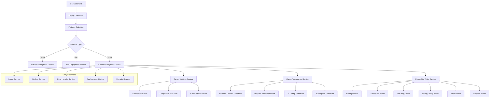

# Design Document

## Overview

This design document outlines the technical implementation for adding Cursor IDE support to the existing `taptik deploy` command. The solution extends the current deployment architecture to support Cursor IDE as a target platform while maintaining backward compatibility with Claude Code and Kiro IDE deployments.

The implementation follows the existing modular architecture pattern, adding Cursor-specific components for data transformation, validation, and deployment logic. The design leverages the current deployment infrastructure and introduces new services and utilities specifically for Cursor IDE integration.

## Architecture

### High-Level Architecture



### Component Integration

The Cursor deployment functionality integrates with existing deploy module components:

- **Deploy Command**: Extended to support `--platform cursor` option
- **Import Service**: Reused for Supabase data retrieval
- **Backup Service**: Extended for Cursor-specific file backup
- **Error Handler**: Enhanced with Cursor-specific error handling
- **Performance Monitor**: Extended to track Cursor deployment metrics
- **Security Scanner**: Enhanced with AI-specific security rules

## Components and Interfaces

### Core Interfaces

```typescript
// Cursor-specific deployment interfaces
interface CursorDeploymentOptions extends DeployOptions {
  platform: 'cursor';
  cursorComponents?: CursorComponentType[];
  skipCursorComponents?: CursorComponentType[];
  cursorConflictStrategy?: CursorConflictStrategy;
  aiSecurityLevel?: AISecurityLevel;
  extensionValidation?: boolean;
  workspaceMode?: WorkspaceMode;
}

enum CursorComponentType {
  SETTINGS = 'settings',
  EXTENSIONS = 'extensions',
  SNIPPETS = 'snippets',
  AI_CONFIG = 'ai-config',
  DEBUG_CONFIG = 'debug-config',
  TASKS = 'tasks',
  WORKSPACE = 'workspace'
}

enum CursorConflictStrategy {
  PROMPT = 'prompt',
  MERGE = 'merge',
  BACKUP = 'backup',
  SKIP = 'skip',
  OVERWRITE = 'overwrite'
}

enum AISecurityLevel {
  STRICT = 'strict',
  STANDARD = 'standard',
  PERMISSIVE = 'permissive'
}

enum WorkspaceMode {
  SINGLE_ROOT = 'single-root',
  MULTI_ROOT = 'multi-root',
  AUTO_DETECT = 'auto-detect'
}

interface CursorDeploymentResult extends DeploymentResult {
  cursorComponents: {
    [key in CursorComponentType]: {
      deployed: boolean;
      files: string[];
      conflicts: string[];
      errors: string[];
      warnings: string[];
    };
  };
  cursorDirectories: {
    global: string;
    project: string;
    ai: string;
    workspace?: string;
  };
  aiValidationResults: AIValidationResult[];
  extensionCompatibility: ExtensionCompatibilityResult[];
}

interface CursorValidationResult {
  isValid: boolean;
  errors: ValidationError[];
  warnings: ValidationWarning[];
  componentResults: {
    [key in CursorComponentType]: ComponentValidationResult;
  };
  aiSecurityResults: AISecurityValidationResult[];
  extensionValidationResults: ExtensionValidationResult[];
}
```

### Service Interfaces

```typescript
interface ICursorDeploymentService {
  deploy(options: CursorDeploymentOptions): Promise<CursorDeploymentResult>;
  validateDeployment(data: TaptikCommonFormat): Promise<CursorValidationResult>;
  previewDeployment(options: CursorDeploymentOptions): Promise<CursorDeploymentPreview>;
  
  // Enhanced deployment methods
  detectExistingCursorInstallation(path: string): Promise<CursorInstallationInfo>;
  mergeWithExistingConfiguration(existing: CursorConfig, incoming: CursorConfig): Promise<MergeResult>;
  validateCursorVersion(version: string): Promise<VersionCompatibilityResult>;
  optimizeForCursorPerformance(config: CursorConfig): Promise<OptimizedCursorConfig>;
}

interface ICursorTransformerService {
  transformPersonalContext(context: TaptikPersonalContext): Promise<CursorPersonalConfig>;
  transformProjectContext(context: TaptikProjectContext): Promise<CursorProjectConfig>;
  transformPromptTemplates(templates: TaptikPromptTemplates): Promise<CursorAIConfig>;
  transformWorkspaceSettings(workspace: TaptikWorkspaceContext): Promise<CursorWorkspaceConfig>;
  
  // Cursor-specific transformations
  transformAIRules(rules: AIRulesContext): Promise<CursorAIRules>;
  transformDebugConfigurations(debug: DebugContext): Promise<CursorDebugConfig>;
  transformBuildTasks(tasks: TasksContext): Promise<CursorTasksConfig>;
  transformCodeSnippets(snippets: SnippetsContext): Promise<CursorSnippetsConfig>;
}

interface ICursorValidatorService {
  validateConfiguration(config: TaptikCommonFormat): Promise<CursorValidationResult>;
  validateComponent(component: CursorComponentType, data: any): Promise<ComponentValidationResult>;
  validateSchema(data: any, schema: JSONSchema): Promise<SchemaValidationResult>;
  
  // Cursor-specific validation methods
  validateAIConfiguration(aiConfig: CursorAIConfig): Promise<AIValidationResult>;
  validateExtensionCompatibility(extensions: string[], cursorVersion: string): Promise<ExtensionCompatibilityResult>;
  validateWorkspaceStructure(workspace: CursorWorkspaceConfig): Promise<WorkspaceValidationResult>;
  validateSnippetSyntax(snippets: CursorSnippetsConfig): Promise<SnippetValidationResult>;
  scanAIContentForSecurity(content: string): Promise<AISecurityScanResult>;
}

interface ICursorFileWriterService {
  writeSettings(config: CursorSettingsConfig, options: WriteOptions): Promise<WriteResult>;
  writeExtensions(extensions: CursorExtensionsConfig, options: WriteOptions): Promise<WriteResult>;
  writeSnippets(snippets: CursorSnippetsConfig, options: WriteOptions): Promise<WriteResult>;
  writeAIConfig(aiConfig: CursorAIConfig, options: WriteOptions): Promise<WriteResult>;
  writeDebugConfig(debugConfig: CursorDebugConfig, options: WriteOptions): Promise<WriteResult>;
  writeTasks(tasks: CursorTasksConfig, options: WriteOptions): Promise<WriteResult>;
  writeWorkspace(workspace: CursorWorkspaceConfig, options: WriteOptions): Promise<WriteResult>;
  
  // Cursor-specific file operations
  ensureCursorDirectories(): Promise<void>;
  backupCursorConfiguration(): Promise<BackupManifest>;
  restoreCursorConfiguration(backup: BackupManifest): Promise<RestoreResult>;
}
```

## Data Models

### Cursor Configuration Models

```typescript
// Cursor Global Settings Model
interface CursorGlobalSettings {
  // Editor settings
  "editor.fontSize": number;
  "editor.fontFamily": string;
  "editor.tabSize": number;
  "editor.insertSpaces": boolean;
  "editor.wordWrap": "off" | "on" | "wordWrapColumn" | "bounded";
  "editor.lineNumbers": "off" | "on" | "relative" | "interval";
  "editor.minimap.enabled": boolean;
  "editor.formatOnSave": boolean;
  "editor.codeActionsOnSave": Record<string, boolean>;
  
  // Workbench settings
  "workbench.colorTheme": string;
  "workbench.iconTheme": string;
  "workbench.startupEditor": "none" | "welcomePage" | "readme" | "newUntitledFile" | "welcomePageInEmptyWorkbench";
  "workbench.sideBar.location": "left" | "right";
  "workbench.panel.defaultLocation": "bottom" | "right";
  
  // AI settings (Cursor-specific)
  "cursor.ai.enabled": boolean;
  "cursor.ai.model": string;
  "cursor.ai.temperature": number;
  "cursor.ai.maxTokens": number;
  "cursor.ai.contextWindow": number;
  "cursor.ai.codeActions": boolean;
  "cursor.ai.autoComplete": boolean;
  "cursor.ai.chat": boolean;
  "cursor.ai.composer": boolean;
  
  // Security settings
  "security.workspace.trust.enabled": boolean;
  "security.workspace.trust.startupPrompt": "always" | "once" | "never";
  "security.workspace.trust.banner": "always" | "untilDismissed" | "never";
  
  // Language-specific settings
  "[typescript]": LanguageSpecificSettings;
  "[javascript]": LanguageSpecificSettings;
  "[python]": LanguageSpecificSettings;
  "[markdown]": LanguageSpecificSettings;
  
  // Files and terminal settings
  "files.autoSave": "off" | "afterDelay" | "onFocusChange" | "onWindowChange";
  "files.autoSaveDelay": number;
  "files.exclude": Record<string, boolean>;
  "terminal.integrated.fontSize": number;
  "terminal.integrated.fontFamily": string;
  
  // Extensions settings
  "extensions.autoUpdate": boolean;
  "extensions.autoCheckUpdates": boolean;
  "extensions.ignoreRecommendations": boolean;
}

// Cursor AI Configuration Model
interface CursorAIConfig {
  rules: {
    content: string;
    path: '.cursor/ai/rules.md';
  };
  context: {
    content: string;
    path: '.cursor/ai/context.md';
  };
  prompts: {
    [promptName: string]: {
      content: string;
      path: string;
      metadata?: {
        description: string;
        category: string;
        tags: string[];
      };
    };
  };
  cursorRules: {
    content: string;
    path: '.cursorrules';
  };
  modelSettings: {
    defaultModel: string;
    temperature: number;
    maxTokens: number;
    contextWindow: number;
  };
}
```

## Error Handling

### Error Classification

```typescript
enum CursorDeploymentErrorType {
  VALIDATION_ERROR = 'VALIDATION_ERROR',
  TRANSFORMATION_ERROR = 'TRANSFORMATION_ERROR',
  FILE_SYSTEM_ERROR = 'FILE_SYSTEM_ERROR',
  PERMISSION_ERROR = 'PERMISSION_ERROR',
  CONFLICT_ERROR = 'CONFLICT_ERROR',
  ROLLBACK_ERROR = 'ROLLBACK_ERROR',
  NETWORK_ERROR = 'NETWORK_ERROR',
  AI_CONFIG_ERROR = 'AI_CONFIG_ERROR',
  EXTENSION_ERROR = 'EXTENSION_ERROR',
  WORKSPACE_ERROR = 'WORKSPACE_ERROR'
}

interface CursorDeploymentError extends Error {
  type: CursorDeploymentErrorType;
  code: string;
  component?: CursorComponentType;
  filePath?: string;
  suggestions: string[];
  recoverable: boolean;
  cursorVersion?: string;
  aiRelated?: boolean;
}
```

## Testing Strategy

### Unit Testing Approach

```typescript
// Service testing structure
describe('CursorDeploymentService', () => {
  describe('deploy', () => {
    it('should deploy all Cursor components successfully');
    it('should handle Cursor-specific component deployment');
    it('should skip specified Cursor components');
    it('should handle Cursor deployment conflicts');
    it('should rollback on Cursor deployment failure');
    it('should validate Cursor version compatibility');
  });
  
  describe('validateDeployment', () => {
    it('should validate complete Cursor configuration');
    it('should detect missing required Cursor components');
    it('should validate Cursor component schemas');
    it('should validate AI configuration security');
    it('should validate extension compatibility');
    it('should provide detailed error messages');
  });
});
```

## Security Considerations

### Enhanced Cursor-Specific Security

```typescript
interface CursorSecurityEnforcer {
  cursorSpecificRules: {
    aiContentValidation: {
      allowedAIModels: string[];
      blockedPromptPatterns: RegExp[];
      maxContextSize: number;
      promptInjectionPrevention: (content: string) => Promise<InjectionScanResult>;
      maliciousRuleDetection: (rules: string) => Promise<MaliciousContentResult>;
    };
    extensionSecurity: {
      trustedPublishers: string[];
      blockedExtensions: string[];
      extensionPermissionValidation: (extensionId: string) => Promise<PermissionValidationResult>;
      marketplaceValidation: (extensionId: string) => Promise<MarketplaceValidationResult>;
    };
    workspaceSecurity: {
      maxFolderCount: number;
      allowedWorkspacePaths: RegExp[];
      workspaceTrustValidation: (workspace: CursorWorkspaceConfig) => Promise<TrustValidationResult>;
      folderPermissionCheck: (folderPath: string) => Promise<FolderPermissionResult>;
    };
  };

  enforceSecurityPolicies(
    content: any,
    component: CursorComponentType,
    securityLevel: AISecurityLevel
  ): Promise<SecurityEnforcementResult>;

  generateSecurityReport(violations: SecurityViolation[]): SecurityReport;
}
```

## Performance Optimization

### Memory Management

- **Streaming Processing**: Process large AI content files in chunks to minimize memory usage
- **Lazy Loading**: Load Cursor configuration components only when needed
- **Garbage Collection**: Explicit cleanup of large AI content objects after processing
- **Memory Monitoring**: Track memory usage during Cursor deployment operations
- **AI Content Caching**: Intelligent caching of processed AI content

### I/O Optimization

- **Batch Operations**: Group multiple Cursor file operations for efficiency
- **Parallel Processing**: Process multiple Cursor components simultaneously where safe
- **Async Processing**: Use asynchronous operations for all Cursor I/O
- **Connection Pooling**: Reuse connections for multiple operations
- **Compression**: Compress large AI content files during transfer
- **Progress Indicators**: Provide progress feedback for large Cursor deployments

## Implementation Details

### File System Operations

```typescript
interface CursorFileSystemManager {
  ensureCursorDirectories(paths: string[]): Promise<void>;
  writeConfigFile(path: string, content: any, options: WriteOptions): Promise<void>;
  writeMarkdownFile(path: string, content: string, options: WriteOptions): Promise<void>;
  writeJSONFile(path: string, content: any, options: WriteOptions): Promise<void>;
  createBackup(filePath: string): Promise<BackupInfo>;
  restoreBackup(backupInfo: BackupInfo): Promise<void>;
  setPermissions(path: string, permissions: FilePermissions): Promise<void>;
  
  // Cursor-specific operations
  validateCursorInstallation(): Promise<CursorInstallationStatus>;
  getCursorVersion(): Promise<string>;
  getCursorConfigPaths(): Promise<CursorConfigPaths>;
  ensureAIDirectories(): Promise<void>;
  validateWorkspaceStructure(workspacePath: string): Promise<WorkspaceValidationResult>;
}
```

This design provides a comprehensive foundation for implementing Cursor IDE support in the taptik deploy command, ensuring robust functionality, security, and performance while maintaining compatibility with existing platforms.