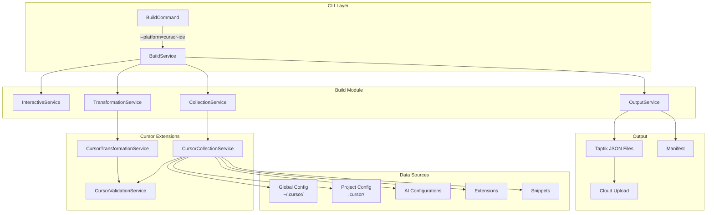

# Design Document

## Overview

The Cursor IDE build feature extends Taptik's configuration management platform to support Cursor IDE, a VS Code-based AI-powered development environment. This feature enables users to collect, transform, and synchronize their Cursor IDE configurations across different development environments while maintaining VS Code ecosystem compatibility.

Cursor IDE combines traditional VS Code functionality with advanced AI features including intelligent code completion, automated refactoring, and context-aware documentation generation. The build feature must handle both standard VS Code configurations and Cursor-specific AI settings while ensuring security, compatibility, and seamless integration with Taptik's cloud platform.

### Key Design Goals

- **VS Code Compatibility**: Maintain 100% compatibility with VS Code settings schema and extension ecosystem
- **AI Security**: Implement robust security filtering for AI configurations, API keys, and sensitive prompts
- **Cross-Platform Portability**: Enable configuration migration between Cursor IDE, VS Code, and other VS Code-based editors
- **Intelligent Metadata**: Generate rich metadata for AI features, extensions, and project characteristics
- **Seamless Integration**: Follow existing Taptik architecture patterns while extending functionality

## Architecture

### System Integration

The Cursor IDE build feature integrates with Taptik's existing modular architecture by extending the BuildModule with Cursor-specific services while maintaining separation of concerns and reusability.



### Service Architecture

#### CursorCollectionService

Responsible for discovering and collecting Cursor IDE configurations from both global and project-specific locations.

```typescript
interface CursorCollectionService {
  collectCursorLocalSettings(): Promise<CursorLocalSettings>;
  collectCursorGlobalSettings(): Promise<CursorGlobalSettings>;
  parseCursorAiConfig(configPath: string): Promise<CursorAiConfiguration>;
  collectCursorExtensions(extensionsPath: string): Promise<CursorExtension[]>;
  collectCursorSnippets(snippetsPath: string): Promise<CursorSnippet[]>;
  validateVSCodeCompatibility(settings: any): ValidationResult;
}
```

#### CursorTransformationService

Handles conversion of Cursor IDE configurations to Taptik's standardized format while maintaining VS Code compatibility.

```typescript
interface CursorTransformationService {
  transformCursorPersonalContext(globalSettings: CursorGlobalSettings): Promise<TaptikPersonalContext>;
  transformCursorProjectContext(localSettings: CursorLocalSettings): Promise<TaptikProjectContext>;
  transformCursorPromptTemplates(aiConfig: CursorAiConfiguration): Promise<TaptikPromptTemplates>;
  mapCursorExtensions(extensions: CursorExtension[]): Promise<ExtensionMapping[]>;
  sanitizeAiConfiguration(aiConfig: CursorAiConfiguration): Promise<SanitizedAiConfig>;
}
```

#### CursorValidationService

Provides validation, security filtering, and compatibility checking for Cursor IDE configurations.

```typescript
interface CursorValidationService {
  validateVSCodeSchema(settings: any): ValidationResult;
  sanitizeAiConfiguration(config: CursorAiConfiguration): SanitizedAiConfig;
  checkExtensionCompatibility(extensions: CursorExtension[]): CompatibilityReport;
  filterSensitiveData(data: any): FilterResult;
  generateSecurityReport(originalData: any, filteredData: any): SecurityReport;
}
```

### VS Code Compatibility Strategy

The design ensures seamless compatibility with the VS Code ecosystem through multiple strategies:

1. **Schema Validation**: All settings are validated against VS Code's settings schema
2. **Extension Mapping**: Cursor-specific extensions are mapped to VS Code equivalents where possible
3. **Command Translation**: Cursor-specific commands are translated to standard VS Code commands
4. **Compatibility Metadata**: Generated configurations include compatibility information for different editors

## Components and Interfaces

### Core Data Interfaces

#### CursorSettingsData

Represents the complete Cursor IDE configuration structure including both VS Code-compatible and Cursor-specific settings.

```typescript
interface CursorSettingsData {
  // VS Code compatible settings
  settings: VSCodeSettings;
  keybindings: VSCodeKeybinding[];
  extensions: CursorExtension[];
  snippets: CursorSnippet[];

  // Cursor-specific configurations
  aiConfiguration: CursorAiConfiguration;
  copilotSettings: CopilotIntegration;
  workspaceSettings: CursorWorkspaceSettings;

  // Metadata
  version: string;
  compatibility: CompatibilityInfo;
  lastModified: Date;
}

interface VSCodeSettings {
  [key: string]: any;
  'editor.fontSize'?: number;
  'workbench.colorTheme'?: string;
  'files.autoSave'?: string;
  // ... other VS Code settings
}

interface CursorExtension {
  id: string;
  name: string;
  version: string;
  publisher: string;
  enabled: boolean;
  settings?: Record<string, any>;
  cursorSpecific: boolean;
  vsCodeEquivalent?: string;
}

interface CursorSnippet {
  language: string;
  name: string;
  prefix: string;
  body: string[];
  description?: string;
  scope?: string;
}
```

#### CursorAiConfiguration

Represents AI-specific configurations unique to Cursor IDE, with security considerations for sensitive data.

```typescript
interface CursorAiConfiguration {
  // AI Model Settings
  models: {
    codeCompletion: AiModelConfig;
    chatAssistant: AiModelConfig;
    codeGeneration: AiModelConfig;
  };

  // AI Rules and Prompts
  rules: CursorAiRule[];
  customPrompts: CursorPromptTemplate[];

  // Integration Settings
  copilotIntegration: CopilotConfig;
  externalServices: ExternalAiService[];

  // Security and Privacy
  privacySettings: AiPrivacyConfig;
  dataSharing: DataSharingPreferences;
}

interface AiModelConfig {
  provider: string;
  model: string;
  temperature: number;
  maxTokens: number;
  apiEndpoint?: string; // Will be sanitized
  apiKey?: string; // Will be removed during collection
}

interface CursorAiRule {
  id: string;
  name: string;
  description: string;
  rule: string;
  enabled: boolean;
  scope: 'global' | 'project' | 'language';
  languages?: string[];
}

interface CursorPromptTemplate {
  id: string;
  name: string;
  description: string;
  template: string;
  variables: PromptVariable[];
  category: string;
  tags: string[];
}
```

### Collection Service Extensions

The CollectionService is extended with Cursor-specific methods that handle the unique aspects of Cursor IDE configuration discovery and parsing.

```typescript
class CursorCollectionService extends BaseCollectionService {
  async collectCursorLocalSettings(): Promise<CursorLocalSettings> {
    const projectCursorDir = path.join(process.cwd(), '.cursor');

    if (!(await this.fileExists(projectCursorDir))) {
      this.logger.warn('No .cursor directory found in current project');
      return this.createEmptyCursorLocalSettings();
    }

    const settings = await this.collectSettingsFromDirectory(projectCursorDir);
    const aiConfig = await this.collectAiConfiguration(projectCursorDir);
    const extensions = await this.collectExtensions(projectCursorDir);
    const snippets = await this.collectSnippets(projectCursorDir);

    return {
      settings,
      aiConfiguration: aiConfig,
      extensions,
      snippets,
      workspaceSettings: await this.collectWorkspaceSettings(projectCursorDir),
      path: projectCursorDir,
    };
  }

  async parseCursorAiConfig(configPath: string): Promise<CursorAiConfiguration> {
    const aiRulesPath = path.join(configPath, 'ai-rules.json');
    const copilotSettingsPath = path.join(configPath, 'copilot-settings.json');

    const aiRules = await this.parseJsonFile(aiRulesPath);
    const copilotSettings = await this.parseJsonFile(copilotSettingsPath);

    // Apply security filtering
    const sanitizedConfig = await this.cursorValidationService.sanitizeAiConfiguration({
      ...aiRules,
      copilotIntegration: copilotSettings,
    });

    return sanitizedConfig;
  }
}
```

### Transformation Service Extensions

The TransformationService is extended to handle the conversion of Cursor IDE configurations to Taptik's standardized format while preserving VS Code compatibility.

```typescript
class CursorTransformationService extends BaseTransformationService {
  async transformCursorPersonalContext(globalSettings: CursorGlobalSettings): Promise<TaptikPersonalContext> {
    return {
      source: {
        platform: 'cursor-ide',
        version: globalSettings.version,
        compatibility: {
          vscode: this.checkVSCodeCompatibility(globalSettings.settings),
          platforms: ['vscode', 'vscode-insiders', 'cursor-ide'],
        },
      },
      user: {
        preferences: this.transformUserPreferences(globalSettings.settings),
        theme: globalSettings.settings['workbench.colorTheme'],
        extensions: await this.mapExtensionsToUniversal(globalSettings.extensions),
        aiSettings: await this.transformAiSettings(globalSettings.aiConfiguration),
      },
      metadata: {
        generatedAt: new Date().toISOString(),
        taptikVersion: this.getTaptikVersion(),
        securityLevel: 'filtered',
        compatibilityReport: await this.generateCompatibilityReport(globalSettings),
      },
    };
  }

  async transformCursorPromptTemplates(aiConfig: CursorAiConfiguration): Promise<TaptikPromptTemplates> {
    const templates = aiConfig.customPrompts.map((prompt) => ({
      id: prompt.id,
      name: prompt.name,
      description: prompt.description,
      template: prompt.template,
      variables: prompt.variables,
      category: prompt.category,
      tags: [...prompt.tags, 'cursor-ide', 'ai-generated'],
      metadata: {
        source: 'cursor-ide',
        aiModel: aiConfig.models.codeGeneration.model,
        securityFiltered: true,
      },
    }));

    return {
      templates,
      categories: this.extractCategories(templates),
      metadata: {
        totalTemplates: templates.length,
        source: 'cursor-ide',
        aiCapabilities: this.extractAiCapabilities(aiConfig),
      },
    };
  }
}
```

## Data Models

### Cursor to Taptik Mapping

The transformation process maps Cursor IDE configurations to Taptik's standardized format while preserving essential information and maintaining compatibility.

#### Personal Context Mapping

```typescript
// Cursor Global Settings → Taptik Personal Context
{
  // User Preferences
  "editor.fontSize": 14 → personalContext.user.preferences.editor.fontSize
  "workbench.colorTheme": "Dark+" → personalContext.user.theme.name
  "files.autoSave": "afterDelay" → personalContext.user.preferences.files.autoSave

  // AI Settings
  aiConfiguration.models → personalContext.user.aiSettings.models
  aiConfiguration.rules → personalContext.user.aiSettings.globalRules

  // Extensions
  extensions[] → personalContext.user.extensions[] (with compatibility mapping)
}
```

#### Project Context Mapping

```typescript
// Cursor Project Settings → Taptik Project Context
{
  // Project Settings
  ".cursor/settings.json" → projectContext.workspace.settings
  ".cursor/ai-rules.json" → projectContext.ai.projectRules
  ".cursor/workspace.json" → projectContext.workspace.configuration

  // Development Environment
  ".cursor/launch.json" → projectContext.development.debugConfiguration
  ".cursor/tasks.json" → projectContext.development.buildTasks

  // Project-specific Extensions
  ".cursor/extensions.json" → projectContext.extensions.recommended
}
```

#### AI Configuration Security Mapping

```typescript
// Security Filtering for AI Configurations
{
  // Safe to preserve
  models.temperature → aiSettings.models.temperature
  models.maxTokens → aiSettings.models.maxTokens
  rules[].rule → aiSettings.rules[].content

  // Must be filtered/removed
  models.apiKey → [REMOVED]
  models.apiEndpoint → [SANITIZED]
  externalServices[].credentials → [REMOVED]

  // Metadata added
  securityReport: {
    itemsFiltered: 3,
    sensitiveDataRemoved: ['apiKey', 'credentials'],
    safetyLevel: 'team-shareable'
  }
}
```

### Extension Compatibility Matrix

The system maintains a compatibility matrix for extensions to enable cross-platform installation:

```typescript
interface ExtensionMapping {
  cursorId: string;
  vsCodeId?: string;
  alternatives: AlternativeExtension[];
  compatibility: {
    vscode: 'compatible' | 'alternative' | 'incompatible';
    vsCodeInsiders: 'compatible' | 'alternative' | 'incompatible';
    otherEditors: Record<string, 'compatible' | 'alternative' | 'incompatible'>;
  };
  migrationNotes?: string;
}

// Example mappings
const extensionMappings: ExtensionMapping[] = [
  {
    cursorId: 'cursor.ai-assistant',
    vsCodeId: undefined, // Cursor-specific
    alternatives: [{ id: 'github.copilot', name: 'GitHub Copilot', similarity: 0.8 }],
    compatibility: {
      vscode: 'alternative',
      vsCodeInsiders: 'alternative',
      otherEditors: { 'code-oss': 'incompatible' },
    },
    migrationNotes: 'Cursor AI Assistant is Cursor-specific. Consider GitHub Copilot as alternative.',
  },
];
```

## Error Handling

### Cursor-Specific Error Scenarios

The error handling system addresses unique challenges in Cursor IDE configuration processing:

#### Configuration File Errors

```typescript
class CursorConfigurationError extends Error {
  constructor(
    public readonly file: string,
    public readonly issue: string,
    public readonly suggestion: string,
  ) {
    super(`Cursor IDE configuration error in ${file}: ${issue}`);
  }
}

// Error scenarios
const errorHandlers = {
  // Missing Cursor installation
  cursorNotFound: () => new CursorConfigurationError('cursor-ide', 'Cursor IDE installation not detected', 'Please install Cursor IDE from https://cursor.sh/ and ensure it has been run at least once'),

  // Malformed AI configuration
  invalidAiConfig: (file: string, error: string) => new CursorConfigurationError(file, `Invalid AI configuration: ${error}`, 'Check the JSON syntax and ensure all required AI configuration fields are present'),

  // VS Code compatibility issues
  incompatibleSettings: (setting: string) => new CursorConfigurationError('settings.json', `Setting '${setting}' is not compatible with VS Code`, 'This setting will be excluded from the build. Consider using VS Code compatible alternatives'),

  // Extension compatibility issues
  extensionNotFound: (extensionId: string) => new CursorConfigurationError('extensions', `Extension '${extensionId}' not found or incompatible`, 'This extension may be Cursor-specific. Check the compatibility report for alternatives'),
};
```

#### Security Filtering Errors

```typescript
class SecurityFilteringError extends Error {
  constructor(
    public readonly dataType: string,
    public readonly reason: string,
    public readonly action: string,
  ) {
    super(`Security filtering applied to ${dataType}: ${reason}`);
  }
}

// Security error scenarios
const securityHandlers = {
  sensitiveDataDetected: (dataType: string, pattern: string) => new SecurityFilteringError(dataType, `Detected sensitive pattern: ${pattern}`, 'Data has been automatically removed for security'),

  apiKeyFound: (location: string) => new SecurityFilteringError('AI Configuration', `API key detected in ${location}`, 'API key has been removed. You will need to reconfigure API access after deployment'),

  unsafePrompt: (promptId: string) => new SecurityFilteringError('AI Prompt Template', `Potentially unsafe content in prompt ${promptId}`, 'Prompt has been flagged for review. Consider revising the content'),
};
```

### Recovery Strategies

The system implements graceful degradation when encountering errors:

1. **Partial Collection**: If some configuration files are inaccessible, continue with available data
2. **Compatibility Fallbacks**: When VS Code compatibility issues arise, provide alternative mappings
3. **Security Filtering**: When sensitive data is detected, automatically sanitize and continue
4. **Extension Alternatives**: When extensions are incompatible, suggest alternatives

## Testing Strategy

### Test Categories

#### Unit Tests

```typescript
describe('CursorCollectionService', () => {
  describe('collectCursorLocalSettings', () => {
    it('should collect project-specific Cursor settings', async () => {
      // Test with mock .cursor directory
    });

    it('should handle missing .cursor directory gracefully', async () => {
      // Test error handling
    });

    it('should sanitize AI configurations during collection', async () => {
      // Test security filtering
    });
  });
});

describe('CursorTransformationService', () => {
  describe('transformCursorPersonalContext', () => {
    it('should map Cursor settings to Taptik personal context format', async () => {
      // Test transformation logic
    });

    it('should preserve VS Code compatibility metadata', async () => {
      // Test compatibility preservation
    });
  });
});
```

#### VS Code Compatibility Tests

```typescript
describe('VS Code Compatibility', () => {
  it('should validate settings against VS Code schema', async () => {
    const cursorSettings = loadTestCursorSettings();
    const validationResult = await cursorValidationService.validateVSCodeSchema(cursorSettings);
    expect(validationResult.isValid).toBe(true);
  });

  it('should map Cursor extensions to VS Code equivalents', async () => {
    const cursorExtensions = loadTestCursorExtensions();
    const mappings = await cursorTransformationService.mapCursorExtensions(cursorExtensions);
    expect(mappings).toContainCompatibleExtensions();
  });

  it('should translate Cursor-specific keybindings', async () => {
    const cursorKeybindings = loadTestCursorKeybindings();
    const translated = await cursorTransformationService.translateKeybindings(cursorKeybindings);
    expect(translated).toBeVSCodeCompatible();
  });
});
```

#### Security Testing

```typescript
describe('Security Filtering', () => {
  it('should remove API keys from AI configurations', async () => {
    const configWithApiKey = createConfigWithApiKey();
    const sanitized = await cursorValidationService.sanitizeAiConfiguration(configWithApiKey);
    expect(sanitized).not.toContainApiKeys();
  });

  it('should generate security reports for filtered data', async () => {
    const sensitiveConfig = createSensitiveConfig();
    const result = await cursorValidationService.filterSensitiveData(sensitiveConfig);
    expect(result.securityReport).toContainFilteringDetails();
  });

  it('should validate prompt templates for safety', async () => {
    const unsafePrompt = createUnsafePromptTemplate();
    const validation = await cursorValidationService.validatePromptSafety(unsafePrompt);
    expect(validation.isSafe).toBe(false);
  });
});
```

#### Integration Tests

```typescript
describe('Cursor IDE Build Integration', () => {
  it('should complete full build process with Cursor IDE platform', async () => {
    const result = await buildService.build({
      platform: 'cursor-ide',
      categories: ['personal-context', 'project-context', 'prompt-templates'],
    });

    expect(result.success).toBe(true);
    expect(result.files).toContainValidTaptikFiles();
    expect(result.compatibilityReport).toBeVSCodeCompatible();
  });

  it('should handle mixed Cursor and VS Code configurations', async () => {
    // Test with configurations that have both Cursor-specific and VS Code standard settings
  });
});
```

### Test Data and Fixtures

The testing strategy includes comprehensive test fixtures representing various Cursor IDE configuration scenarios:

```typescript
// Test fixtures structure
const testFixtures = {
  cursorSettings: {
    minimal: 'cursor-settings-minimal.json',
    complete: 'cursor-settings-complete.json',
    withAiConfig: 'cursor-settings-with-ai.json',
    malformed: 'cursor-settings-malformed.json',
  },
  aiConfigurations: {
    basic: 'ai-config-basic.json',
    withApiKeys: 'ai-config-with-keys.json',
    withCustomPrompts: 'ai-config-with-prompts.json',
    copilotIntegration: 'ai-config-copilot.json',
  },
  extensions: {
    cursorSpecific: 'extensions-cursor-specific.json',
    vsCodeCompatible: 'extensions-vscode-compatible.json',
    mixed: 'extensions-mixed.json',
  },
  workspaces: {
    singleFolder: 'workspace-single-folder.json',
    multiRoot: 'workspace-multi-root.json',
    withTasks: 'workspace-with-tasks.json',
  },
};
```

## Implementation Phases

### Phase 1: Foundation and Core Services (Weeks 1-2)

- Implement CursorCollectionService with basic file discovery
- Create CursorValidationService with VS Code schema validation
- Establish test infrastructure with mock file system
- Implement basic error handling patterns

### Phase 2: Configuration Collection (Weeks 2-3)

- Complete settings.json collection and parsing
- Implement extension discovery and metadata extraction
- Add snippet collection with language organization
- Create workspace configuration handling

### Phase 3: AI Configuration Processing (Weeks 3-4)

- Implement AI configuration parsing and validation
- Add security filtering for sensitive data
- Create prompt template extraction and conversion
- Implement Copilot integration handling

### Phase 4: Transformation Services (Weeks 4-5)

- Complete CursorTransformationService implementation
- Add VS Code compatibility mapping
- Implement extension compatibility matrix
- Create metadata generation for AI features

### Phase 5: CLI Integration and Testing (Weeks 5-6)

- Integrate with existing BuildCommand
- Add progress indicators and user feedback
- Complete comprehensive test suite
- Implement error recovery and user guidance

### Phase 6: Cloud Integration and Optimization (Weeks 6-7)

- Integrate with Supabase push functionality
- Add metadata optimization for search and discovery
- Implement compatibility reporting
- Complete documentation and user guides

This phased approach ensures incremental development with continuous testing and validation, allowing for early feedback and course correction while maintaining the high quality standards expected for the Taptik platform.
