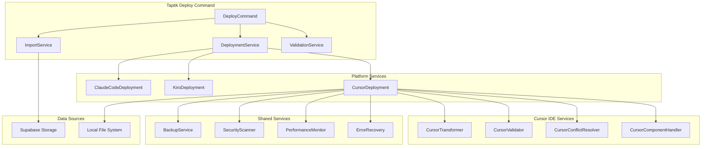
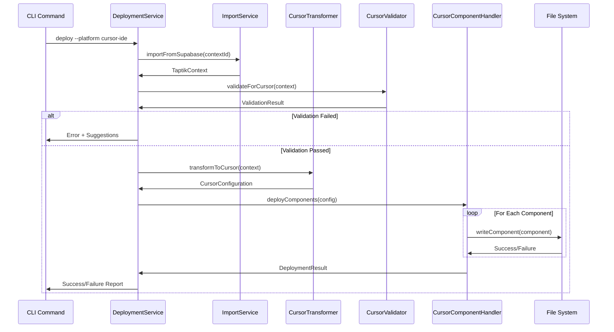

# 설계 문서

## 개요

이 설계 문서는 Taptik deploy 명령어에 Cursor IDE 지원을 추가하기 위한 아키텍처와 구현 방법을 정의합니다. 기존 Claude Code 및 Kiro IDE 배포 아키텍처를 확장하여 Cursor IDE의 고유한 설정 구조와 AI 중심 기능을 지원합니다.

핵심 설계 원칙:
- **확장성**: 기존 배포 아키텍처를 확장하여 새로운 플랫폼 지원
- **일관성**: 기존 CLI 인터페이스와 일관된 사용자 경험 제공
- **안전성**: 강력한 검증, 백업, 롤백 메커니즘
- **성능**: 대용량 설정에 대한 효율적인 처리
- **호환성**: Cursor IDE의 고유 기능과 제약사항 준수

## 아키텍처

### 전체 시스템 아키텍처



### Cursor IDE 배포 플로우



## 컴포넌트 및 인터페이스

### 1. CursorDeploymentService

Cursor IDE 배포의 핵심 서비스로, 전체 배포 프로세스를 조율합니다.

```typescript
@Injectable()
export class CursorDeploymentService {
  constructor(
    private cursorTransformer: CursorTransformerService,
    private cursorValidator: CursorValidatorService,
    private cursorComponentHandler: CursorComponentHandlerService,
    private cursorConflictResolver: CursorConflictResolverService,
    private backupService: BackupService,
    private securityScanner: SecurityScannerService,
    private performanceMonitor: PerformanceMonitorService,
  ) {}

  async deployToCursor(
    context: TaptikContext,
    options: DeployOptions,
  ): Promise<DeploymentResult> {
    // 1. 성능 모니터링 시작
    const monitor = this.performanceMonitor.start('cursor-deployment');
    
    try {
      // 2. 검증
      const validationResult = await this.cursorValidator.validate(context);
      if (!validationResult.isValid && !options.force) {
        return this.createFailureResult(validationResult.errors);
      }

      // 3. 백업 생성
      const backupResult = await this.backupService.createBackup('cursor');
      
      // 4. 변환
      const cursorConfig = await this.cursorTransformer.transform(context);
      
      // 5. 보안 스캔
      const securityResult = await this.securityScanner.scan(cursorConfig);
      if (securityResult.hasThreats && !options.force) {
        return this.createFailureResult(securityResult.threats);
      }

      // 6. 배포
      const deployResult = await this.cursorComponentHandler.deploy(
        cursorConfig,
        options,
      );

      // 7. 성능 메트릭 수집
      monitor.end();
      
      return deployResult;
    } catch (error) {
      // 8. 오류 발생 시 롤백
      if (backupResult?.success) {
        await this.backupService.restore(backupResult.backupId);
      }
      throw error;
    }
  }
}
```

### 2. CursorTransformerService

Taptik 공통 형식을 Cursor IDE 형식으로 변환하는 서비스입니다.

```typescript
@Injectable()
export class CursorTransformerService {
  async transform(context: TaptikContext): Promise<CursorConfiguration> {
    const cursorConfig: CursorConfiguration = {
      globalSettings: await this.transformGlobalSettings(context.personalContext),
      projectSettings: await this.transformProjectSettings(context.projectContext),
      extensions: await this.transformExtensions(context),
      snippets: await this.transformSnippets(context),
      aiPrompts: await this.transformAIPrompts(context),
      tasks: await this.transformTasks(context),
      launch: await this.transformLaunch(context),
    };

    return cursorConfig;
  }

  private async transformGlobalSettings(
    personalContext: TaptikPersonalContext,
  ): Promise<CursorGlobalSettings> {
    return {
      'editor.fontSize': personalContext.preferences?.fontSize || 14,
      'editor.fontFamily': personalContext.preferences?.fontFamily || 'Consolas',
      'editor.tabSize': personalContext.preferences?.tabSize || 2,
      'editor.insertSpaces': personalContext.preferences?.insertSpaces ?? true,
      'editor.wordWrap': personalContext.preferences?.wordWrap || 'on',
      'editor.lineNumbers': 'on',
      'editor.minimap.enabled': personalContext.preferences?.minimap ?? true,
      'editor.formatOnSave': personalContext.preferences?.formatOnSave ?? true,
      
      'workbench.colorTheme': this.mapTheme(personalContext.preferences?.theme),
      'workbench.iconTheme': personalContext.preferences?.iconTheme || 'vs-seti',
      'workbench.startupEditor': 'welcomePage',
      'workbench.sideBar.location': 'left',
      'workbench.panel.defaultLocation': 'bottom',
      
      'files.autoSave': personalContext.preferences?.autoSave ? 'afterDelay' : 'off',
      'files.autoSaveDelay': 1000,
      'files.exclude': personalContext.preferences?.excludeFiles || {},
      
      'terminal.integrated.fontSize': personalContext.preferences?.terminalFontSize || 12,
      'terminal.integrated.fontFamily': personalContext.preferences?.terminalFontFamily || 'Consolas',
      
      'cursor.ai.enabled': true,
      'cursor.ai.model': personalContext.aiSettings?.defaultModel || 'gpt-4',
      'cursor.ai.temperature': personalContext.aiSettings?.temperature || 0.7,
      'cursor.ai.maxTokens': personalContext.aiSettings?.maxTokens || 4000,
      'cursor.ai.contextWindow': personalContext.aiSettings?.contextWindow || 8000,
      'cursor.ai.autoComplete': personalContext.aiSettings?.autoComplete ?? true,
      'cursor.ai.codeActions': personalContext.aiSettings?.codeActions ?? true,
      'cursor.ai.chat': personalContext.aiSettings?.chat ?? true,
      
      'extensions.autoUpdate': personalContext.preferences?.autoUpdateExtensions ?? true,
      'extensions.autoCheckUpdates': true,
      'extensions.ignoreRecommendations': false,
      
      'security.workspace.trust.enabled': true,
      'security.workspace.trust.startupPrompt': 'once',
      'security.workspace.trust.banner': 'untilDismissed',
    };
  }

  private async transformProjectSettings(
    projectContext: TaptikProjectContext,
  ): Promise<CursorProjectSettings> {
    const settings: CursorProjectSettings = {
      'editor.rulers': projectContext.codeStyle?.rulers || [80, 120],
      'editor.detectIndentation': true,
      'editor.trimAutoWhitespace': true,
      
      'search.exclude': projectContext.searchExclude || {
        '**/node_modules': true,
        '**/dist': true,
        '**/.git': true,
      },
      'search.useIgnoreFiles': true,
      'search.useGlobalIgnoreFiles': true,
      
      'cursor.ai.projectContext': {
        includeFiles: projectContext.aiContext?.includeFiles || ['**/*.ts', '**/*.js', '**/*.md'],
        excludeFiles: projectContext.aiContext?.excludeFiles || ['**/node_modules/**', '**/dist/**'],
        maxFileSize: projectContext.aiContext?.maxFileSize || 1048576, // 1MB
        followSymlinks: false,
      },
      'cursor.ai.rules': [], // 변환 후 채워짐
      'cursor.ai.prompts': [], // 변환 후 채워짐
    };

    // 언어별 설정 추가
    if (projectContext.languages) {
      for (const lang of projectContext.languages) {
        const langSettings = this.getLanguageSettings(lang, projectContext);
        if (langSettings) {
          settings[`[${lang}]`] = langSettings;
        }
      }
    }

    return settings;
  }

  private async transformAIPrompts(
    context: TaptikContext,
  ): Promise<CursorAIPrompts> {
    const prompts: CursorAIPrompts = {
      systemPrompts: {},
      projectPrompts: {},
      rules: {},
    };

    // 개인 프롬프트 변환
    if (context.personalContext?.customPrompts) {
      for (const [name, prompt] of Object.entries(context.personalContext.customPrompts)) {
        prompts.systemPrompts[name] = {
          content: prompt.content,
          description: prompt.description,
          tags: prompt.tags || [],
        };
      }
    }

    // 프로젝트 프롬프트 변환
    if (context.projectContext?.prompts) {
      for (const [name, prompt] of Object.entries(context.projectContext.prompts)) {
        prompts.projectPrompts[name] = {
          content: prompt.content,
          description: prompt.description,
          context: prompt.context || 'project',
          tags: prompt.tags || [],
        };
      }
    }

    // 규칙 변환
    if (context.projectContext?.steeringDocuments) {
      prompts.rules = {
        'architecture': this.generateArchitectureRule(context.projectContext),
        'coding-style': this.generateCodingStyleRule(context.projectContext),
        'testing': this.generateTestingRule(context.projectContext),
        'security': this.generateSecurityRule(context.projectContext),
      };
    }

    return prompts;
  }

  private mapTheme(theme?: string): string {
    const themeMap: Record<string, string> = {
      'dark': 'Default Dark+',
      'light': 'Default Light+',
      'high-contrast': 'Default High Contrast',
      'claude-dark': 'Default Dark+',
      'claude-light': 'Default Light+',
    };
    
    return themeMap[theme || 'dark'] || 'Default Dark+';
  }

  private getLanguageSettings(language: string, context: TaptikProjectContext): any {
    const commonSettings = {
      'editor.formatOnSave': true,
      'editor.codeActionsOnSave': {
        'source.fixAll': true,
        'source.organizeImports': true,
      },
    };

    switch (language) {
      case 'typescript':
      case 'javascript':
        return {
          ...commonSettings,
          'editor.defaultFormatter': 'esbenp.prettier-vscode',
          'typescript.preferences.quoteStyle': 'single',
          'typescript.suggest.autoImports': true,
        };
      
      case 'python':
        return {
          ...commonSettings,
          'editor.defaultFormatter': 'ms-python.black-formatter',
          'python.defaultInterpreterPath': context.pythonPath || 'python',
          'python.linting.enabled': true,
          'python.linting.pylintEnabled': true,
        };
      
      case 'json':
        return {
          ...commonSettings,
          'editor.defaultFormatter': 'vscode.json-language-features',
        };
      
      default:
        return commonSettings;
    }
  }
}
```

### 3. CursorValidatorService

Cursor IDE 배포 전 검증을 수행하는 서비스입니다.

```typescript
@Injectable()
export class CursorValidatorService {
  async validate(context: TaptikContext): Promise<ValidationResult> {
    const errors: ValidationError[] = [];
    const warnings: ValidationWarning[] = [];

    // 1. 기본 구조 검증
    await this.validateBasicStructure(context, errors, warnings);
    
    // 2. Cursor 호환성 검증
    await this.validateCursorCompatibility(context, errors, warnings);
    
    // 3. AI 설정 검증
    await this.validateAISettings(context, errors, warnings);
    
    // 4. 파일 크기 검증
    await this.validateFileSizes(context, errors, warnings);
    
    // 5. 보안 검증
    await this.validateSecurity(context, errors, warnings);

    return {
      isValid: errors.length === 0,
      errors,
      warnings,
    };
  }

  private async validateBasicStructure(
    context: TaptikContext,
    errors: ValidationError[],
    warnings: ValidationWarning[],
  ): Promise<void> {
    if (!context) {
      errors.push({
        code: 'MISSING_CONTEXT',
        message: 'Taptik context is required',
        severity: 'error',
      });
      return;
    }

    if (!context.personalContext && !context.projectContext) {
      errors.push({
        code: 'EMPTY_CONTEXT',
        message: 'At least one of personalContext or projectContext is required',
        severity: 'error',
      });
    }

    if (!context.metadata?.version) {
      warnings.push({
        code: 'MISSING_VERSION',
        message: 'Context version is missing, using default',
        severity: 'warning',
      });
    }
  }

  private async validateCursorCompatibility(
    context: TaptikContext,
    errors: ValidationError[],
    warnings: ValidationWarning[],
  ): Promise<void> {
    // AI 설정 검증
    if (context.personalContext?.aiSettings) {
      const aiSettings = context.personalContext.aiSettings;
      
      if (aiSettings.maxTokens && aiSettings.maxTokens > 32000) {
        warnings.push({
          code: 'TOKEN_LIMIT_HIGH',
          message: 'Token limit exceeds Cursor recommended maximum (32000)',
          severity: 'warning',
        });
      }

      if (aiSettings.temperature && (aiSettings.temperature < 0 || aiSettings.temperature > 2)) {
        errors.push({
          code: 'INVALID_TEMPERATURE',
          message: 'AI temperature must be between 0 and 2',
          severity: 'error',
        });
      }
    }

    // 확장 프로그램 호환성 검증
    if (context.personalContext?.extensions) {
      const incompatibleExtensions = this.getIncompatibleExtensions(
        context.personalContext.extensions,
      );
      
      if (incompatibleExtensions.length > 0) {
        warnings.push({
          code: 'INCOMPATIBLE_EXTENSIONS',
          message: `Some extensions may not be compatible with Cursor: ${incompatibleExtensions.join(', ')}`,
          severity: 'warning',
        });
      }
    }
  }

  private async validateAISettings(
    context: TaptikContext,
    errors: ValidationError[],
    warnings: ValidationWarning[],
  ): Promise<void> {
    // 프롬프트 크기 검증
    if (context.promptTemplates) {
      for (const [name, template] of Object.entries(context.promptTemplates)) {
        if (template.content.length > 50000) { // 50KB 제한
          warnings.push({
            code: 'LARGE_PROMPT',
            message: `Prompt '${name}' is very large (${template.content.length} chars), may affect performance`,
            severity: 'warning',
          });
        }
      }
    }

    // AI 컨텍스트 파일 검증
    if (context.projectContext?.aiContext?.includeFiles) {
      const includeFiles = context.projectContext.aiContext.includeFiles;
      if (includeFiles.length > 1000) {
        warnings.push({
          code: 'TOO_MANY_CONTEXT_FILES',
          message: `Too many files in AI context (${includeFiles.length}), may slow down AI responses`,
          severity: 'warning',
        });
      }
    }
  }

  private getIncompatibleExtensions(extensions: string[]): string[] {
    const incompatible = [
      'ms-vscode.vscode-typescript-next', // Cursor has built-in TypeScript support
      'github.copilot', // Cursor has built-in AI
      'tabnine.tabnine-vscode', // Conflicts with Cursor AI
    ];

    return extensions.filter(ext => incompatible.includes(ext));
  }
}
```

### 4. CursorComponentHandlerService

개별 Cursor 컴포넌트의 배포를 처리하는 서비스입니다.

```typescript
@Injectable()
export class CursorComponentHandlerService {
  constructor(
    private cursorConflictResolver: CursorConflictResolverService,
    private fileService: FileService,
  ) {}

  async deploy(
    config: CursorConfiguration,
    options: DeployOptions,
  ): Promise<DeploymentResult> {
    const result: DeploymentResult = {
      success: true,
      deployedComponents: [],
      errors: [],
      warnings: [],
      summary: {
        filesDeployed: 0,
        filesSkipped: 0,
        conflictsResolved: 0,
        backupCreated: false,
      },
    };

    const components = this.getComponentsToDeploy(config, options);

    for (const component of components) {
      try {
        const componentResult = await this.deployComponent(component, config, options);
        this.mergeResults(result, componentResult);
      } catch (error) {
        result.errors.push({
          code: 'COMPONENT_DEPLOY_FAILED',
          message: `Failed to deploy ${component}: ${error.message}`,
          severity: 'error',
        });
        result.success = false;
      }
    }

    return result;
  }

  private async deployComponent(
    component: CursorComponent,
    config: CursorConfiguration,
    options: DeployOptions,
  ): Promise<ComponentDeploymentResult> {
    switch (component) {
      case 'settings':
        return this.deploySettings(config, options);
      case 'extensions':
        return this.deployExtensions(config, options);
      case 'snippets':
        return this.deploySnippets(config, options);
      case 'ai-prompts':
        return this.deployAIPrompts(config, options);
      case 'tasks':
        return this.deployTasks(config, options);
      case 'launch':
        return this.deployLaunch(config, options);
      default:
        throw new Error(`Unknown component: ${component}`);
    }
  }

  private async deploySettings(
    config: CursorConfiguration,
    options: DeployOptions,
  ): Promise<ComponentDeploymentResult> {
    const result: ComponentDeploymentResult = {
      component: 'settings',
      filesProcessed: 0,
      filesDeployed: 0,
      conflicts: 0,
    };

    // 전역 설정 배포
    if (config.globalSettings) {
      const globalPath = path.join(os.homedir(), '.cursor', 'settings.json');
      await this.deploySettingsFile(globalPath, config.globalSettings, options, result);
    }

    // 프로젝트 설정 배포
    if (config.projectSettings) {
      const projectPath = path.join(process.cwd(), '.cursor', 'settings.json');
      await this.deploySettingsFile(projectPath, config.projectSettings, options, result);
    }

    return result;
  }

  private async deploySettingsFile(
    filePath: string,
    settings: any,
    options: DeployOptions,
    result: ComponentDeploymentResult,
  ): Promise<void> {
    result.filesProcessed++;

    // 기존 파일 확인
    const exists = await this.fileService.exists(filePath);
    if (exists) {
      const existingContent = await this.fileService.readJson(filePath);
      const conflict = await this.cursorConflictResolver.resolveSettingsConflict(
        existingContent,
        settings,
        options.conflictStrategy,
      );

      if (conflict.action === 'skip') {
        return;
      }

      if (conflict.action === 'merge') {
        settings = conflict.mergedContent;
        result.conflicts++;
      }
    }

    // 디렉토리 생성
    await this.fileService.ensureDir(path.dirname(filePath));

    // 파일 작성
    if (!options.dryRun) {
      await this.fileService.writeJson(filePath, settings, { spaces: 2 });
    }

    result.filesDeployed++;
  }

  private async deployAIPrompts(
    config: CursorConfiguration,
    options: DeployOptions,
  ): Promise<ComponentDeploymentResult> {
    const result: ComponentDeploymentResult = {
      component: 'ai-prompts',
      filesProcessed: 0,
      filesDeployed: 0,
      conflicts: 0,
    };

    if (!config.aiPrompts) return result;

    // 프로젝트 AI 디렉토리 생성
    const aiDir = path.join(process.cwd(), '.cursor', 'ai');
    const promptsDir = path.join(aiDir, 'prompts');
    const rulesDir = path.join(aiDir, 'rules');

    await this.fileService.ensureDir(promptsDir);
    await this.fileService.ensureDir(rulesDir);

    // 프롬프트 파일 배포
    for (const [name, prompt] of Object.entries(config.aiPrompts.projectPrompts)) {
      const filePath = path.join(promptsDir, `${name}.md`);
      await this.deployMarkdownFile(filePath, prompt.content, options, result);
    }

    // 규칙 파일 배포
    for (const [name, rule] of Object.entries(config.aiPrompts.rules)) {
      const filePath = path.join(rulesDir, `${name}.md`);
      await this.deployMarkdownFile(filePath, rule, options, result);
    }

    // AI 컨텍스트 설정 업데이트
    const contextPath = path.join(aiDir, 'context.json');
    const contextConfig = this.generateAIContextConfig(config);
    await this.deploySettingsFile(contextPath, contextConfig, options, result);

    return result;
  }

  private async deployMarkdownFile(
    filePath: string,
    content: string,
    options: DeployOptions,
    result: ComponentDeploymentResult,
  ): Promise<void> {
    result.filesProcessed++;

    const exists = await this.fileService.exists(filePath);
    if (exists && options.conflictStrategy !== 'overwrite') {
      const existingContent = await this.fileService.readFile(filePath, 'utf8');
      if (existingContent === content) {
        return; // 내용이 동일하면 건너뛰기
      }

      if (options.conflictStrategy === 'skip') {
        return;
      }

      if (options.conflictStrategy === 'prompt') {
        // 사용자에게 확인 요청 (실제 구현에서는 CLI 프롬프트 사용)
        console.log(`File ${filePath} already exists. Overwrite? (y/n)`);
        // 여기서는 간단히 덮어쓰기로 처리
      }

      result.conflicts++;
    }

    if (!options.dryRun) {
      await this.fileService.writeFile(filePath, content, 'utf8');
    }

    result.filesDeployed++;
  }

  private generateAIContextConfig(config: CursorConfiguration): CursorAIContext {
    return {
      version: '1.0.0',
      project: {
        name: config.projectSettings?.['cursor.ai.projectContext']?.name || 'Unknown Project',
        description: 'Project deployed via Taptik',
        type: 'web', // 기본값
        languages: ['typescript', 'javascript'], // 기본값
        frameworks: [], // 프로젝트에서 감지
      },
      context: {
        files: {
          include: config.projectSettings?.['cursor.ai.projectContext']?.includeFiles || ['**/*.ts', '**/*.js'],
          exclude: config.projectSettings?.['cursor.ai.projectContext']?.excludeFiles || ['**/node_modules/**'],
          maxSize: config.projectSettings?.['cursor.ai.projectContext']?.maxFileSize || 1048576,
        },
        directories: {
          include: ['src', 'lib', 'components'],
          exclude: ['node_modules', 'dist', '.git'],
        },
        patterns: {
          important: ['**/*.ts', '**/*.tsx', '**/*.js', '**/*.jsx', '**/README.md'],
          ignore: ['**/*.log', '**/*.tmp', '**/.DS_Store'],
        },
      },
      rules: {
        coding: config.aiPrompts?.rules ? Object.keys(config.aiPrompts.rules).filter(r => r.includes('coding')) : [],
        architecture: config.aiPrompts?.rules ? Object.keys(config.aiPrompts.rules).filter(r => r.includes('architecture')) : [],
        testing: config.aiPrompts?.rules ? Object.keys(config.aiPrompts.rules).filter(r => r.includes('testing')) : [],
        security: config.aiPrompts?.rules ? Object.keys(config.aiPrompts.rules).filter(r => r.includes('security')) : [],
      },
      prompts: {
        system: 'You are a helpful AI assistant for code development.',
        templates: config.aiPrompts?.systemPrompts || {},
      },
    };
  }
}
```

## 데이터 모델

### CursorConfiguration 인터페이스

```typescript
export interface CursorConfiguration {
  globalSettings?: CursorGlobalSettings;
  projectSettings?: CursorProjectSettings;
  extensions?: CursorExtensions;
  snippets?: CursorSnippets;
  aiPrompts?: CursorAIPrompts;
  tasks?: CursorTasks;
  launch?: CursorLaunch;
}

export interface CursorGlobalSettings {
  // 에디터 설정
  'editor.fontSize': number;
  'editor.fontFamily': string;
  'editor.tabSize': number;
  'editor.insertSpaces': boolean;
  'editor.wordWrap': 'on' | 'off' | 'wordWrapColumn' | 'bounded';
  'editor.lineNumbers': 'on' | 'off' | 'relative' | 'interval';
  'editor.minimap.enabled': boolean;
  'editor.formatOnSave': boolean;
  'editor.codeActionsOnSave': Record<string, boolean>;
  
  // 워크벤치 설정
  'workbench.colorTheme': string;
  'workbench.iconTheme': string;
  'workbench.startupEditor': 'none' | 'welcomePage' | 'readme' | 'newUntitledFile';
  'workbench.sideBar.location': 'left' | 'right';
  'workbench.panel.defaultLocation': 'bottom' | 'right';
  
  // AI 설정
  'cursor.ai.enabled': boolean;
  'cursor.ai.model': string;
  'cursor.ai.temperature': number;
  'cursor.ai.maxTokens': number;
  'cursor.ai.contextWindow': number;
  'cursor.ai.autoComplete': boolean;
  'cursor.ai.codeActions': boolean;
  'cursor.ai.chat': boolean;
  
  // 기타 설정
  [key: string]: any;
}

export interface CursorProjectSettings {
  'editor.rulers': number[];
  'editor.detectIndentation': boolean;
  'editor.trimAutoWhitespace': boolean;
  
  'search.exclude': Record<string, boolean>;
  'search.useIgnoreFiles': boolean;
  'search.useGlobalIgnoreFiles': boolean;
  
  'cursor.ai.projectContext': {
    includeFiles: string[];
    excludeFiles: string[];
    maxFileSize: number;
    followSymlinks: boolean;
  };
  'cursor.ai.rules': string[];
  'cursor.ai.prompts': string[];
  
  // 언어별 설정
  [key: string]: any;
}

export interface CursorAIPrompts {
  systemPrompts: Record<string, {
    content: string;
    description: string;
    tags: string[];
  }>;
  projectPrompts: Record<string, {
    content: string;
    description: string;
    context: string;
    tags: string[];
  }>;
  rules: Record<string, string>;
}

export interface CursorExtensions {
  recommendations: string[];
  unwantedRecommendations: string[];
}

export interface CursorSnippets {
  [language: string]: Record<string, {
    prefix: string;
    body: string[];
    description: string;
  }>;
}

export interface CursorTasks {
  version: string;
  tasks: Array<{
    label: string;
    type: string;
    command: string;
    args?: string[];
    group?: 'build' | 'test' | 'clean';
    presentation?: {
      echo?: boolean;
      reveal?: 'always' | 'silent' | 'never';
      focus?: boolean;
      panel?: 'shared' | 'dedicated' | 'new';
    };
    problemMatcher?: string | string[];
    runOptions?: {
      runOn?: 'default' | 'folderOpen';
    };
  }>;
}

export interface CursorLaunch {
  version: string;
  configurations: Array<{
    name: string;
    type: string;
    request: 'launch' | 'attach';
    program?: string;
    args?: string[];
    cwd?: string;
    env?: Record<string, string>;
    console?: 'internalConsole' | 'integratedTerminal' | 'externalTerminal';
    preLaunchTask?: string;
    postDebugTask?: string;
  }>;
}
```

## 오류 처리

### 오류 분류 및 처리 전략

```typescript
export enum CursorDeploymentErrorCode {
  // 검증 오류
  INVALID_CONTEXT = 'CURSOR_INVALID_CONTEXT',
  MISSING_REQUIRED_FIELD = 'CURSOR_MISSING_REQUIRED_FIELD',
  INCOMPATIBLE_VERSION = 'CURSOR_INCOMPATIBLE_VERSION',
  
  // 파일 시스템 오류
  PERMISSION_DENIED = 'CURSOR_PERMISSION_DENIED',
  DISK_FULL = 'CURSOR_DISK_FULL',
  PATH_NOT_FOUND = 'CURSOR_PATH_NOT_FOUND',
  
  // 변환 오류
  TRANSFORMATION_FAILED = 'CURSOR_TRANSFORMATION_FAILED',
  DATA_LOSS_DETECTED = 'CURSOR_DATA_LOSS_DETECTED',
  
  // 보안 오류
  SECURITY_THREAT_DETECTED = 'CURSOR_SECURITY_THREAT_DETECTED',
  MALICIOUS_CONTENT = 'CURSOR_MALICIOUS_CONTENT',
  
  // 성능 오류
  TIMEOUT = 'CURSOR_TIMEOUT',
  MEMORY_LIMIT_EXCEEDED = 'CURSOR_MEMORY_LIMIT_EXCEEDED',
}

export class CursorDeploymentError extends Error {
  constructor(
    public code: CursorDeploymentErrorCode,
    message: string,
    public details?: any,
    public recoverable: boolean = true,
  ) {
    super(message);
    this.name = 'CursorDeploymentError';
  }
}

@Injectable()
export class CursorErrorRecoveryService {
  async handleError(
    error: CursorDeploymentError,
    context: DeploymentContext,
  ): Promise<RecoveryResult> {
    switch (error.code) {
      case CursorDeploymentErrorCode.PERMISSION_DENIED:
        return this.handlePermissionError(error, context);
      
      case CursorDeploymentErrorCode.DISK_FULL:
        return this.handleDiskFullError(error, context);
      
      case CursorDeploymentErrorCode.TRANSFORMATION_FAILED:
        return this.handleTransformationError(error, context);
      
      default:
        return this.handleGenericError(error, context);
    }
  }

  private async handlePermissionError(
    error: CursorDeploymentError,
    context: DeploymentContext,
  ): Promise<RecoveryResult> {
    return {
      success: false,
      message: 'Permission denied. Please check file permissions and try again.',
      suggestions: [
        'Run with elevated privileges (sudo on Unix systems)',
        'Check file and directory permissions',
        'Ensure Cursor is not running and locking files',
      ],
      retryable: true,
    };
  }

  private async handleTransformationError(
    error: CursorDeploymentError,
    context: DeploymentContext,
  ): Promise<RecoveryResult> {
    return {
      success: false,
      message: 'Failed to transform configuration for Cursor IDE.',
      suggestions: [
        'Check if the source configuration is valid',
        'Try deploying individual components with --components flag',
        'Use --validate-only to check for specific issues',
      ],
      retryable: true,
    };
  }
}
```

## 테스팅 전략

### 단위 테스트

```typescript
describe('CursorTransformerService', () => {
  let service: CursorTransformerService;

  beforeEach(async () => {
    const module = await Test.createTestingModule({
      providers: [CursorTransformerService],
    }).compile();

    service = module.get<CursorTransformerService>(CursorTransformerService);
  });

  describe('transformGlobalSettings', () => {
    it('should transform basic personal context to Cursor global settings', async () => {
      const personalContext: TaptikPersonalContext = {
        preferences: {
          fontSize: 16,
          theme: 'dark',
          autoSave: true,
        },
        aiSettings: {
          defaultModel: 'gpt-4',
          temperature: 0.8,
        },
      };

      const result = await service.transformGlobalSettings(personalContext);

      expect(result['editor.fontSize']).toBe(16);
      expect(result['workbench.colorTheme']).toBe('Default Dark+');
      expect(result['files.autoSave']).toBe('afterDelay');
      expect(result['cursor.ai.model']).toBe('gpt-4');
      expect(result['cursor.ai.temperature']).toBe(0.8);
    });

    it('should use default values for missing preferences', async () => {
      const personalContext: TaptikPersonalContext = {};

      const result = await service.transformGlobalSettings(personalContext);

      expect(result['editor.fontSize']).toBe(14);
      expect(result['workbench.colorTheme']).toBe('Default Dark+');
      expect(result['cursor.ai.model']).toBe('gpt-4');
    });
  });

  describe('transformAIPrompts', () => {
    it('should transform prompts and rules correctly', async () => {
      const context: TaptikContext = {
        personalContext: {
          customPrompts: {
            'code-review': {
              content: 'Review this code for best practices',
              description: 'Code review prompt',
              tags: ['review', 'quality'],
            },
          },
        },
        projectContext: {
          prompts: {
            'architecture': {
              content: 'Follow clean architecture principles',
              description: 'Architecture guidance',
              context: 'project',
            },
          },
        },
      };

      const result = await service.transformAIPrompts(context);

      expect(result.systemPrompts['code-review']).toBeDefined();
      expect(result.systemPrompts['code-review'].content).toBe('Review this code for best practices');
      expect(result.projectPrompts['architecture']).toBeDefined();
      expect(result.projectPrompts['architecture'].context).toBe('project');
    });
  });
});
```

### 통합 테스트

```typescript
describe('Cursor IDE Deployment Integration', () => {
  let deploymentService: CursorDeploymentService;
  let fileService: FileService;
  let tempDir: string;

  beforeEach(async () => {
    tempDir = await fs.mkdtemp(path.join(os.tmpdir(), 'cursor-test-'));
    
    const module = await Test.createTestingModule({
      providers: [
        CursorDeploymentService,
        CursorTransformerService,
        CursorValidatorService,
        CursorComponentHandlerService,
        CursorConflictResolverService,
        FileService,
        // ... other providers
      ],
    }).compile();

    deploymentService = module.get<CursorDeploymentService>(CursorDeploymentService);
    fileService = module.get<FileService>(FileService);
  });

  afterEach(async () => {
    await fs.rm(tempDir, { recursive: true, force: true });
  });

  it('should deploy complete Cursor configuration', async () => {
    const context: TaptikContext = {
      personalContext: {
        preferences: { fontSize: 14, theme: 'dark' },
        aiSettings: { defaultModel: 'gpt-4' },
      },
      projectContext: {
        aiContext: { includeFiles: ['**/*.ts'] },
        prompts: {
          'coding-style': {
            content: 'Use TypeScript best practices',
            description: 'Coding style guide',
          },
        },
      },
    };

    const options: DeployOptions = {
      platform: 'cursor-ide',
      dryRun: false,
      conflictStrategy: 'overwrite',
    };

    // 임시 디렉토리를 홈 디렉토리로 설정
    jest.spyOn(os, 'homedir').mockReturnValue(tempDir);
    jest.spyOn(process, 'cwd').mockReturnValue(tempDir);

    const result = await deploymentService.deployToCursor(context, options);

    expect(result.success).toBe(true);
    expect(result.deployedComponents).toContain('settings');
    expect(result.deployedComponents).toContain('ai-prompts');

    // 파일이 생성되었는지 확인
    const globalSettingsPath = path.join(tempDir, '.cursor', 'settings.json');
    const projectSettingsPath = path.join(tempDir, '.cursor', 'settings.json');
    const promptPath = path.join(tempDir, '.cursor', 'ai', 'prompts', 'coding-style.md');

    expect(await fileService.exists(globalSettingsPath)).toBe(true);
    expect(await fileService.exists(promptPath)).toBe(true);

    // 설정 내용 확인
    const globalSettings = await fileService.readJson(globalSettingsPath);
    expect(globalSettings['editor.fontSize']).toBe(14);
    expect(globalSettings['cursor.ai.model']).toBe('gpt-4');

    const promptContent = await fileService.readFile(promptPath, 'utf8');
    expect(promptContent).toBe('Use TypeScript best practices');
  });

  it('should handle conflicts correctly', async () => {
    // 기존 설정 파일 생성
    const settingsPath = path.join(tempDir, '.cursor', 'settings.json');
    await fileService.ensureDir(path.dirname(settingsPath));
    await fileService.writeJson(settingsPath, {
      'editor.fontSize': 12,
      'workbench.colorTheme': 'Light Theme',
      'custom.setting': 'preserve me',
    });

    const context: TaptikContext = {
      personalContext: {
        preferences: { fontSize: 16, theme: 'dark' },
      },
    };

    const options: DeployOptions = {
      platform: 'cursor-ide',
      conflictStrategy: 'merge',
    };

    jest.spyOn(os, 'homedir').mockReturnValue(tempDir);

    const result = await deploymentService.deployToCursor(context, options);

    expect(result.success).toBe(true);
    expect(result.summary.conflictsResolved).toBeGreaterThan(0);

    // 병합된 설정 확인
    const mergedSettings = await fileService.readJson(settingsPath);
    expect(mergedSettings['editor.fontSize']).toBe(16); // 새 값
    expect(mergedSettings['workbench.colorTheme']).toBe('Default Dark+'); // 변환된 값
    expect(mergedSettings['custom.setting']).toBe('preserve me'); // 기존 값 보존
  });
});
```

이 설계 문서는 Cursor IDE 지원을 위한 포괄적인 아키텍처와 구현 방법을 제시합니다. 기존 배포 시스템을 확장하면서도 Cursor IDE의 고유한 특성을 충분히 활용할 수 있도록 설계되었습니다.