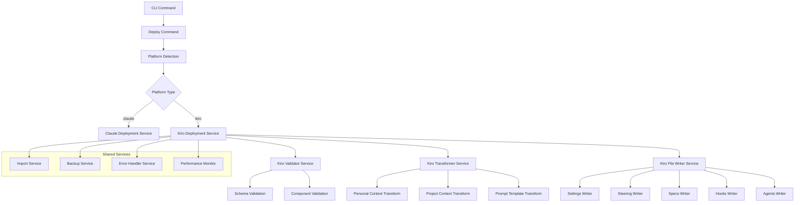

# Design Document

## Overview

This design document outlines the technical implementation for adding Kiro IDE support to the existing `taptik deploy` command. The solution extends the current deployment architecture to support Kiro IDE as a target platform while maintaining backward compatibility with Claude Code deployments.

The implementation follows the existing modular architecture pattern, adding Kiro-specific components for data transformation, validation, and deployment logic. The design leverages the current deployment infrastructure and introduces new services and utilities specifically for Kiro IDE integration.

## Architecture

### High-Level Architecture



### Component Integration

The Kiro deployment functionality integrates with existing deploy module components:

- **Deploy Command**: Extended to support `--platform kiro` option
- **Import Service**: Reused for Supabase data retrieval
- **Backup Service**: Extended for Kiro-specific file backup
- **Error Handler**: Enhanced with Kiro-specific error handling
- **Performance Monitor**: Extended to track Kiro deployment metrics

### Component-Specific Deployment Logic (Requirements 2, 10)

```typescript
interface ComponentDeploymentStrategy {
  settings: {
    globalPath: '~/.kiro/settings.json';
    projectPath: '.kiro/settings.json';
    mergeStrategy: 'preserve-user-customizations';
    validationRules: KiroSettingsValidationRules;
  };
  steering: {
    targetDirectory: '.kiro/steering/';
    requiredFiles: ['persona.md', 'principle.md', 'architecture.md', 'TDD.md', 'TEST.md', 'git.md', 'PRD.md', 'project-context.md', 'flags.md', 'mcp.md'];
    conflictResolution: 'intelligent-merge-with-content-analysis';
    maxFileSize: 10 * 1024 * 1024; // 10MB per document
  };
  hooks: {
    targetDirectory: '.kiro/hooks/';
    fileFormat: 'json';
    validationRules: KiroHookValidationRules;
    dependencyChecking: true;
    executionSafety: 'sandbox-mode';
  };
  specs: {
    targetDirectory: '.kiro/specs/';
    structure: '{spec-name}/[requirements.md, design.md, tasks.md]';
    taskCompletionPreservation: true;
    crossReferenceValidation: true;
    maxSpecSize: 50 * 1024 * 1024; // 50MB per spec directory
  };
  agents: {
    globalDirectory: '~/.kiro/agents/';
    fileFormat: 'markdown';
    metadataRegistry: '~/.kiro/agents/metadata.json';
    securityScanning: true;
    capabilityValidation: true;
  };
}

interface ComponentDeploymentHandler {
  deploySettings(config: KiroSettingsConfig, options: DeploymentOptions): Promise<SettingsDeploymentResult>;
  deploySteering(documents: KiroSteeringDocuments, options: DeploymentOptions): Promise<SteeringDeploymentResult>;
  deployHooks(hooks: KiroHooksConfig, options: DeploymentOptions): Promise<HooksDeploymentResult>;
  deploySpecs(specs: KiroSpecsConfig, options: DeploymentOptions): Promise<SpecsDeploymentResult>;
  deployAgents(agents: KiroAgentsConfig, options: DeploymentOptions): Promise<AgentsDeploymentResult>;
}
```

## Components and Interfaces

### Core Interfaces

```typescript
// Kiro-specific deployment interfaces
interface KiroDeploymentOptions extends DeployOptions {
  platform: 'kiro';
  kiroComponents?: KiroComponentType[];
  skipKiroComponents?: KiroComponentType[];
  kiroConflictStrategy?: KiroConflictStrategy;
  securityLevel?: SecurityLevel;
  migrationMode?: MigrationMode;
}

enum KiroComponentType {
  SETTINGS = 'settings',
  STEERING = 'steering',
  HOOKS = 'hooks',
  SPECS = 'specs',
  AGENTS = 'agents'
}

enum KiroConflictStrategy {
  PROMPT = 'prompt',
  MERGE = 'merge',
  BACKUP = 'backup',
  SKIP = 'skip',
  OVERWRITE = 'overwrite'
}

enum SecurityLevel {
  STRICT = 'strict',
  STANDARD = 'standard',
  PERMISSIVE = 'permissive'
}

enum MigrationMode {
  FULL = 'full',
  INCREMENTAL = 'incremental',
  SELECTIVE = 'selective'
}

interface KiroDeploymentResult extends DeploymentResult {
  kiroComponents: {
    [key in KiroComponentType]: {
      deployed: boolean;
      files: string[];
      conflicts: string[];
      errors: string[];
    };
  };
  kiroDirectories: {
    global: string;
    project: string;
  };
}

interface KiroValidationResult {
  isValid: boolean;
  errors: ValidationError[];
  warnings: ValidationWarning[];
  componentResults: {
    [key in KiroComponentType]: ComponentValidationResult;
  };
}
```

### Service Interfaces

```typescript
interface IKiroDeploymentService {
  deploy(options: KiroDeploymentOptions): Promise<KiroDeploymentResult>;
  validateDeployment(data: TaptikCommonFormat): Promise<KiroValidationResult>;
  previewDeployment(options: KiroDeploymentOptions): Promise<KiroDeploymentPreview>;
  // Enhanced deployment methods (Requirements 12, 13, 16)
  detectExistingKiroInstallation(path: string): Promise<KiroInstallationInfo>;
  mergeWithExistingConfiguration(existing: KiroConfig, incoming: KiroConfig): Promise<MergeResult>;
  createDeploymentCheckpoint(context: DeploymentContext): Promise<CheckpointId>;
  resumeInterruptedDeployment(checkpointId: CheckpointId): Promise<DeploymentResult>;
  generateBidirectionalMetadata(deployment: KiroDeploymentResult): Promise<BidirectionalMetadata>;
}

interface IKiroTransformerService {
  transformPersonalContext(context: TaptikPersonalContext): Promise<KiroPersonalConfig>;
  transformProjectContext(context: TaptikProjectContext): Promise<KiroProjectConfig>;
  transformPromptTemplates(templates: TaptikPromptTemplates): Promise<KiroTemplateConfig>;
}

interface IKiroValidatorService {
  validateConfiguration(config: TaptikCommonFormat): Promise<KiroValidationResult>;
  validateComponent(component: KiroComponentType, data: any): Promise<ComponentValidationResult>;
  validateSchema(data: any, schema: JSONSchema): Promise<SchemaValidationResult>;
  // Enhanced validation methods (Requirements 3, 11)
  validateTaptikCommonFormat(data: any): Promise<ValidationResult>;
  validateRequiredKiroFields(component: KiroComponentType, data: any): Promise<ValidationResult>;
  validateDataIntegrity(source: any, transformed: any): Promise<DataIntegrityResult>;
  generateValidationReport(results: ValidationResult[]): ValidationReport;
}

interface IKiroFileWriterService {
  writeSettings(config: KiroSettingsConfig, options: WriteOptions): Promise<WriteResult>;
  writeSteering(documents: KiroSteeringDocuments, options: WriteOptions): Promise<WriteResult>;
  writeSpecs(specs: KiroSpecsConfig, options: WriteOptions): Promise<WriteResult>;
  writeHooks(hooks: KiroHooksConfig, options: WriteOptions): Promise<WriteResult>;
  writeAgents(agents: KiroAgentsConfig, options: WriteOptions): Promise<WriteResult>;
}
```

### Platform Detection and Routing

```typescript
// Extended platform detection
enum PlatformType {
  CLAUDE = 'claude',
  KIRO = 'kiro'
}

interface PlatformDetector {
  detectPlatform(options: DeployOptions): PlatformType;
  validatePlatformSupport(platform: PlatformType): boolean;
}

// Enhanced platform-specific service factory
interface PlatformServiceFactory {
  createValidator(platform: PlatformType): IPlatformValidator;
  createTransformer(platform: PlatformType): IPlatformTransformer;
  createFileWriter(platform: PlatformType): IPlatformFileWriter;
  createBackupManager(platform: PlatformType): IPlatformBackupManager;
  createSecurityEnforcer(platform: PlatformType): IPlatformSecurityEnforcer;
  createHealthChecker(platform: PlatformType): IPlatformHealthChecker;
}

interface DeploymentServiceFactory {
  createDeploymentService(platform: PlatformType): IDeploymentService;
}
```

## Data Models

### Kiro Configuration Models

```typescript
// Kiro Global Settings Model
interface KiroGlobalSettings {
  version: string;
  user: KiroUserConfig;
  security: KiroSecurityConfig;
  ai: KiroAIConfig;
  plugins: KiroPluginsConfig;
  ui: KiroUIConfig;
  env: Record<string, string>;
}

interface KiroUserConfig {
  name: string;
  email: string;
  preferences: {
    theme: 'light' | 'dark' | 'auto';
    fontSize: number;
    fontFamily: string;
    autoSave: boolean;
    autoFormat: boolean;
  };
}

// Kiro Project Settings Model
interface KiroProjectSettings {
  version: string;
  project: KiroProjectInfo;
  ai: KiroProjectAIConfig;
  hooks: KiroProjectHooksConfig;
  specs: KiroProjectSpecsConfig;
  integrations: KiroProjectIntegrationsConfig;
  env: Record<string, string>;
}

// Kiro Steering Documents Model (Requirement 10)
interface KiroSteeringDocuments {
  persona?: string;      // .kiro/steering/persona.md
  principle?: string;    // .kiro/steering/principle.md
  architecture?: string; // .kiro/steering/architecture.md
  tdd?: string;         // .kiro/steering/TDD.md
  test?: string;        // .kiro/steering/TEST.md
  git?: string;         // .kiro/steering/git.md
  prd?: string;         // .kiro/steering/PRD.md
  projectContext?: string; // .kiro/steering/project-context.md
  flags?: string;       // .kiro/steering/flags.md
  mcp?: string;         // .kiro/steering/mcp.md
}

// Kiro Specs Model (Requirement 10)
interface KiroSpecsConfig {
  [specName: string]: {
    requirements?: string; // .kiro/specs/{spec-name}/requirements.md
    design?: string;       // .kiro/specs/{spec-name}/design.md
    tasks?: string;        // .kiro/specs/{spec-name}/tasks.md
  };
}

// Kiro Hooks Model
interface KiroHooksConfig {
  [hookName: string]: KiroHookConfiguration;
}

// Kiro Agents Model
interface KiroAgentsConfig {
  [agentName: string]: KiroAgentDefinition;
}
```

### Transformation Models

```typescript
// Concrete data transformation mapping models (Requirement 17)
interface TaptikToKiroTransformation {
  claudeCodeSettings: {
    permissions: (permissions: string[]) => string[]; // → kiroSettings.security.permissions
    environmentVariables: (env: Record<string, string>) => Record<string, string>; // → kiroSettings.env
    statusLine: {
      enabled: (enabled: boolean) => boolean; // → kiroSettings.ui.statusBar.enabled
      position: (pos: 'top' | 'bottom') => 'top' | 'bottom'; // → kiroSettings.ui.statusBar.position
      components: (components: string[]) => string[]; // → kiroSettings.ui.statusBar.components
    };
    theme: (theme: string) => 'light' | 'dark' | 'auto'; // → kiroSettings.user.preferences.theme
    fontSize: (size: number) => number; // → kiroSettings.user.preferences.fontSize
  };
  claudeCodeAgents: {
    content: (markdown: string, name: string) => { path: string; content: string }; // → ~/.kiro/agents/{agent-name}.md
    metadata: (meta: AgentMeta) => KiroAgentDefinition; // → ~/.kiro/agents/metadata.json registry entry
    capabilities: (caps: string[]) => { triggers: AgentTriggers; configuration: AgentConfig }; // → Kiro agent triggers and configuration
  };
  claudeCodeCommands: {
    content: (command: string, name: string) => KiroHookConfiguration; // → .kiro/hooks/{command-name}.json
    permissions: (perms: string[]) => { dependencies: string[]; actions: HookAction[] }; // → Hook action permissions and dependencies
    triggers: (triggers: string[]) => { filePatterns: string[]; conditions: HookCondition[] }; // → Hook conditions and file patterns
  };
  projectSettings: {
    instructions: (instructions: string) => string; // → .kiro/steering/project-context.md
    mcpConfig: (mcp: any) => string; // → .kiro/steering/mcp.md
    customSettings: (settings: any) => Partial<KiroProjectSettings>; // → .kiro/settings.json project-specific section
  };
  steeringGeneration: {
    persona: (userContext: any, aiPrefs: any) => string; // → persona.md from user context and AI preferences
    principle: (guidelines: any) => string; // → principle.md from development guidelines
    architecture: (patterns: any) => string; // → architecture.md from project structure patterns
    tdd: (testConfig: any) => string; // → TDD.md from testing configurations
    test: (testConfig: any) => string; // → TEST.md from testing configurations
  };
}

// Enhanced component mapping with migration strategies
interface ComponentMapping {
  claude: {
    settings: {
      target: 'settings';
      strategy: 'merge';
      conflicts: 'preserve-kiro';
    };
    agents: {
      target: 'agents';
      strategy: 'append';
      conflicts: 'rename-duplicate';
    };
    commands: {
      target: 'hooks';
      strategy: 'transform';
      conflicts: 'convert-and-merge';
    };
    project: {
      target: ['steering', 'specs'];
      strategy: 'split-and-organize';
      conflicts: 'intelligent-merge';
    };
  };
  transformationRules: {
    dataPreservation: {
      requiresComment: string[]; // Fields that need preservation comments
      lossy: string[]; // Transformations that lose data
      enhanced: string[]; // Transformations that add functionality
    };
    defaultValues: {
      [key: string]: any; // Default values for missing fields
    };
    validation: {
      required: string[]; // Required fields after transformation
      optional: string[]; // Optional fields with defaults
    };
  };
}

// Migration helpers and utilities
interface ConfigurationMigrator {
  migrateFromClaude(claudeConfig: ClaudeCodeConfig): Promise<KiroConfig>;
  validateMigration(source: any, target: any): Promise<MigrationValidationResult>;
  generateMigrationReport(migration: MigrationResult): string;
  preserveDataInComments(originalData: any, targetPath: string): string;
}

interface IncrementalDeployment {
  detectChanges(current: KiroConfig, incoming: KiroConfig): Promise<ChangeSet>;
  applyIncrementalChanges(changes: ChangeSet): Promise<DeploymentResult>;
  createDeltaBackup(changes: ChangeSet): Promise<BackupManifest>;
  optimizeForRepeatedDeployments(deploymentHistory: DeploymentHistory): Promise<OptimizationStrategy>;
}
```

## Error Handling

### Error Classification

```typescript
enum KiroDeploymentErrorType {
  VALIDATION_ERROR = 'VALIDATION_ERROR',
  TRANSFORMATION_ERROR = 'TRANSFORMATION_ERROR',
  FILE_SYSTEM_ERROR = 'FILE_SYSTEM_ERROR',
  PERMISSION_ERROR = 'PERMISSION_ERROR',
  CONFLICT_ERROR = 'CONFLICT_ERROR',
  ROLLBACK_ERROR = 'ROLLBACK_ERROR',
  NETWORK_ERROR = 'NETWORK_ERROR'
}

interface KiroDeploymentError extends Error {
  type: KiroDeploymentErrorType;
  code: string;
  component?: KiroComponentType;
  filePath?: string;
  suggestions: string[];
  recoverable: boolean;
}
```

### Error Recovery Strategy

```typescript
interface ErrorRecoveryStrategy {
  canRecover(error: KiroDeploymentError): boolean;
  recover(error: KiroDeploymentError, context: DeploymentContext): Promise<RecoveryResult>;
  rollback(context: DeploymentContext): Promise<RollbackResult>;
}

enum RecoveryActions {
  RETRY = 'retry',
  SKIP_COMPONENT = 'skip_component',
  USE_DEFAULT = 'use_default',
  PROMPT_USER = 'prompt_user',
  ROLLBACK = 'rollback',
  ABORT = 'abort'
}

// Kiro-specific recovery scenarios (Requirements 6, 13)
interface KiroSpecificRecoveryScenarios {
  supabaseImportFailure: {
    strategy: RecoveryActions;
    retryWithBackoff: (attempt: number) => Promise<RetryResult>;
    offlineMode: () => Promise<OfflineModeResult>;
    validation: (result: ImportResult) => boolean;
  };
  partialComponentDeployment: {
    strategy: RecoveryActions;
    continueWithOthers: (failedComponent: KiroComponentType) => Promise<PartialDeploymentResult>;
    reportPartialSuccess: (results: ComponentResult[]) => Promise<void>;
  };
  fileSystemPermissionError: {
    strategy: RecoveryActions;
    permissionGuidance: (path: string, operation: FileOperation) => Promise<PermissionGuidance>;
    alternativeLocation: (originalPath: string) => Promise<AlternativePathResult>;
  };
  deploymentInterruption: {
    strategy: RecoveryActions;
    saveDeploymentState: (context: DeploymentContext) => Promise<StateSnapshot>;
    resumeFromCheckpoint: (checkpointId: CheckpointId) => Promise<ResumeResult>;
  };
  integrityVerificationFailure: {
    strategy: RecoveryActions;
    rollbackToLastKnownGood: (context: DeploymentContext) => Promise<RollbackResult>;
    manualRecoveryInstructions: (failure: IntegrityFailure) => Promise<RecoveryInstructions>;
  };
  partialSteeringDeployment: {
    strategy: RecoveryActions;
    fallback: () => Promise<RecoveryResult>;
    validation: (result: RecoveryResult) => boolean;
  };
  corruptedSpecFiles: {
    strategy: RecoveryActions;
    reconstruction: (backup: BackupManifest) => Promise<SpecReconstructionResult>;
    validation: (reconstructed: KiroSpecsConfig) => boolean;
  };
  hookExecutionFailure: {
    strategy: RecoveryActions;
    safeMode: () => Promise<SafeModeResult>;
    dependencyCheck: (hook: KiroHookConfiguration) => Promise<DependencyCheckResult>;
  };
  agentValidationError: {
    strategy: RecoveryActions;
    sanitization: (agent: KiroAgentDefinition) => Promise<SanitizedAgent>;
    fallbackAgent: () => KiroAgentDefinition;
  };
  securityViolation: {
    strategy: RecoveryActions;
    quarantine: (violatingContent: any) => Promise<QuarantineResult>;
    administratorNotification: (violation: SecurityViolation) => Promise<void>;
  };
}
```

### Rollback Mechanism

```typescript
interface RollbackManager {
  createCheckpoint(context: DeploymentContext): Promise<CheckpointId>;
  rollbackToCheckpoint(checkpointId: CheckpointId): Promise<RollbackResult>;
  cleanupCheckpoints(context: DeploymentContext): Promise<void>;
}

interface CheckpointData {
  id: CheckpointId;
  timestamp: Date;
  files: BackupFileInfo[];
  directories: string[];
  metadata: DeploymentMetadata;
}
```

## Testing Strategy

### Unit Testing Approach

```typescript
// Service testing structure
describe('KiroDeploymentService', () => {
  describe('deploy', () => {
    it('should deploy all components successfully');
    it('should handle component-specific deployment');
    it('should skip specified components');
    it('should handle deployment conflicts');
    it('should rollback on failure');
  });
  
  describe('validateDeployment', () => {
    it('should validate complete configuration');
    it('should detect missing required components');
    it('should validate component schemas');
    it('should provide detailed error messages');
  });
});

describe('KiroTransformerService', () => {
  describe('transformPersonalContext', () => {
    it('should transform user preferences correctly');
    it('should handle missing optional fields');
    it('should preserve essential data');
    it('should apply sensible defaults');
  });
});

describe('KiroValidatorService', () => {
  describe('validateConfiguration', () => {
    it('should validate against Kiro schemas');
    it('should detect incompatible data types');
    it('should provide field-level validation');
    it('should handle nested validation errors');
  });
});
```

### Integration Testing

```typescript
// Integration test scenarios
describe('Kiro Deployment Integration', () => {
  it('should perform end-to-end deployment');
  it('should handle real file system operations');
  it('should integrate with existing backup service');
  it('should work with actual Supabase data');
  it('should handle concurrent deployments');
});

describe('Platform Compatibility', () => {
  it('should maintain Claude Code compatibility');
  it('should handle mixed platform deployments');
  it('should preserve existing deployment workflows');
});
```

### Performance Testing

```typescript
// Performance test cases
describe('Kiro Deployment Performance', () => {
  it('should handle large configuration files (>10MB)');
  it('should process multiple components in parallel');
  it('should optimize file I/O operations');
  it('should complete deployment within acceptable time limits');
  it('should handle memory efficiently for large deployments');
});
```

## Implementation Details

### File System Operations

```typescript
interface KiroFileSystemManager {
  ensureDirectories(paths: string[]): Promise<void>;
  writeConfigFile(path: string, content: any, options: WriteOptions): Promise<void>;
  writeMarkdownFile(path: string, content: string, options: WriteOptions): Promise<void>;
  createBackup(filePath: string): Promise<BackupInfo>;
  restoreBackup(backupInfo: BackupInfo): Promise<void>;
  setPermissions(path: string, permissions: FilePermissions): Promise<void>;
}

interface WriteOptions {
  createBackup: boolean;
  conflictStrategy: KiroConflictStrategy;
  preservePermissions: boolean;
  validateContent: boolean;
}
```

### Configuration Merging

```typescript
interface ConfigurationMerger {
  mergeSettings(existing: KiroSettings, incoming: KiroSettings): Promise<KiroSettings>;
  mergeSteeringDocuments(existing: KiroSteeringDocuments, incoming: KiroSteeringDocuments): Promise<KiroSteeringDocuments>;
  resolveConflicts(conflicts: ConfigConflict[], strategy: KiroConflictStrategy): Promise<ConflictResolution[]>;
}

interface ConfigConflict {
  path: string;
  existingValue: any;
  incomingValue: any;
  conflictType: ConflictType;
}

enum ConflictType {
  VALUE_MISMATCH = 'VALUE_MISMATCH',
  TYPE_MISMATCH = 'TYPE_MISMATCH',
  STRUCTURE_MISMATCH = 'STRUCTURE_MISMATCH'
}
```

### Validation Engine

```typescript
interface ValidationEngine {
  validateSchema(data: any, schema: JSONSchema): ValidationResult;
  validateBusinessRules(data: any, rules: BusinessRule[]): ValidationResult;
  validateFileConstraints(filePath: string, content: any): ValidationResult;
  validatePermissions(path: string, requiredPermissions: Permission[]): ValidationResult;
}

interface BusinessRule {
  name: string;
  description: string;
  validator: (data: any) => boolean;
  errorMessage: string;
  severity: 'error' | 'warning';
}
```

## Security Considerations

### Enhanced Kiro-Specific Security

```typescript
interface KiroSecurityEnforcer {
  kiroSpecificRules: {
    hookValidation: {
      allowedCommands: string[];
      blockedPatterns: RegExp[];
      timeoutLimits: { [hookType: string]: number };
      dependencyValidation: (hook: KiroHookConfiguration) => Promise<DependencyCheckResult>;
    };
    specValidation: {
      maxSpecSize: number; // 50MB per spec directory
      allowedMarkdownElements: string[];
      requirementValidation: boolean;
      crossReferenceCheck: (specs: KiroSpecsConfig) => Promise<CrossRefResult>;
    };
    steeringValidation: {
      requiredDocuments: string[]; // ['persona.md', 'principle.md']
      contentSizeLimit: number; // 10MB per document
      crossReferences: boolean;
      promptInjectionPrevention: (content: string) => Promise<InjectionScanResult>;
    };
    agentSecurity: {
      commandExecutionScan: (agent: KiroAgentDefinition) => Promise<CommandScanResult>;
      fileAccessValidation: (agent: KiroAgentDefinition) => Promise<AccessValidationResult>;
      networkAccessDetection: (agent: KiroAgentDefinition) => Promise<NetworkScanResult>;
      privilegeEscalationCheck: (agent: KiroAgentDefinition) => Promise<PrivilegeCheckResult>;
    };
    templateSecurity: {
      complexityLimits: { maxSize: number; maxDepth: number };
      variableInjectionPrevention: (template: string) => Promise<InjectionPreventionResult>;
      templateEngineRestrictions: string[];
      dependencyValidation: (template: KiroTemplateConfig) => Promise<TemplateDepCheckResult>;
    };
  };

  enforceSecurityPolicies(
    content: any,
    component: KiroComponentType,
    securityLevel: SecurityLevel
  ): Promise<SecurityEnforcementResult>;

  generateSecurityReport(violations: SecurityViolation[]): SecurityReport;
}

interface KiroHealthChecker {
  validateKiroInstallation(): Promise<InstallationStatus>;
  checkKiroVersion(): Promise<VersionCompatibility>;
  validateKiroPermissions(): Promise<PermissionStatus>;
  testKiroIntegration(): Promise<IntegrationTestResult>;
  
  performanceHealthCheck(): Promise<PerformanceHealthResult>;
  securityHealthCheck(): Promise<SecurityHealthResult>;
  dependencyHealthCheck(): Promise<DependencyHealthResult>;
}
```

### File System Security

- **Permission Validation**: Verify read/write permissions before file operations
- **Path Sanitization**: Sanitize all file paths to prevent directory traversal
- **Backup Encryption**: Encrypt sensitive backup files using organizational key management
- **Secure Cleanup**: Implement DoD 5220.22-M standard for temporary file deletion

### Data Security

- **Content Scanning**: Scan configuration content for malicious patterns with Kiro-specific rules
- **Schema Validation**: Strict validation against known schemas with business rule enforcement
- **Input Sanitization**: Sanitize all user inputs and configuration data with data classification
- **Audit Logging**: Log all security-relevant operations with SIEM compatibility

### Enhanced Access Control

```typescript
interface SecurityManager {
  validateFileAccess(path: string, operation: FileOperation): Promise<boolean>;
  scanContent(content: string, rules: SecurityRule[]): Promise<SecurityScanResult>;
  auditOperation(operation: AuditableOperation): Promise<void>;
  encryptSensitiveData(data: any): Promise<EncryptedData>;
  
  // Enhanced security features
  classifyData(data: any): Promise<DataClassification>;
  applyRetentionPolicy(auditLog: AuditLog): Promise<RetentionResult>;
  integrateWithSecretManagement(secrets: SensitiveData): Promise<SecretIntegrationResult>;
  enforceComplianceRules(operation: Operation): Promise<ComplianceResult>;
}

interface SecurityRule {
  pattern: RegExp;
  severity: SecuritySeverity;
  description: string;
  action: SecurityAction;
  compliance?: ComplianceRequirement[];
}

enum SecurityAction {
  BLOCK = 'block',
  WARN = 'warn',
  SANITIZE = 'sanitize',
  LOG = 'log',
  QUARANTINE = 'quarantine',
  NOTIFY_ADMIN = 'notify_admin'
}

interface ComplianceRequirement {
  standard: 'SOX' | 'GDPR' | 'HIPAA' | 'SOC2';
  requirement: string;
  enforcement: 'mandatory' | 'recommended';
}
```

## Performance Optimization

### Streaming and Batching

```typescript
interface StreamingProcessor {
  processLargeConfiguration(config: LargeConfiguration): AsyncIterable<ProcessingResult>;
  batchFileOperations(operations: FileOperation[]): Promise<BatchResult>;
  streamTransformation(input: ReadableStream, transformer: Transformer): ReadableStream;
}

interface PerformanceOptimizer {
  optimizeForSize(config: Configuration): OptimizedConfiguration;
  parallelizeOperations(operations: Operation[]): Promise<OperationResult[]>;
  cacheTransformations(transformations: Transformation[]): void;
  measurePerformance(operation: () => Promise<any>): Promise<PerformanceMetrics>;
}
```

### Memory Management

- **Streaming Processing**: Process large files in chunks to minimize memory usage (Requirement 15)
- **Lazy Loading**: Load configuration components only when needed
- **Garbage Collection**: Explicit cleanup of large objects after processing
- **Memory Monitoring**: Track memory usage during deployment operations

### I/O Optimization (Requirement 15)

- **Batch Operations**: Group multiple file operations for efficiency
- **Parallel Processing**: Process multiple components simultaneously where safe
- **Async Processing**: Use asynchronous operations for all I/O
- **Connection Pooling**: Reuse connections for multiple operations
- **Compression**: Compress large configuration files during transfer
- **Progress Indicators**: Provide progress feedback for large deployments
- **Filesystem Optimization**: Optimize for many small files vs. few large files

## Bidirectional Compatibility Support

### Reverse Conversion Support (Requirement 16)

```typescript
interface BidirectionalCompatibilityManager {
  preserveMetadataForReverseConversion(deployment: KiroDeploymentResult): Promise<ReverseConversionMetadata>;
  detectConfigurationChanges(original: TaptikCommonFormat, current: KiroConfig): Promise<ChangeDetectionResult>;
  generateConflictResolutionOptions(conflicts: ConfigurationConflict[]): Promise<ResolutionOption[]>;
  optimizeForIncrementalUpdates(deploymentHistory: DeploymentHistory): Promise<IncrementalStrategy>;
  maintainAuditTrail(transformations: Transformation[], deployments: Deployment[]): Promise<AuditTrail>;
}

interface ReverseConversionMetadata {
  originalTaptikFormat: TaptikCommonFormat;
  transformationRules: TransformationRule[];
  lossyTransformations: LossyTransformation[];
  enhancedFeatures: EnhancedFeature[];
  conversionTimestamp: Date;
  sourceVersion: string;
}

interface ChangeDetectionResult {
  modifiedComponents: ComponentChange[];
  addedComponents: ComponentAddition[];
  removedComponents: ComponentRemoval[];
  conflictingChanges: ConfigurationConflict[];
  synchronizationStrategy: SyncStrategy;
}

interface IncrementalStrategy {
  deltaDetection: boolean;
  componentLevelSync: boolean;
  conflictResolution: ConflictResolutionStrategy;
  performanceOptimizations: PerformanceOptimization[];
}
```

### Synchronization Conflict Resolution

```typescript
interface SynchronizationConflictResolver {
  detectBidirectionalConflicts(
    taptikChanges: TaptikChange[],
    kiroChanges: KiroChange[]
  ): Promise<BidirectionalConflict[]>;
  
  provideMergeAssistance(conflicts: BidirectionalConflict[]): Promise<MergeAssistanceResult>;
  
  generateDiffViews(
    original: Configuration,
    taptikVersion: Configuration,
    kiroVersion: Configuration
  ): Promise<ThreeWayDiffView>;
  
  applyUserResolutions(
    conflicts: BidirectionalConflict[],
    resolutions: UserResolution[]
  ): Promise<ResolvedConfiguration>;
}

interface BidirectionalConflict {
  componentType: KiroComponentType;
  conflictType: 'value_mismatch' | 'structure_change' | 'deletion_vs_modification';
  taptikValue: any;
  kiroValue: any;
  originalValue: any;
  resolutionOptions: ResolutionOption[];
  recommendedResolution: ResolutionOption;
}
```

This design provides a comprehensive foundation for implementing Kiro IDE support in the deploy command while maintaining the existing architecture patterns and ensuring robust error handling, security, performance, and bidirectional compatibility support.