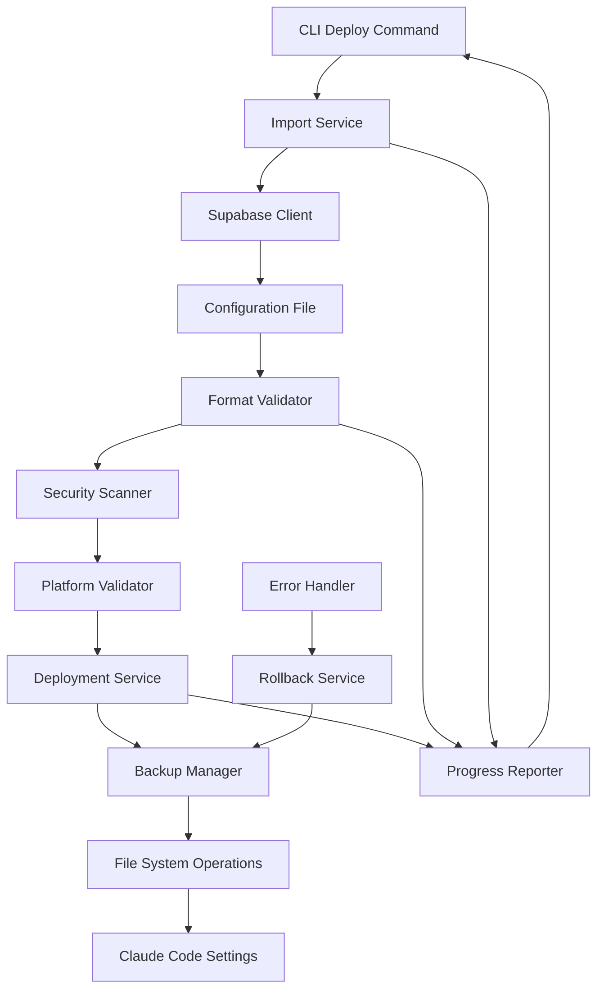

# Design Document

## Overview

This design outlines the implementation of Supabase import and Claude Code deployment functionality for the Taptik CLI. The system enables users to import configurations from Supabase cloud storage and deploy them to Claude Code IDE with comprehensive validation, security scanning, backup, and rollback capabilities. The design follows TDD principles and integrates seamlessly with existing Supabase integration and context validation modules.

## Architecture

### High-Level Flow

```
CLI Command → Import Service → Validation → Deployment Service → Claude Code
     ↓              ↓             ↓              ↓                ↓
  Options      Supabase      Security      Backup &         File System
  Parsing      Storage       Scanning      Rollback         Operations
```

### Component Interaction



### Module Structure

```
src/modules/deploy/
├── commands/
│   └── deploy.command.ts           # CLI command implementation
├── services/
│   ├── import.service.ts           # Supabase import operations
│   ├── deployment.service.ts       # Core deployment logic
│   ├── backup.service.ts           # Backup and rollback management
│   ├── platform-validator.service.ts # Platform-specific validation
│   ├── security-scanner.service.ts # Security scanning and validation
│   ├── locking.service.ts          # Concurrent deployment prevention
│   ├── diff.service.ts             # Configuration comparison and merging
│   └── prompt.service.ts           # User interaction and progress
├── interfaces/
│   ├── deploy-options.interface.ts # CLI options and configuration
│   ├── deployment-result.interface.ts # Deployment outcomes
│   ├── platform-config.interface.ts # Platform-specific configurations
│   ├── security-config.interface.ts # Security validation configuration
│   └── merge-strategy.interface.ts # Merge and conflict resolution
├── utils/
│   ├── path-resolver.util.ts       # Safe path resolution and validation
│   └── performance-optimizer.util.ts # Caching and parallel processing
├── constants/
│   ├── platform-paths.constants.ts # File paths for each platform
│   ├── exit-codes.constants.ts     # CLI exit codes
│   ├── deployment.constants.ts     # Deployment configuration
│   └── security.constants.ts       # Security patterns and rules
└── deploy.module.ts                # NestJS module definition
```

## Components and Interfaces

### 1. Deploy Command (commands/deploy.command.ts)

**Purpose**: CLI interface for the deploy functionality with comprehensive option handling

**Key Features**:

- Argument parsing and validation for config ID and options
- Progress reporting and user interaction
- Error handling with appropriate exit codes
- Integration with existing Supabase authentication

**Interface**:

```typescript
@Command({
  name: 'deploy',
  description: 'Import configuration from Supabase and deploy to target IDE',
})
export class DeployCommand extends CommandRunner {
  async run(passedParams: string[], options: DeployCommandOptions): Promise<void>;
}

interface DeployCommandOptions {
  platform?: 'claude-code' | 'kiro-ide' | 'cursor-ide';
  dryRun?: boolean;
  validate?: boolean;
  diff?: boolean;
  force?: boolean;
  only?: ComponentType[];
  skip?: ComponentType[];
  conflict?: ConflictStrategy;
  backupDir?: string;
}

type ComponentType = 'settings' | 'agents' | 'commands' | 'project';
type ConflictStrategy = 'skip' | 'overwrite' | 'merge' | 'backup';
```

### 2. Import Service (services/import.service.ts)

**Purpose**: Handle configuration import from Supabase Storage with validation

**Key Features**:

- Fetch configurations using Supabase client
- Parse and validate TaptikContext format
- Handle network errors with retry logic
- Cache imported configurations for performance

**Interface**:

```typescript
@Injectable()
export class ImportService {
  async importConfiguration(configId: string): Promise<TaptikContext>;
  async validateConfigExists(configId: string): Promise<boolean>;
  async getConfigMetadata(configId: string): Promise<CloudMetadataDto>;
  private async fetchFromStorage(configId: string): Promise<Buffer>;
  private async parseConfiguration(data: Buffer): Promise<TaptikContext>;
}
```

### 3. Platform Validator Service (services/platform-validator.service.ts)

**Purpose**: Platform-specific validation and compatibility checking

**Key Features**:

- Validate configuration compatibility with target platform
- Check required components and dependencies
- Provide platform-specific warnings and recommendations
- Extensible design for future platform support

**Interface**:

```typescript
@Injectable()
export class PlatformValidatorService {
  async validateForPlatform(context: TaptikContext, platform: string): Promise<ValidationResult>;
  async validateClaudeCode(context: TaptikContext): Promise<ValidationResult>;
  async checkPlatformSupport(platform: string): Promise<boolean>;
  private validateAgents(agents: AgentConfig[]): ValidationResult;
  private validateCommands(commands: CommandConfig[]): ValidationResult;
  private validateSettings(settings: ClaudeCodeSettings): ValidationResult;
}
```

### 4. Deployment Service (services/deployment.service.ts)

**Purpose**: Core deployment logic with component-specific handling

**Key Features**:

- Deploy configurations to Claude Code file system
- Handle selective deployment (only/skip options)
- Manage file conflicts with configurable strategies
- Track deployment progress and generate manifests

**Interface**:

```typescript
@Injectable()
export class DeploymentService {
  async deployToClaudeCode(context: TaptikContext, options: DeploymentOptions): Promise<DeploymentResult>;

  async deployGlobalSettings(settings: GlobalSettings): Promise<ComponentResult>;
  async deployAgents(agents: AgentConfig[]): Promise<ComponentResult>;
  async deployCommands(commands: CommandConfig[]): Promise<ComponentResult>;
  async deployProjectSettings(settings: ProjectSettings): Promise<ComponentResult>;

  private async handleFileConflict(filePath: string, newContent: string, strategy: ConflictStrategy): Promise<ConflictResult>;
}

interface DeploymentOptions {
  platform: string;
  components: ComponentType[];
  conflictStrategy: ConflictStrategy;
  backupDir: string;
  dryRun: boolean;
}

interface DeploymentResult {
  success: boolean;
  deployedComponents: ComponentResult[];
  conflicts: ConflictResult[];
  backupManifest: BackupManifest;
  summary: DeploymentSummary;
}
```

### 5. Security Scanner Service (services/security-scanner.service.ts)

**Purpose**: Comprehensive security validation and malicious content detection

**Key Features**:

- Scan for malicious commands and dangerous patterns
- Detect directory traversal attempts and path validation
- Validate command safety and permission requirements
- Sanitize sensitive data with configurable patterns

**Interface**:

```typescript
@Injectable()
export class SecurityScannerService {
  async scanForMaliciousCommands(content: string): Promise<SecurityScanResult>;
  async detectDirectoryTraversal(paths: string[]): Promise<boolean>;
  async validateCommandSafety(command: CommandConfig): Promise<boolean>;
  async sanitizeSensitiveData(context: TaptikContext): Promise<TaptikContext>;
  async runSecurityPipeline(context: TaptikContext): Promise<SecurityValidationResult>;

  private async validateCommands(commands: CommandConfig[]): Promise<CommandValidationResult>;
  private async validatePaths(paths: string[]): Promise<PathValidationResult>;
  private async scanSensitiveData(content: unknown): Promise<SensitiveDataResult>;
}

interface SecurityConfig {
  dangerousPatterns: RegExp[];
  whitelistedCommands: string[];
  sensitiveDataPatterns: RegExp[];
  pathValidation: {
    allowedPaths: string[];
    blockedPaths: string[];
  };
}
```

### 6. Locking Service (services/locking.service.ts)

**Purpose**: Prevent concurrent deployments and manage deployment locks

**Key Features**:

- Acquire and release deployment locks safely
- Detect and cleanup stale locks from interrupted deployments
- Support timeout-based lock expiration
- Provide lock status information for user feedback

**Interface**:

```typescript
@Injectable()
export class LockingService {
  async acquireLock(lockFile: string): Promise<LockHandle>;
  async releaseLock(handle: LockHandle): Promise<void>;
  async isLocked(lockFile: string): Promise<boolean>;
  async cleanupStaleLocks(): Promise<void>;
  async waitForLock(lockFile: string, timeout: number): Promise<boolean>;

  private async createLockFile(lockFile: string): Promise<LockHandle>;
  private async validateLockFile(lockFile: string): Promise<boolean>;
}

interface LockHandle {
  id: string;
  filePath: string;
  timestamp: Date;
  processId: number;
}
```

### 7. Diff Service (services/diff.service.ts)

**Purpose**: Configuration comparison and intelligent merging

**Key Features**:

- Generate detailed diffs between current and incoming configurations
- Format diff output for user-friendly display
- Apply merge strategies with conflict resolution
- Support component-level diff analysis

**Interface**:

```typescript
@Injectable()
export class DiffService {
  async generateDiff(current: TaptikContext, incoming: TaptikContext): Promise<DiffResult>;
  async formatDiffForDisplay(diff: DiffResult): Promise<string>;
  async applyDiff(diff: DiffResult, strategy: ConflictStrategy): Promise<TaptikContext>;
  async mergeConfigurations(local: TaptikContext, remote: TaptikContext, strategy: MergeStrategy): Promise<TaptikContext>;

  private async diffComponents(localComp: unknown, remoteComp: unknown): Promise<ComponentDiff>;
  private async mergePermissions(local: string[], remote: string[]): Promise<string[]>;
  private async mergeJsonObjects(local: object, remote: object, strategy: MergeStrategy): Promise<object>;
}

interface MergeStrategy {
  jsonMerge: {
    arrays: 'union' | 'concat' | 'replace';
    objects: 'deep' | 'shallow' | 'replace';
    conflicts: 'prefer-local' | 'prefer-remote' | 'interactive';
  };
  permissionMerge: {
    strategy: 'union';
    validation: boolean;
    sorting: boolean;
  };
  contentMerge: {
    strategy: 'version-based' | 'timestamp-based' | 'manual';
  };
}
```

### 8. Prompt Service (services/prompt.service.ts)

**Purpose**: User interaction and progress reporting

**Key Features**:

- Handle user confirmations and interactive prompts
- Display progress indicators and deployment status
- Manage conflict resolution user input
- Provide formatted output for CLI display

**Interface**:

```typescript
@Injectable()
export class PromptService {
  async confirmDeployment(summary: DeploymentSummary): Promise<boolean>;
  async selectConflictResolution(conflict: FileConflict): Promise<ConflictStrategy>;
  async showProgress(progress: ProgressInfo): void;
  async displayDiff(diff: DiffResult): Promise<boolean>;
  async confirmRollback(backupId: string): Promise<boolean>;

  private async createProgressBar(total: number): Promise<ProgressBar>;
  private async formatConflictOptions(conflict: FileConflict): Promise<string>;
}

interface ProgressInfo {
  current: number;
  total: number;
  stage: string;
  message: string;
}
```

### 9. Backup Service (services/backup.service.ts)

**Purpose**: Backup and rollback management for safe deployments

**Key Features**:

- Create timestamped backups before deployment
- Generate backup manifests for rollback operations
- Selective rollback for specific components
- Cleanup old backups with retention policies

**Interface**:

```typescript
@Injectable()
export class BackupService {
  async createBackup(platform: string, backupDir?: string): Promise<BackupManifest>;
  async rollbackDeployment(backupId: string): Promise<RollbackResult>;
  async rollbackComponent(backupId: string, component: ComponentType): Promise<RollbackResult>;
  async listBackups(): Promise<BackupManifest[]>;
  async cleanupOldBackups(retentionDays: number): Promise<void>;

  private async backupFile(filePath: string, backupDir: string): Promise<string>;
  private async restoreFile(backupPath: string, originalPath: string): Promise<void>;
}

interface BackupManifest {
  id: string;
  timestamp: Date;
  platform: string;
  files: BackupFileEntry[];
  deploymentOptions: DeploymentOptions;
}

interface BackupFileEntry {
  originalPath: string;
  backupPath: string;
  component: ComponentType;
  checksum: string;
}
```

### 10. Path Resolver Utility (utils/path-resolver.util.ts)

**Purpose**: Safe path resolution and validation to prevent security issues

**Key Features**:

- Resolve home directory paths programmatically
- Validate paths to prevent directory traversal
- Cross-platform path handling
- Security validation for all file operations

**Interface**:

```typescript
export class PathResolver {
  static resolvePath(path: string): string;
  static validatePath(path: string): boolean;
  static isWithinAllowedDirectory(path: string, allowedDirs: string[]): boolean;
  static sanitizePath(path: string): string;

  private static expandHomeDirectory(path: string): string;
  private static preventDirectoryTraversal(path: string): boolean;
}
```

### 11. Performance Optimizer Utility (utils/performance-optimizer.util.ts)

**Purpose**: Caching, parallel processing, and performance optimization

**Key Features**:

- Import and validation result caching
- Parallel deployment for independent components
- Streaming for large configuration files
- Memory and performance monitoring

**Interface**:

```typescript
export class PerformanceOptimizer {
  private importCache: Map<string, TaptikContext> = new Map();
  private validationCache: Map<string, ValidationResult> = new Map();

  async getCachedImport(configId: string): Promise<TaptikContext | null>;
  async setCachedImport(configId: string, context: TaptikContext): Promise<void>;
  async parallelDeploy(components: ComponentDeployment[]): Promise<DeploymentResult[]>;
  async streamLargeFile(filePath: string, threshold: number): Promise<ReadableStream>;

  private async checkCacheExpiry(key: string): Promise<boolean>;
  private async optimizeMemoryUsage(): Promise<void>;
}

interface PerformanceConfig {
  parallelDeployment: {
    enabled: boolean;
    maxConcurrency: number;
    components: ComponentType[];
  };
  caching: {
    importCache: Map<string, TaptikContext>;
    validationCache: Map<string, ValidationResult>;
    ttl: number;
  };
  streaming: {
    largeFileThreshold: number;
    useStreaming: boolean;
  };
}
```

## Security Architecture

### Security Pipeline

```typescript
class SecurityPipeline {
  stages = [
    'commandValidation', // Command safety verification
    'pathValidation', // Path security validation
    'sensitiveDataScan', // Sensitive data detection
    'permissionCheck', // Permission validation
    'integrityCheck', // Configuration integrity
  ];

  async runPipeline(context: TaptikContext): Promise<SecurityValidationResult> {
    const results: SecurityStageResult[] = [];

    for (const stage of this.stages) {
      const result = await this.runStage(stage, context);
      results.push(result);

      if (result.severity === SecuritySeverity.HIGH && result.blocking) {
        throw new SecurityError(`Security violation in ${stage}: ${result.message}`);
      }
    }

    return { passed: true, stages: results };
  }
}

interface SecurityValidationResult {
  passed: boolean;
  stages: SecurityStageResult[];
  warnings: string[];
  errors: string[];
  blockers: string[];
}
```

### Error Recovery Strategies

```typescript
interface ErrorRecoveryStrategy {
  networkErrors: {
    retryPolicy: ExponentialBackoffWithJitter;
    maxRetries: 3;
    timeout: 30000;
    resumable: boolean;
  };
  fileSystemErrors: {
    permissionFallback: 'request-sudo' | 'alternative-path';
    spaceCheck: 'pre-deployment';
    corruptionRecovery: 'from-backup';
  };
  deploymentErrors: {
    partialRollback: boolean;
    componentIsolation: boolean;
    dependencyTracking: boolean;
  };
}
```

## Data Models

### Platform Configuration Structure

```typescript
interface PlatformConfig {
  name: string;
  supported: boolean;
  paths: PlatformPaths;
  validator: (context: TaptikContext) => ValidationResult;
  deployer: (context: TaptikContext, options: DeploymentOptions) => Promise<DeploymentResult>;
}

interface PlatformPaths {
  globalSettings: string;
  agents?: string;
  commands?: string;
  projectSettings: string;
  instructions: string;
  mcp?: string;
}

const PLATFORM_CONFIGS: Record<string, PlatformConfig> = {
  'claude-code': {
    name: 'Claude Code',
    supported: true,
    paths: {
      globalSettings: '~/.claude/settings.json',
      agents: '~/.claude/agents/',
      commands: '~/.claude/commands/',
      projectSettings: '.claude/settings.json',
      instructions: 'CLAUDE.md',
      mcp: '.mcp.json',
    },
    validator: validateClaudeCode,
    deployer: deployToClaudeCode,
  },
  'kiro-ide': {
    name: 'Kiro IDE',
    supported: false, // Phase 2
    paths: {
      globalSettings: '~/.kiro/settings.json',
      projectSettings: '.kiro/settings.json',
      instructions: '.kiro/README.md',
    },
    validator: validateKiroIde,
    deployer: deployToKiroIde,
  },
};
```

### Claude Code Specific Models

```typescript
interface ClaudeCodeSettings {
  permissions?: string[];
  environmentVariables?: Record<string, string>;
  statusLine?: StatusLineConfig;
  theme?: string;
  fontSize?: number;
  autoSave?: boolean;
}

interface AgentConfig {
  name: string;
  description: string;
  content: string;
  metadata: {
    version: string;
    author: string;
    tags: string[];
  };
}

interface CommandConfig {
  name: string;
  description: string;
  content: string;
  permissions: string[];
  metadata: {
    version: string;
    author: string;
  };
}

interface StatusLineConfig {
  enabled: boolean;
  position: 'top' | 'bottom';
  components: string[];
}
```

## Error Handling

### Error Categories and Responses

```typescript
enum DeployErrorType {
  IMPORT_FAILED = 'IMPORT_FAILED',
  VALIDATION_FAILED = 'VALIDATION_FAILED',
  PLATFORM_UNSUPPORTED = 'PLATFORM_UNSUPPORTED',
  BACKUP_FAILED = 'BACKUP_FAILED',
  DEPLOYMENT_FAILED = 'DEPLOYMENT_FAILED',
  ROLLBACK_FAILED = 'ROLLBACK_FAILED',
  NETWORK_ERROR = 'NETWORK_ERROR',
  AUTH_ERROR = 'AUTH_ERROR',
  FILE_SYSTEM_ERROR = 'FILE_SYSTEM_ERROR',
}

interface DeployError extends Error {
  type: DeployErrorType;
  code: number;
  details: Record<string, unknown>;
  suggestions: string[];
  recoverable: boolean;
}
```

### Error Recovery Strategies

1. **Network Errors**: Exponential backoff retry with timeout
2. **Validation Errors**: Detailed error messages with fix suggestions
3. **File System Errors**: Permission checks and alternative paths
4. **Deployment Failures**: Automatic rollback with component isolation
5. **Authentication Errors**: Clear re-authentication instructions

## Testing Strategy

### Test Structure Following TDD

```typescript
// Test files structure
src/modules/deploy/
├── commands/
│   └── deploy.command.spec.ts
├── services/
│   ├── import.service.spec.ts
│   ├── deployment.service.spec.ts
│   ├── backup.service.spec.ts
│   └── platform-validator.service.spec.ts
└── deploy.module.spec.ts
```

### Test Categories

#### 1. Unit Tests (Red-Green-Refactor)

**Import Service Tests**:

```typescript
describe('ImportService', () => {
  describe('importConfiguration', () => {
    it('should fetch and parse valid configuration', async () => {
      // Red: Write failing test
      const mockConfigId = 'test-config-123';
      const expectedContext = createMockTaptikContext();

      // Mock Supabase client response
      mockSupabaseClient.storage.from.mockReturnValue({
        download: vi.fn().mockResolvedValue({ data: Buffer.from(JSON.stringify(expectedContext)) }),
      });

      // Green: Implement minimal code to pass
      const result = await importService.importConfiguration(mockConfigId);

      // Assert
      expect(result).toEqual(expectedContext);
      expect(mockSupabaseClient.storage.from).toHaveBeenCalledWith('taptik-configs');
    });

    it('should throw error for invalid config ID', async () => {
      // Test error handling
    });
  });
});
```

**Deployment Service Tests**:

```typescript
describe('DeploymentService', () => {
  describe('deployToClaudeCode', () => {
    it('should deploy global settings successfully', async () => {
      // Red: Write failing test for global settings deployment
    });

    it('should handle file conflicts with merge strategy', async () => {
      // Red: Write failing test for conflict resolution
    });

    it('should rollback on partial deployment failure', async () => {
      // Red: Write failing test for rollback mechanism
    });
  });
});
```

#### 2. Integration Tests

**End-to-End Command Tests**:

```typescript
describe('Deploy Command Integration', () => {
  it('should complete full deploy workflow', async () => {
    // Test complete import → validate → deploy → backup flow
  });

  it('should handle authentication errors gracefully', async () => {
    // Test Supabase auth integration
  });
});
```

#### 3. Platform-Specific Tests

**Claude Code Deployment Tests**:

```typescript
describe('Claude Code Platform', () => {
  it('should deploy agents to correct directory', async () => {
    // Test agent deployment to ~/.claude/agents/
  });

  it('should merge permissions arrays correctly', async () => {
    // Test intelligent permission merging
  });

  it('should preserve existing custom agents', async () => {
    // Test preservation of non-imported content
  });
});
```

### Mock Strategy

```typescript
// Mock Supabase client for testing
const mockSupabaseClient = {
  storage: {
    from: vi.fn().mockReturnValue({
      download: vi.fn(),
      upload: vi.fn(),
      list: vi.fn(),
    }),
  },
  auth: {
    getUser: vi.fn(),
    getSession: vi.fn(),
  },
};

// Mock file system operations
vi.mock('fs/promises', () => ({
  readFile: vi.fn(),
  writeFile: vi.fn(),
  mkdir: vi.fn(),
  access: vi.fn(),
  copyFile: vi.fn(),
}));

// Mock existing services
vi.mock('../context/utils/format-validator.utility', () => ({
  FormatValidator: {
    validateExportFormat: vi.fn(),
    validateDeployFormat: vi.fn(),
    sanitizeContext: vi.fn(),
  },
}));
```

## Implementation Approach

### Phase 1: Core Infrastructure (TDD)

1. **Write Tests First**: Create comprehensive test suite for all services
2. **Import Service**: Implement Supabase configuration fetching with validation
3. **Platform Validator**: Create Claude Code specific validation logic
4. **Basic Deployment**: Implement core deployment service with file operations

### Phase 2: Advanced Features (TDD)

1. **Backup System**: Implement backup and rollback mechanisms
2. **Conflict Resolution**: Add intelligent conflict handling strategies
3. **CLI Integration**: Create comprehensive command interface
4. **Error Handling**: Implement robust error recovery and reporting

### Phase 3: Optimization and Extension (TDD)

1. **Performance**: Optimize import and deployment operations
2. **Platform Extension**: Prepare architecture for Kiro IDE and Cursor IDE
3. **Advanced Features**: Add diff viewing, selective deployment
4. **Documentation**: Create comprehensive usage guides and examples

### Development Workflow

1. **Red**: Write failing test for specific functionality
2. **Green**: Implement minimal code to pass the test
3. **Refactor**: Improve code quality while keeping tests green
4. **Lint & Build**: Ensure code passes ESLint and TypeScript compilation
5. **Integration**: Test with existing Supabase and context modules
6. **Documentation**: Update usage examples and API documentation

This design provides a comprehensive foundation for implementing the Supabase import and Claude Code deployment functionality with proper TDD methodology, robust error handling, and extensible architecture for future platform support.

#### 4. Security Tests

**Security Validation Tests**:

```typescript
describe('Security Tests', () => {
  it('should block malicious commands', async () => {
    const maliciousCommand = { name: 'evil', content: 'rm -rf /' };
    const result = await securityScanner.validateCommandSafety(maliciousCommand);
    expect(result).toBe(false);
  });

  it('should prevent directory traversal', async () => {
    const dangerousPaths = ['../../../etc/passwd', '..\\..\\windows\\system32'];
    const result = await securityScanner.detectDirectoryTraversal(dangerousPaths);
    expect(result).toBe(true);
  });

  it('should sanitize sensitive data', async () => {
    const contextWithSecrets = createContextWithApiKeys();
    const sanitized = await securityScanner.sanitizeSensitiveData(contextWithSecrets);
    expect(sanitized.content).not.toContain('sk-');
  });

  it('should validate all user inputs', async () => {
    const userInput = '../../../malicious/path';
    const isValid = PathResolver.validatePath(userInput);
    expect(isValid).toBe(false);
  });
});
```

#### 5. Edge Case Tests

**Concurrent and Error Handling Tests**:

```typescript
describe('Edge Cases', () => {
  it('should handle concurrent deployments with lock file', async () => {
    // Test locking mechanism prevents concurrent deployments
    const lock1 = await lockingService.acquireLock('deploy.lock');
    const lock2Promise = lockingService.acquireLock('deploy.lock');

    await expect(lock2Promise).rejects.toThrow('Deployment already in progress');
    await lockingService.releaseLock(lock1);
  });

  it('should handle network interruption during import', async () => {
    // Test resumable downloads and retry logic
    mockSupabaseClient.storage.from().download.mockRejectedValueOnce(new Error('Network error'));
    mockSupabaseClient.storage.from().download.mockResolvedValueOnce({ data: mockConfigData });

    const result = await importService.importConfiguration('test-config');
    expect(result).toBeDefined();
  });

  it('should handle corrupted local state', async () => {
    // Test recovery from corrupted configuration files
    vi.mocked(fs.readFile).mockRejectedValueOnce(new Error('File corrupted'));

    const result = await backupService.rollbackDeployment('backup-123');
    expect(result.success).toBe(false);
    expect(result.error).toContain('corrupted');
  });

  it('should handle empty configuration', async () => {
    // Test graceful handling of empty or minimal configurations
    const emptyContext = { metadata: {}, content: {}, security: {} };
    const validation = await platformValidator.validateForPlatform(emptyContext, 'claude-code');

    expect(validation.warnings).toContain('No deployable content found');
  });

  it('should handle very large configurations (>10MB)', async () => {
    // Test streaming and memory management for large files
    const largeConfig = createLargeConfiguration(15 * 1024 * 1024); // 15MB
    const result = await performanceOptimizer.streamLargeFile(largeConfig, 10 * 1024 * 1024);

    expect(result).toBeInstanceOf(ReadableStream);
  });

  it('should handle version mismatch between IDE and config', async () => {
    // Test compatibility validation and warnings
    const futureVersionContext = createContextWithVersion('2.0.0');
    const validation = await platformValidator.validateForPlatform(futureVersionContext, 'claude-code');

    expect(validation.warnings).toContain('Version compatibility');
  });
});
```

### Enhanced Mock Strategy

```typescript
// Enhanced mocking for new services
const mockSecurityScanner = {
  scanForMaliciousCommands: vi.fn(),
  detectDirectoryTraversal: vi.fn(),
  validateCommandSafety: vi.fn(),
  sanitizeSensitiveData: vi.fn(),
  runSecurityPipeline: vi.fn(),
};

const mockLockingService = {
  acquireLock: vi.fn(),
  releaseLock: vi.fn(),
  isLocked: vi.fn(),
  cleanupStaleLocks: vi.fn(),
};

const mockDiffService = {
  generateDiff: vi.fn(),
  formatDiffForDisplay: vi.fn(),
  applyDiff: vi.fn(),
  mergeConfigurations: vi.fn(),
};

const mockPromptService = {
  confirmDeployment: vi.fn(),
  selectConflictResolution: vi.fn(),
  showProgress: vi.fn(),
  displayDiff: vi.fn(),
};

// Mock file system with security considerations
vi.mock('fs/promises', () => ({
  readFile: vi.fn(),
  writeFile: vi.fn(),
  mkdir: vi.fn(),
  access: vi.fn(),
  copyFile: vi.fn(),
  stat: vi.fn(),
  chmod: vi.fn(),
}));

// Mock path operations
vi.mock('path', () => ({
  join: vi.fn(),
  resolve: vi.fn(),
  dirname: vi.fn(),
  basename: vi.fn(),
  extname: vi.fn(),
}));

// Mock OS operations
vi.mock('os', () => ({
  homedir: vi.fn().mockReturnValue('/home/testuser'),
  platform: vi.fn().mockReturnValue('linux'),
  tmpdir: vi.fn().mockReturnValue('/tmp'),
}));
```

This enhanced design now includes all the critical missing components you identified:

✅ **Security Architecture**: Comprehensive security scanning, path validation, and malicious content detection ✅ **Concurrency Control**: Locking service to prevent concurrent deployments ✅ **Advanced Diff/Merge**: Intelligent configuration comparison and merging strategies ✅ **User Interaction**: Prompt service for confirmations and progress reporting ✅ **Performance Optimization**: Caching, parallel processing, and streaming for large files ✅ **Robust Error Recovery**: Network retry, file system fallbacks, and partial rollback ✅ **Comprehensive Testing**: Security tests, edge cases, and concurrent deployment scenarios

The design is now production-ready with proper security considerations and robust error handling mechanisms.
