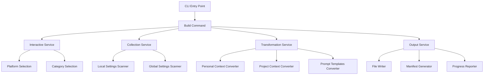

# Design Document

## Overview

The `taptik build` command is designed as a NestJS-based CLI command that provides an interactive interface for collecting and packaging AI IDE settings from Kiro into a standardized format. The design follows a modular architecture with clear separation of concerns between user interaction, data collection, transformation, and output generation.

The command operates in four main phases:
1. **Interactive Selection**: Platform and category selection through CLI prompts
2. **Data Collection**: Scanning and gathering settings from local and global Kiro directories
3. **Data Transformation**: Converting collected data to taptik standard specification format
4. **Output Generation**: Creating timestamped build directory with organized output files

## Architecture

### High-Level Architecture



### Module Structure

Following the established NestJS architecture pattern:

```
src/modules/build/
├── build.module.ts
├── commands/
│   └── build.command.ts
├── services/
│   ├── interactive.service.ts
│   ├── collection.service.ts
│   ├── transformation.service.ts
│   └── output.service.ts
├── interfaces/
│   ├── build-config.interface.ts
│   ├── settings-data.interface.ts
│   └── taptik-format.interface.ts
└── dto/
    └── build-options.dto.ts
```

## Components and Interfaces

### Core Interfaces

#### BuildConfig Interface
```typescript
interface BuildConfig {
  platform: 'kiro' | 'cursor' | 'claude-code';
  categories: BuildCategory[];
  outputPath: string;
  timestamp: Date;
}

interface BuildCategory {
  name: 'personal-context' | 'project-context' | 'prompt-templates';
  enabled: boolean;
}
```

#### SettingsData Interface
```typescript
interface SettingsData {
  personalContext?: PersonalContextData;
  projectContext?: ProjectContextData;
  promptTemplates?: PromptTemplateData[];
}

interface PersonalContextData {
  userPreferences: Record<string, any>;
  globalSettings: Record<string, any>;
  sourceFiles: string[];
}

interface ProjectContextData {
  contextFiles: FileData[];
  steeringFiles: FileData[];
  hookFiles: FileData[];
  sourceFiles: string[];
}

interface PromptTemplateData {
  name: string;
  content: string;
  metadata: Record<string, any>;
}
```

#### TaptikFormat Interface
```typescript
interface TaptikManifest {
  build_id: string;
  source_platform: string;
  categories: string[];
  created_at: string;
  taptik_version: string;
  source_files: string[];
}

interface TaptikPersonalContext {
  version: string;
  user_preferences: Record<string, any>;
  global_settings: Record<string, any>;
  metadata: {
    source_platform: string;
    collected_at: string;
  };
}

interface TaptikProjectContext {
  version: string;
  project_settings: Record<string, any>;
  steering_rules: SteeringRule[];
  hooks: HookDefinition[];
  metadata: {
    source_platform: string;
    project_path: string;
    collected_at: string;
  };
}
```

### Service Components

#### InteractiveService
**Responsibility**: Handle user interaction and input collection
- Platform selection with timeout handling
- Multi-select category interface
- Input validation and error handling
- Progress indication during user interaction

**Key Methods**:
```typescript
async selectPlatform(): Promise<string>
async selectCategories(): Promise<string[]>
async confirmSelection(config: BuildConfig): Promise<boolean>
```

#### CollectionService
**Responsibility**: Scan and collect settings from file system
- Local Kiro settings scanning (`.kiro/` directory)
- Global Kiro settings scanning (`~/.kiro/` directory)
- File existence validation and error handling
- Security filtering for sensitive data

**Key Methods**:
```typescript
async collectLocalSettings(): Promise<ProjectContextData>
async collectGlobalSettings(): Promise<PersonalContextData>
async collectPromptTemplates(): Promise<PromptTemplateData[]>
private filterSensitiveData(data: any): any
```

#### TransformationService
**Responsibility**: Convert collected data to taptik standard format
- Data mapping and transformation
- Schema validation
- Error handling for conversion failures
- Format compliance verification

**Key Methods**:
```typescript
async transformPersonalContext(data: PersonalContextData): Promise<TaptikPersonalContext>
async transformProjectContext(data: ProjectContextData): Promise<TaptikProjectContext>
async transformPromptTemplates(data: PromptTemplateData[]): Promise<TaptikPromptTemplates>
async validateOutput(data: any, schema: string): Promise<boolean>
```

#### OutputService
**Responsibility**: Generate output files and directory structure
- Timestamped directory creation
- JSON file generation
- Manifest creation
- Progress reporting and summary display

**Key Methods**:
```typescript
async createOutputDirectory(): Promise<string>
async writeOutputFiles(data: SettingsData, outputPath: string): Promise<void>
async generateManifest(config: BuildConfig, outputPath: string): Promise<void>
async displaySummary(outputPath: string): Promise<void>
```

## Data Models

### File System Scanning Strategy

#### Local Settings Scanning
- **Target Directory**: `./kiro/` (current working directory)
- **Files to Collect**:
  - `settings/context.md`
  - `settings/user-preferences.md`
  - `settings/project-spec.md`
  - `steering/*.md` (all markdown files)
  - `hooks/*.kiro.hook` (all hook files)

#### Global Settings Scanning
- **Target Directory**: `~/.kiro/` (user home directory)
- **Files to Collect**:
  - User configuration files
  - Global prompt templates
  - User preferences
- **Security Filtering**: Exclude API keys, tokens, and sensitive credentials

### Data Transformation Pipeline

#### Personal Context Transformation
```typescript
// Input: PersonalContextData
// Output: TaptikPersonalContext
{
  version: "1.0.0",
  user_preferences: {
    // Mapped from Kiro user preferences
    theme: "dark",
    editor_settings: {...},
    shortcuts: {...}
  },
  global_settings: {
    // Mapped from global Kiro settings
    default_templates: [...],
    global_hooks: [...]
  },
  metadata: {
    source_platform: "kiro",
    collected_at: "2025-01-04T10:30:00Z"
  }
}
```

#### Project Context Transformation
```typescript
// Input: ProjectContextData
// Output: TaptikProjectContext
{
  version: "1.0.0",
  project_settings: {
    // Mapped from project-specific settings
    context_files: [...],
    project_config: {...}
  },
  steering_rules: [
    {
      name: "rule_name",
      content: "rule_content",
      conditions: {...}
    }
  ],
  hooks: [
    {
      name: "hook_name",
      trigger: "trigger_type",
      action: "action_definition"
    }
  ],
  metadata: {
    source_platform: "kiro",
    project_path: "/path/to/project",
    collected_at: "2025-01-04T10:30:00Z"
  }
}
```

## Error Handling

### Error Categories and Strategies

#### File System Errors
- **Permission Denied**: Display clear error message with suggested resolution
- **File Not Found**: Log info message and continue with available files
- **Directory Not Accessible**: Log warning and continue with empty data

#### Data Processing Errors
- **JSON Parsing Failures**: Log specific file and error details, skip corrupted files
- **Conversion Failures**: Continue with other categories, report partial success
- **Schema Validation Failures**: Log validation errors, exclude invalid data

#### User Interaction Errors
- **Timeout Handling**: Exit gracefully after 30 seconds of inactivity
- **Invalid Selection**: Re-prompt user with error message
- **Interrupt Handling**: Cleanup partial files on Ctrl+C

### Error Recovery Mechanisms

```typescript
interface ErrorHandler {
  handleFileSystemError(error: Error, context: string): void;
  handleConversionError(error: Error, category: string): void;
  handleUserInterruptError(): Promise<void>;
  displayErrorSummary(errors: Error[]): void;
}
```

## Testing Strategy

### Unit Testing Approach
- **Service Testing**: Mock file system operations and test business logic
- **Command Testing**: Test CLI argument parsing and command execution flow
- **Transformation Testing**: Verify data mapping and format compliance
- **Error Handling Testing**: Test all error scenarios and recovery mechanisms

### Integration Testing
- **File System Integration**: Test actual file reading and writing operations
- **End-to-End Workflow**: Test complete build process with real data
- **Interactive Testing**: Test user interaction flows with mocked inputs

### Test Data Strategy
- **Fixture Files**: Create sample Kiro configuration files for testing
- **Mock Data**: Generate test data for various scenarios
- **Error Scenarios**: Create test cases for all error conditions

### Testing Structure
```
src/modules/build/
├── commands/
│   ├── build.command.ts
│   └── build.command.spec.ts
├── services/
│   ├── interactive.service.ts
│   ├── interactive.service.spec.ts
│   ├── collection.service.ts
│   ├── collection.service.spec.ts
│   ├── transformation.service.ts
│   ├── transformation.service.spec.ts
│   ├── output.service.ts
│   └── output.service.spec.ts
└── __tests__/
    ├── fixtures/
    │   ├── sample-kiro-settings/
    │   └── expected-outputs/
    └── integration/
        └── build-workflow.integration.spec.ts
```

This design provides a robust, maintainable, and testable implementation that addresses all requirements while following established architectural patterns and best practices.