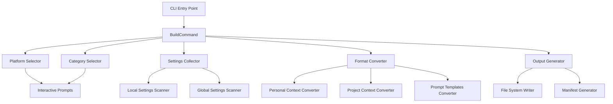

# Design Document

## Overview

The `taptik build` command is implemented as a NestJS command using the nest-commander framework. It provides an interactive CLI experience that guides users through platform and category selection, then collects and converts AI IDE settings into taptik's standardized format. The design emphasizes modularity, cross-platform compatibility, and robust error handling.

## Architecture

### High-Level Architecture



### Component Interaction Flow

1. **Command Initialization**: BuildCommand receives CLI arguments and initializes dependencies
2. **Interactive Selection**: Platform and category selection through inquirer prompts
3. **Settings Collection**: Parallel scanning of local and global Kiro configurations
4. **Data Conversion**: Transform collected settings to taptik specification format
5. **Output Generation**: Create timestamped directory with converted files and manifest

## Components and Interfaces

### Core Command Component

```typescript
@Command({
  name: 'build',
  description: 'Build configuration bundle from AI IDE settings'
})
export class BuildCommand extends CommandRunner {
  constructor(
    private readonly platformSelector: PlatformSelectorService,
    private readonly categorySelector: CategorySelectorService,
    private readonly settingsCollector: SettingsCollectorService,
    private readonly formatConverter: FormatConverterService,
    private readonly outputGenerator: OutputGeneratorService,
    private readonly logger: LoggerService
  ) {}

  async run(passedParams: string[], options?: BuildCommandOptions): Promise<void>
}
```

### Platform Selection Service

```typescript
export interface PlatformSelectorService {
  selectPlatform(): Promise<SupportedPlatform>;
}

export enum SupportedPlatform {
  KIRO = 'kiro',
  CURSOR = 'cursor',
  CLAUDE_CODE = 'claude_code'
}
```

### Category Selection Service

```typescript
export interface CategorySelectorService {
  selectCategories(): Promise<BuildCategory[]>;
}

export enum BuildCategory {
  PERSONAL_CONTEXT = 'personal',
  PROJECT_CONTEXT = 'project',
  PROMPT_TEMPLATES = 'prompts'
}
```

### Settings Collection Service

```typescript
export interface SettingsCollectorService {
  collectSettings(platform: SupportedPlatform, categories: BuildCategory[]): Promise<CollectedSettings>;
}

export interface CollectedSettings {
  local: LocalSettings;
  global: GlobalSettings;
  metadata: CollectionMetadata;
}

export interface LocalSettings {
  contextJson?: any;
  userPreferencesJson?: any;
  projectSpecJson?: any;
  prompts?: Record<string, any>;
  hooks?: Record<string, any>;
}

export interface GlobalSettings {
  userConfig?: any;
  globalPrompts?: Record<string, any>;
  preferences?: any;
}
```

### Format Conversion Service

```typescript
export interface FormatConverterService {
  convertToTaptikFormat(
    settings: CollectedSettings,
    categories: BuildCategory[]
  ): Promise<ConvertedOutput>;
}

export interface ConvertedOutput {
  personalContext?: PersonalContextSpec;
  projectContext?: ProjectContextSpec;
  promptTemplates?: PromptTemplatesSpec;
}

export interface PersonalContextSpec {
  category: 'personal';
  spec_version: string;
  data: {
    developer_profile: DeveloperProfile;
    coding_preferences: CodingPreferences;
    domain_knowledge: string[];
    communication_style: CommunicationStyle;
  };
}
```

### Output Generation Service

```typescript
export interface OutputGeneratorService {
  generateOutput(
    convertedData: ConvertedOutput,
    metadata: BuildMetadata
  ): Promise<BuildResult>;
}

export interface BuildResult {
  outputDirectory: string;
  files: GeneratedFile[];
  manifest: BuildManifest;
}

export interface BuildManifest {
  build_id: string;
  source_platform: string;
  categories: string[];
  created_at: string;
  taptik_version: string;
  source_files: {
    local: string[];
    global: string[];
  };
}
```

## Data Models

### Configuration File Locations

```typescript
export interface KiroConfigPaths {
  local: {
    contextJson: string;           // .kiro/context.json
    userPreferences: string;       // .kiro/user-preferences.json
    projectSpec: string;          // .kiro/project-spec.json
    promptsDir: string;           // .kiro/prompts/
    hooksDir: string;             // .kiro/hooks/
  };
  global: {
    userConfig: string;           // ~/.kiro/user-config.json
    globalPrompts: string;        // ~/.kiro/prompts/
    preferences: string;          // ~/.kiro/preferences.json
  };
}
```

### Conversion Mapping

```typescript
export interface ConversionMapping {
  personalContext: {
    developerProfile: {
      sourceFields: string[];
      defaultValues: any;
      transformFunction: (input: any) => DeveloperProfile;
    };
    codingPreferences: {
      sourceFields: string[];
      defaultValues: any;
      transformFunction: (input: any) => CodingPreferences;
    };
  };
  projectContext: {
    projectInfo: {
      sourceFields: string[];
      defaultValues: any;
      transformFunction: (input: any) => ProjectInfo;
    };
    techStack: {
      sourceFields: string[];
      defaultValues: any;
      transformFunction: (input: any) => TechStack;
    };
  };
  promptTemplates: {
    templates: {
      sourceFields: string[];
      transformFunction: (input: any) => Record<string, PromptTemplate>;
    };
  };
}
```

## Error Handling

### Error Categories and Responses

1. **Platform Not Supported**
   - Display friendly "coming soon" message
   - Exit gracefully with code 0
   - Log platform selection for analytics

2. **No Categories Selected**
   - Display help message explaining category selection
   - Show example usage
   - Exit with code 1

3. **Settings Not Found**
   - Differentiate between no Kiro installation vs. empty settings
   - Provide setup instructions for new users
   - Continue with partial data if some settings exist

4. **File Access Errors**
   - Handle permission denied errors gracefully
   - Provide platform-specific solutions
   - Continue with accessible files only

5. **Conversion Errors**
   - Log detailed error information
   - Use fallback values where possible
   - Generate partial output with warnings

6. **Output Generation Errors**
   - Handle disk space and permission issues
   - Provide clear error messages with solutions
   - Clean up partial files on failure

### Error Handling Strategy

```typescript
export class ErrorHandler {
  static async handleFileAccessError(error: Error, filePath: string): Promise<void> {
    if (error.code === 'ENOENT') {
      this.logger.warn(`Configuration file not found: ${filePath}`);
    } else if (error.code === 'EACCES') {
      this.logger.error(`Permission denied accessing: ${filePath}`);
      this.logger.info('Try running with appropriate permissions or check file ownership');
    } else {
      this.logger.error(`Unexpected error accessing ${filePath}: ${error.message}`);
    }
  }

  static async handleConversionError(error: Error, category: string, data: any): Promise<any> {
    this.logger.warn(`Conversion error for ${category}: ${error.message}`);
    this.logger.debug('Problematic data:', data);
    return this.getDefaultForCategory(category);
  }
}
```

## Testing Strategy

### Unit Testing Approach

1. **Command Testing**
   - Mock all service dependencies
   - Test argument parsing and validation
   - Verify correct service method calls
   - Test error propagation

2. **Service Testing**
   - Test each service in isolation
   - Mock file system operations
   - Test error handling scenarios
   - Verify data transformations

3. **Integration Testing**
   - Test service interactions
   - Use temporary file system for testing
   - Test cross-platform path handling
   - Verify complete workflow

### Test Data Strategy

```typescript
export const TestFixtures = {
  kiroLocalSettings: {
    validContextJson: { /* valid context data */ },
    invalidContextJson: { /* malformed data */ },
    emptyContextJson: {},
  },
  kiroGlobalSettings: {
    validUserConfig: { /* valid user config */ },
    missingUserConfig: null,
  },
  expectedOutputs: {
    personalContext: { /* expected personal context spec */ },
    projectContext: { /* expected project context spec */ },
    promptTemplates: { /* expected prompt templates spec */ },
  }
};
```

### Cross-Platform Testing

```typescript
describe('BuildCommand Cross-Platform', () => {
  describe('Windows', () => {
    beforeEach(() => {
      jest.spyOn(process, 'platform', 'get').mockReturnValue('win32');
      jest.spyOn(os, 'homedir').mockReturnValue('C:\\Users\\testuser');
    });

    it('should use Windows paths for Kiro settings', async () => {
      // Test Windows-specific path handling
    });
  });

  describe('macOS/Linux', () => {
    beforeEach(() => {
      jest.spyOn(process, 'platform', 'get').mockReturnValue('darwin');
      jest.spyOn(os, 'homedir').mockReturnValue('/Users/testuser');
    });

    it('should use Unix paths for Kiro settings', async () => {
      // Test Unix-specific path handling
    });
  });
});
```

## Implementation Details

### Dependencies Required

```json
{
  "dependencies": {
    "inquirer": "^9.2.0",
    "ora": "^7.0.0",
    "chalk": "^5.3.0",
    "fs-extra": "^11.1.0"
  },
  "devDependencies": {
    "@types/inquirer": "^9.0.0",
    "@types/fs-extra": "^11.0.0"
  }
}
```

### File Structure

```
src/
├── commands/
│   └── build/
│       ├── build.command.ts
│       ├── build.command.spec.ts
│       └── interfaces/
│           ├── build-options.interface.ts
│           ├── collected-settings.interface.ts
│           └── converted-output.interface.ts
├── services/
│   ├── platform-selector/
│   │   ├── platform-selector.service.ts
│   │   └── platform-selector.service.spec.ts
│   ├── category-selector/
│   │   ├── category-selector.service.ts
│   │   └── category-selector.service.spec.ts
│   ├── settings-collector/
│   │   ├── settings-collector.service.ts
│   │   ├── settings-collector.service.spec.ts
│   │   └── kiro/
│   │       ├── kiro-local-collector.ts
│   │       └── kiro-global-collector.ts
│   ├── format-converter/
│   │   ├── format-converter.service.ts
│   │   ├── format-converter.service.spec.ts
│   │   └── converters/
│   │       ├── personal-context.converter.ts
│   │       ├── project-context.converter.ts
│   │       └── prompt-templates.converter.ts
│   └── output-generator/
│       ├── output-generator.service.ts
│       └── output-generator.service.spec.ts
└── utils/
    ├── path-resolver.util.ts
    ├── security-filter.util.ts
    └── validation.util.ts
```

### Security Considerations

1. **Sensitive Data Filtering**
   - Maintain blacklist of sensitive field names
   - Use regex patterns to detect potential secrets
   - Implement data sanitization before output

2. **File System Security**
   - Validate all file paths to prevent directory traversal
   - Respect file permissions and ownership
   - Use secure temporary directories

3. **Data Validation**
   - Validate all input data against schemas
   - Sanitize user input from configuration files
   - Implement size limits for configuration files

```typescript
export class SecurityFilter {
  private static readonly SENSITIVE_FIELDS = [
    'password', 'token', 'key', 'secret', 'credential',
    'auth', 'api_key', 'private_key', 'access_token'
  ];

  static filterSensitiveData(data: any): any {
    if (typeof data !== 'object' || data === null) {
      return data;
    }

    const filtered = { ...data };
    for (const [key, value] of Object.entries(filtered)) {
      if (this.isSensitiveField(key)) {
        filtered[key] = '[FILTERED]';
      } else if (typeof value === 'object') {
        filtered[key] = this.filterSensitiveData(value);
      }
    }
    return filtered;
  }

  private static isSensitiveField(fieldName: string): boolean {
    const lowerField = fieldName.toLowerCase();
    return this.SENSITIVE_FIELDS.some(sensitive => 
      lowerField.includes(sensitive)
    );
  }
}
```