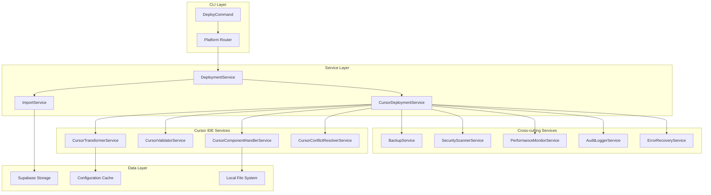
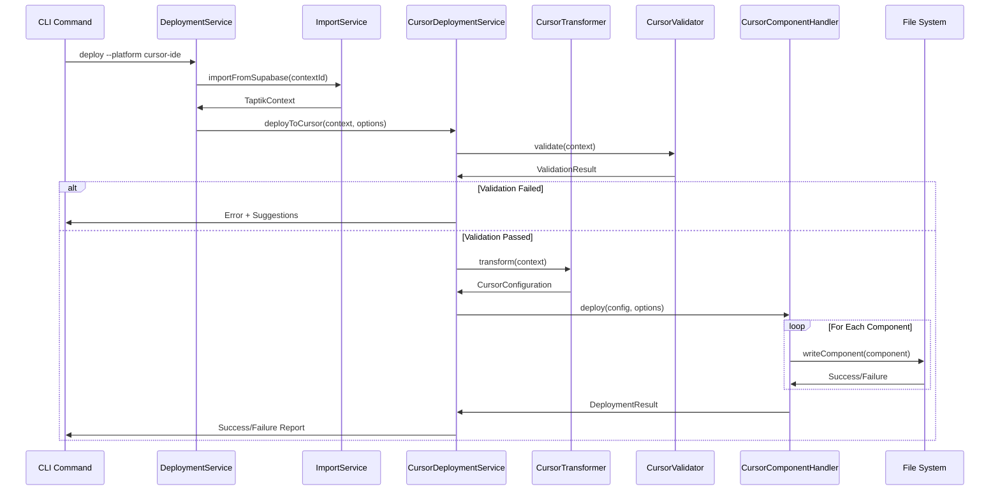
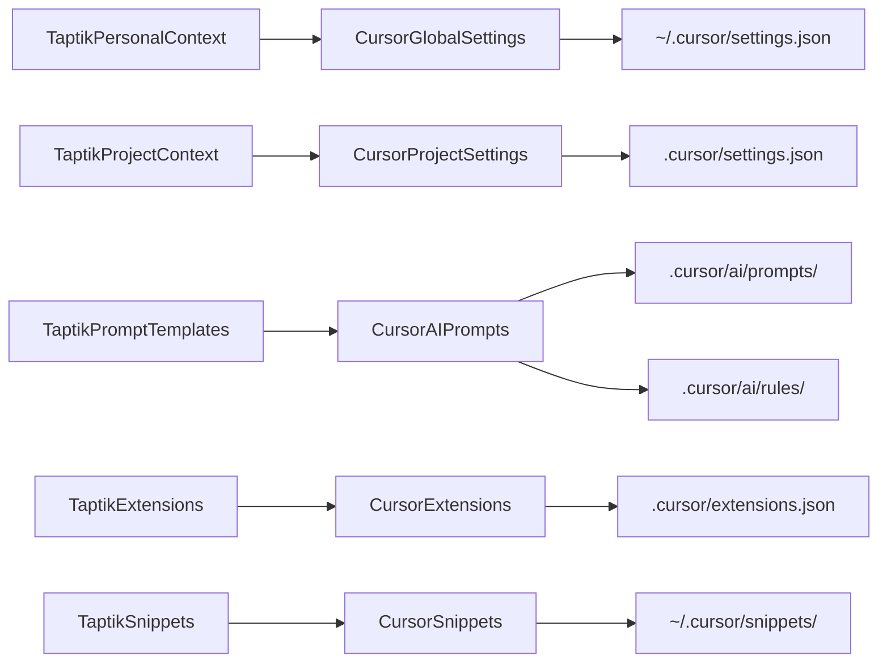
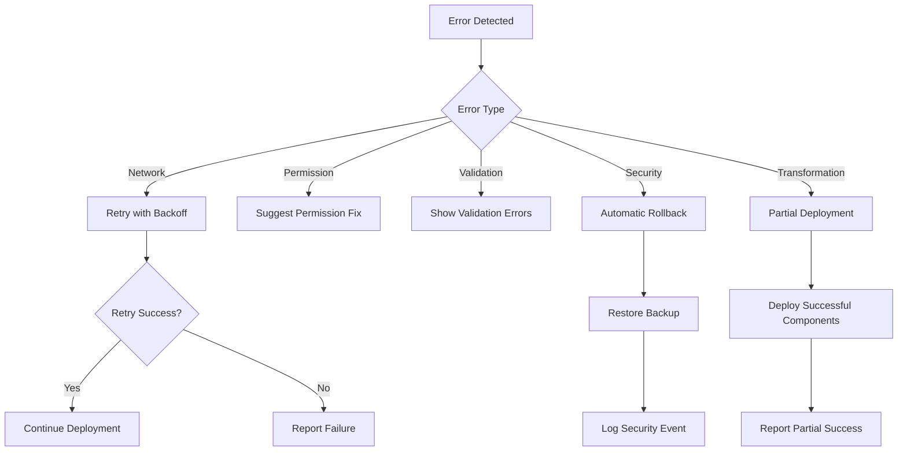
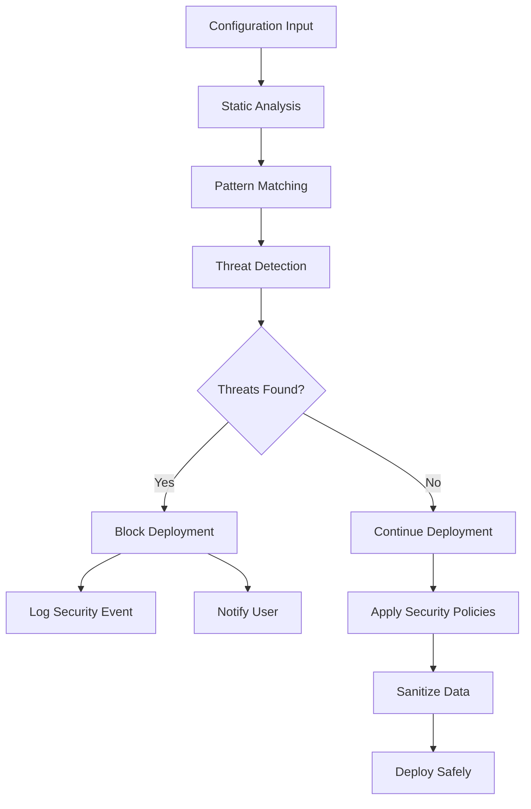

# Cursor IDE 배포 아키텍처 문서

## 개요

이 문서는 Taptik의 Cursor IDE 배포 기능의 아키텍처를 상세히 설명합니다. 시스템 설계, 컴포넌트 구조, 데이터 흐름, 그리고 확장성 고려사항을 다룹니다.

## 시스템 아키텍처

### 전체 아키텍처 다이어그램



### 레이어별 책임

#### 1. CLI Layer
- 사용자 입력 처리 및 검증
- 명령어 옵션 파싱
- 결과 출력 및 포맷팅

#### 2. Service Layer
- 비즈니스 로직 구현
- 플랫폼별 라우팅
- 서비스 간 조율

#### 3. Cursor IDE Services
- Cursor 특화 변환 로직
- Cursor 호환성 검증
- Cursor 컴포넌트 배포

#### 4. Cross-cutting Services
- 공통 기능 제공
- 보안, 성능, 감사 등

#### 5. Data Layer
- 데이터 저장 및 검색
- 캐싱 및 최적화

## 컴포넌트 상세 설계

### CursorDeploymentService

```typescript
@Injectable()
export class CursorDeploymentService {
  constructor(
    private cursorTransformer: CursorTransformerService,
    private cursorValidator: CursorValidatorService,
    private cursorComponentHandler: CursorComponentHandlerService,
    private cursorConflictResolver: CursorConflictResolverService,
    private backupService: BackupService,
    private securityScanner: CursorSecurityScannerService,
    private performanceMonitor: CursorPerformanceMonitorService,
    private auditLogger: CursorAuditLoggerService,
    private errorRecovery: ErrorRecoveryService,
  ) {}

  async deployToCursor(
    context: TaptikContext,
    options: DeployOptions,
  ): Promise<DeploymentResult> {
    // 배포 프로세스 조율
  }
}
```

**책임:**
- 전체 배포 프로세스 조율
- 서비스 간 의존성 관리
- 오류 처리 및 복구
- 성능 모니터링

### CursorTransformerService

```typescript
@Injectable()
export class CursorTransformerService {
  async transform(context: TaptikContext): Promise<CursorConfiguration> {
    // 변환 로직 구현
  }

  private async transformGlobalSettings(
    personalContext: TaptikPersonalContext,
  ): Promise<CursorGlobalSettings> {
    // 전역 설정 변환
  }

  private async transformProjectSettings(
    projectContext: TaptikProjectContext,
  ): Promise<CursorProjectSettings> {
    // 프로젝트 설정 변환
  }

  private async transformAIPrompts(
    context: TaptikContext,
  ): Promise<CursorAIPrompts> {
    // AI 프롬프트 변환
  }
}
```

**책임:**
- Taptik → Cursor 형식 변환
- 데이터 매핑 및 변환
- 기본값 처리
- 타입 안전성 보장

### CursorValidatorService

```typescript
@Injectable()
export class CursorValidatorService {
  async validate(context: TaptikContext): Promise<ValidationResult> {
    // 검증 로직 구현
  }

  private async validateBasicStructure(
    context: TaptikContext,
    errors: ValidationError[],
    warnings: ValidationWarning[],
  ): Promise<void> {
    // 기본 구조 검증
  }

  private async validateCursorCompatibility(
    context: TaptikContext,
    errors: ValidationError[],
    warnings: ValidationWarning[],
  ): Promise<void> {
    // Cursor 호환성 검증
  }
}
```

**책임:**
- 배포 전 검증
- 호환성 확인
- 오류 및 경고 생성
- 수정 제안 제공

### CursorComponentHandlerService

```typescript
@Injectable()
export class CursorComponentHandlerService {
  constructor(
    private cursorConflictResolver: CursorConflictResolverService,
    private fileService: FileService,
  ) {}

  async deploy(
    config: CursorConfiguration,
    options: DeployOptions,
  ): Promise<DeploymentResult> {
    // 컴포넌트별 배포 조율
  }

  private async deploySettings(
    config: CursorConfiguration,
    options: DeployOptions,
  ): Promise<ComponentDeploymentResult> {
    // 설정 파일 배포
  }

  private async deployAIPrompts(
    config: CursorConfiguration,
    options: DeployOptions,
  ): Promise<ComponentDeploymentResult> {
    // AI 프롬프트 배포
  }
}
```

**책임:**
- 컴포넌트별 배포 실행
- 파일 시스템 조작
- 충돌 처리
- 진행 상황 추적

## 데이터 흐름

### 배포 프로세스 흐름



### 데이터 변환 흐름



## 오류 처리 아키텍처

### 오류 분류 체계

```typescript
enum CursorDeploymentErrorCode {
  // 검증 오류 (1xx)
  INVALID_CONTEXT = 'CURSOR_INVALID_CONTEXT',
  MISSING_REQUIRED_FIELD = 'CURSOR_MISSING_REQUIRED_FIELD',
  INCOMPATIBLE_VERSION = 'CURSOR_INCOMPATIBLE_VERSION',
  
  // 파일 시스템 오류 (2xx)
  PERMISSION_DENIED = 'CURSOR_PERMISSION_DENIED',
  DISK_FULL = 'CURSOR_DISK_FULL',
  PATH_NOT_FOUND = 'CURSOR_PATH_NOT_FOUND',
  
  // 변환 오류 (3xx)
  TRANSFORMATION_FAILED = 'CURSOR_TRANSFORMATION_FAILED',
  DATA_LOSS_DETECTED = 'CURSOR_DATA_LOSS_DETECTED',
  
  // 보안 오류 (4xx)
  SECURITY_THREAT_DETECTED = 'CURSOR_SECURITY_THREAT_DETECTED',
  MALICIOUS_CONTENT = 'CURSOR_MALICIOUS_CONTENT',
  
  // 성능 오류 (5xx)
  TIMEOUT = 'CURSOR_TIMEOUT',
  MEMORY_LIMIT_EXCEEDED = 'CURSOR_MEMORY_LIMIT_EXCEEDED',
}
```

### 오류 복구 전략



## 성능 최적화

### 캐싱 전략

```typescript
interface CacheStrategy {
  // 설정 캐시
  configurationCache: {
    ttl: 300000; // 5분
    maxSize: 100;
    strategy: 'LRU';
  };
  
  // 검증 결과 캐시
  validationCache: {
    ttl: 600000; // 10분
    maxSize: 50;
    strategy: 'LRU';
  };
  
  // 변환 결과 캐시
  transformationCache: {
    ttl: 300000; // 5분
    maxSize: 50;
    strategy: 'LRU';
  };
}
```

### 병렬 처리

```typescript
class CursorParallelProcessorService {
  async processComponentsInParallel(
    components: CursorComponent[],
    config: CursorConfiguration,
    options: DeployOptions,
  ): Promise<ComponentDeploymentResult[]> {
    // 독립적인 컴포넌트들을 병렬로 처리
    const independentComponents = this.getIndependentComponents(components);
    const dependentComponents = this.getDependentComponents(components);
    
    // 1단계: 독립적인 컴포넌트들 병렬 처리
    const independentResults = await Promise.all(
      independentComponents.map(component => 
        this.deployComponent(component, config, options)
      )
    );
    
    // 2단계: 의존성이 있는 컴포넌트들 순차 처리
    const dependentResults = [];
    for (const component of dependentComponents) {
      const result = await this.deployComponent(component, config, options);
      dependentResults.push(result);
    }
    
    return [...independentResults, ...dependentResults];
  }
}
```

### 스트리밍 처리

```typescript
class LargeFileStreamerService {
  async streamLargeFile(
    filePath: string,
    content: string,
    options: StreamOptions,
  ): Promise<void> {
    if (content.length > options.streamThreshold) {
      // 대용량 파일은 스트리밍으로 처리
      const stream = new Readable({
        read() {
          // 청크 단위로 데이터 제공
        }
      });
      
      await pipeline(
        stream,
        createWriteStream(filePath),
      );
    } else {
      // 소용량 파일은 일반 처리
      await writeFile(filePath, content, 'utf8');
    }
  }
}
```

## 보안 아키텍처

### 보안 스캐닝 파이프라인



### 보안 정책

```typescript
interface SecurityPolicy {
  // 허용되지 않는 패턴
  blockedPatterns: string[];
  
  // 민감한 데이터 패턴
  sensitiveDataPatterns: string[];
  
  // 허용된 파일 확장자
  allowedExtensions: string[];
  
  // 최대 파일 크기
  maxFileSize: number;
  
  // 디렉토리 제한
  allowedDirectories: string[];
}
```

## 확장성 고려사항

### 새로운 IDE 플랫폼 추가

```typescript
// 1. 플랫폼별 인터페이스 정의
interface NewIDEConfiguration {
  globalSettings?: NewIDEGlobalSettings;
  projectSettings?: NewIDEProjectSettings;
  // ... 기타 설정
}

// 2. 변환 서비스 구현
@Injectable()
export class NewIDETransformerService {
  async transform(context: TaptikContext): Promise<NewIDEConfiguration> {
    // 변환 로직 구현
  }
}

// 3. 배포 서비스에 통합
export class DeploymentService {
  async deployToNewIDE(
    context: TaptikContext,
    options: DeployOptions,
  ): Promise<DeploymentResult> {
    // 새 IDE 배포 로직
  }
}
```

### 플러그인 아키텍처

```typescript
interface DeploymentPlugin {
  name: string;
  version: string;
  supportedPlatforms: string[];
  
  transform(context: TaptikContext): Promise<any>;
  validate(context: TaptikContext): Promise<ValidationResult>;
  deploy(config: any, options: DeployOptions): Promise<DeploymentResult>;
}

class PluginManager {
  private plugins: Map<string, DeploymentPlugin> = new Map();
  
  registerPlugin(plugin: DeploymentPlugin): void {
    this.plugins.set(plugin.name, plugin);
  }
  
  getPlugin(name: string): DeploymentPlugin | undefined {
    return this.plugins.get(name);
  }
}
```

## 모니터링 및 관찰성

### 메트릭 수집

```typescript
interface DeploymentMetrics {
  // 성능 메트릭
  deploymentDuration: number;
  transformationDuration: number;
  validationDuration: number;
  fileWriteDuration: number;
  
  // 사용량 메트릭
  componentsDeployed: number;
  filesProcessed: number;
  conflictsResolved: number;
  
  // 오류 메트릭
  errorCount: number;
  warningCount: number;
  rollbackCount: number;
}
```

### 로깅 전략

```typescript
class CursorAuditLoggerService {
  async logDeploymentStart(
    contextId: string,
    options: DeployOptions,
  ): Promise<void> {
    // 배포 시작 로그
  }
  
  async logComponentDeployment(
    component: string,
    result: ComponentDeploymentResult,
  ): Promise<void> {
    // 컴포넌트별 배포 로그
  }
  
  async logSecurityEvent(
    event: SecurityEvent,
  ): Promise<void> {
    // 보안 이벤트 로그
  }
  
  async logPerformanceMetrics(
    metrics: DeploymentMetrics,
  ): Promise<void> {
    // 성능 메트릭 로그
  }
}
```

## 테스트 아키텍처

### 테스트 피라미드

```
    E2E Tests (10%)
   ┌─────────────────┐
   │ Full CLI Tests  │
   └─────────────────┘
  
  Integration Tests (30%)
 ┌───────────────────────┐
 │ Service Integration   │
 │ File System Tests     │
 │ Supabase Integration  │
 └───────────────────────┘

    Unit Tests (60%)
┌─────────────────────────────┐
│ Service Logic Tests         │
│ Transformation Tests        │
│ Validation Tests            │
│ Error Handling Tests        │
└─────────────────────────────┘
```

### 테스트 전략

```typescript
// 단위 테스트
describe('CursorTransformerService', () => {
  it('should transform personal context to global settings', async () => {
    // 테스트 구현
  });
});

// 통합 테스트
describe('Cursor IDE Deployment Integration', () => {
  it('should deploy complete configuration to Cursor IDE', async () => {
    // 통합 테스트 구현
  });
});

// E2E 테스트
describe('CLI Cursor Deployment E2E', () => {
  it('should deploy via CLI command', async () => {
    // E2E 테스트 구현
  });
});
```

## 배포 및 운영

### 배포 파이프라인

```yaml
# CI/CD Pipeline
stages:
  - test
  - build
  - deploy

test:
  script:
    - pnpm test
    - pnpm test:e2e
    - pnpm test:coverage

build:
  script:
    - pnpm build
    - pnpm package

deploy:
  script:
    - pnpm publish
```

### 운영 모니터링

```typescript
interface OperationalMetrics {
  // 사용량 통계
  dailyDeployments: number;
  platformUsage: Record<string, number>;
  componentUsage: Record<string, number>;
  
  // 성능 통계
  averageDeploymentTime: number;
  p95DeploymentTime: number;
  errorRate: number;
  
  // 사용자 통계
  activeUsers: number;
  newUsers: number;
  retentionRate: number;
}
```

이 아키텍처 문서는 Cursor IDE 배포 기능의 전체적인 설계와 구현 방향을 제시하며, 향후 확장과 유지보수를 위한 가이드라인을 제공합니다.