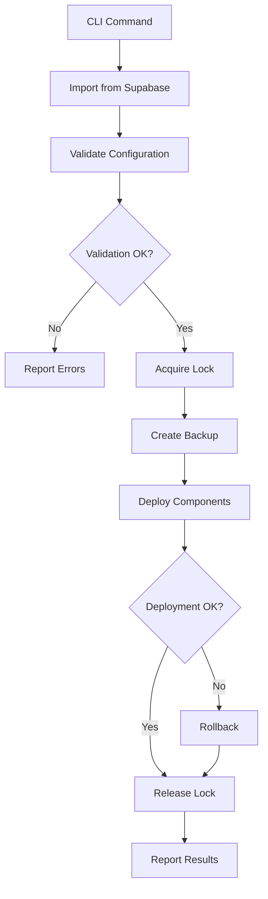

# Deploy Module Documentation

## Overview

The Deploy module provides comprehensive functionality for deploying Taptik configurations to various IDE platforms, with current support for Claude Code. It handles configuration import from Supabase, validation, deployment, backup, and rollback operations with robust error handling and logging.

## Table of Contents

- [CLI Usage](#cli-usage)
- [Architecture](#architecture)
- [Services](#services)
- [Error Handling](#error-handling)
- [Security](#security)
- [Performance](#performance)
- [Troubleshooting](#troubleshooting)
- [Platform Extension](#platform-extension)

## CLI Usage

### Basic Command

```bash
taptik deploy [options]
```

### Options

| Flag | Description | Default | Example |
|------|-------------|---------|---------|
| `-p, --platform <platform>` | Target platform for deployment | `claudeCode` | `--platform claudeCode` |
| `-c, --context-id <id>` | Configuration ID to deploy | `latest` | `--context-id config-123` |
| `-d, --dry-run` | Simulate deployment without changes | `false` | `--dry-run` |
| `-v, --validate-only` | Only validate configuration | `false` | `--validate-only` |
| `-s, --conflict-strategy <strategy>` | Conflict resolution strategy | `prompt` | `--conflict-strategy overwrite` |
| `--components <components...>` | Specific components to deploy | all | `--components settings agents` |
| `--skip-components <components...>` | Components to skip | none | `--skip-components commands` |
| `-f, --force` | Force deployment without prompts | `false` | `--force` |

### Conflict Strategies

- **prompt**: Ask user for each conflict (default)
- **overwrite**: Replace existing files
- **merge**: Intelligently merge configurations
- **skip**: Keep existing files unchanged
- **backup**: Create backup before overwriting

### Component Types

- **settings**: Global Claude Code settings (~/.claude/settings.json)
- **agents**: Custom agents (~/.claude/agents/)
- **commands**: Custom commands (~/.claude/commands/)
- **project**: Project-specific files (CLAUDE.md, .claude/settings.json)

## Usage Examples

### Basic Deployment

Deploy the latest configuration to Claude Code:

```bash
taptik deploy
```

### Deploy Specific Configuration

Deploy a specific configuration by ID:

```bash
taptik deploy --context-id my-config-2024
```

### Validation Only

Validate configuration without deploying:

```bash
taptik deploy --validate-only
```

### Dry Run

Preview what will be deployed without making changes:

```bash
taptik deploy --dry-run
```

### Selective Component Deployment

Deploy only settings and agents:

```bash
taptik deploy --components settings agents
```

Skip commands during deployment:

```bash
taptik deploy --skip-components commands
```

### Conflict Resolution

Always overwrite existing files:

```bash
taptik deploy --conflict-strategy overwrite
```

Create backups before overwriting:

```bash
taptik deploy --conflict-strategy backup
```

### Force Deployment

Deploy without any confirmation prompts:

```bash
taptik deploy --force --conflict-strategy overwrite
```

## Architecture

### Module Structure

```
src/modules/deploy/
├── commands/           # CLI command handlers
│   └── deploy.command.ts
├── services/           # Core business logic
│   ├── deployment.service.ts      # Main deployment orchestrator
│   ├── import.service.ts          # Supabase import
│   ├── platform-validator.service.ts # Platform validation
│   ├── backup.service.ts          # Backup management
│   ├── error-recovery.service.ts  # Error recovery
│   ├── diff.service.ts            # Configuration comparison
│   ├── locking.service.ts         # Deployment locking
│   ├── security-scanner.service.ts # Security validation
│   ├── error-handler.service.ts   # Error handling with retry
│   └── deployment-logger.service.ts # Logging and audit
├── interfaces/         # TypeScript interfaces
├── constants/          # Constants and configurations
├── errors/            # Custom error classes
└── utils/             # Utility functions
```

### Deployment Flow



## Services

### DeploymentService

Main orchestrator for deployment operations.

```typescript
class DeploymentService {
  async deployToClaudeCode(
    context: TaptikContext,
    options: DeployOptions
  ): Promise<DeploymentResult>
}
```

**Key Features:**
- Component-specific deployment logic
- Dry-run and validation modes
- Automatic backup creation
- Progress tracking

### ImportService

Handles importing configurations from Supabase.

```typescript
class ImportService {
  async importFromSupabase(configId: string): Promise<TaptikContext>
  async importConfiguration(configId: string): Promise<TaptikContext>
  async validateConfigExists(configId: string): Promise<boolean>
}
```

**Features:**
- Automatic retry with exponential backoff
- Configuration caching
- Metadata validation

### BackupService

Manages backup creation and restoration.

```typescript
class BackupService {
  async createBackup(filePath: string): Promise<string>
  async rollback(backupPath: string): Promise<void>
  async rollbackComponent(manifestPath: string, componentType: string): Promise<void>
  async rollbackWithDependencies(manifestPath: string, componentType: string): Promise<void>
}
```

**Features:**
- Timestamped backups
- Component-level rollback
- Dependency-aware restoration
- Automatic cleanup of old backups

### SecurityScannerService

Validates configurations for security threats.

```typescript
class SecurityScannerService {
  async scanForMaliciousCommands(commands: any[]): Promise<SecurityScanResult>
  async detectDirectoryTraversal(paths: string[]): Promise<boolean>
  async sanitizeSensitiveData(context: TaptikContext): Promise<TaptikContext>
}
```

**Security Checks:**
- Malicious command patterns (rm -rf, format, etc.)
- Directory traversal attempts
- Sensitive data exposure (API keys, passwords)
- Path injection attacks

### ErrorHandlerService

Provides structured error handling with recovery strategies.

```typescript
class ErrorHandlerService {
  async handleError(error: unknown, context: ErrorContext): Promise<DeployError>
  async executeWithRetry<T>(fn: () => Promise<T>, context: ErrorContext): Promise<T>
  async handleNetworkError<T>(fn: () => Promise<T>): Promise<T>
  async handleFileSystemError<T>(fn: () => Promise<T>): Promise<T>
}
```

**Recovery Strategies:**
- Network errors: 5 retries with exponential backoff
- File system errors: Alternative path attempts
- Security violations: Immediate rollback
- Lock failures: Extended retry with gradual delay

### LockingService

Prevents concurrent deployments.

```typescript
class LockingService {
  async acquireLock(lockFile: string): Promise<LockHandle>
  async releaseLock(handle: LockHandle): Promise<void>
  async isLocked(lockFile: string): Promise<boolean>
  async waitForLock(lockFile: string, timeout: number): Promise<boolean>
}
```

**Features:**
- Process-based locking
- Stale lock detection
- Automatic cleanup
- Configurable timeouts

## Error Handling

### Error Code Categories

| Range | Category | Description |
|-------|----------|-------------|
| 1xx | Import | Configuration import errors |
| 2xx | Validation | Validation failures |
| 3xx | Security | Security violations |
| 4xx | File System | File operation errors |
| 5xx | Deployment | Deployment failures |
| 6xx | Recovery | Recovery errors |
| 9xx | Unknown | Unexpected errors |

### Common Error Codes

| Code | Name | Description | Recovery |
|------|------|-------------|----------|
| 100 | IMPORT_FAILED | Failed to import configuration | Check network, verify config ID |
| 103 | NETWORK_ERROR | Network connectivity issue | Automatic retry with backoff |
| 200 | VALIDATION_FAILED | Configuration validation failed | Fix configuration format |
| 301 | MALICIOUS_CONTENT | Malicious patterns detected | Review configuration, automatic rollback |
| 304 | PERMISSION_DENIED | Insufficient permissions | Check file permissions, try sudo |
| 500 | DEPLOYMENT_FAILED | Deployment operation failed | Automatic rollback |
| 504 | LOCK_ACQUISITION_FAILED | Could not acquire deployment lock | Wait or force unlock |

### Error Recovery Examples

```typescript
// Network error with automatic retry
try {
  await importService.importFromSupabase('config-123');
} catch (error) {
  // Automatically retries 5 times with exponential backoff
  // Delays: 2s, 4s, 8s, 16s, 32s
}

// Security violation with automatic rollback
try {
  await deploymentService.deployToClaudeCode(context, options);
} catch (error) {
  if (error.code === DeployErrorCode.MALICIOUS_CONTENT) {
    // Automatic rollback triggered
    // Cleanup performed
    // Security event logged to audit trail
  }
}
```

## Security

### Security Features

1. **Malicious Command Detection**
   - Dangerous command patterns blocked
   - System modification commands prevented
   - Network access commands restricted

2. **Path Security**
   - Directory traversal prevention
   - Symlink attack prevention
   - Restricted to safe directories

3. **Sensitive Data Protection**
   - Automatic API key detection
   - Password filtering
   - Token sanitization in logs

4. **Audit Trail**
   - All security events logged
   - Deployment actions tracked
   - User actions recorded

### Security Best Practices

1. **Review Configurations**
   - Always review configurations before deployment
   - Use `--dry-run` to preview changes
   - Validate with `--validate-only`

2. **Use Minimal Permissions**
   - Don't run with sudo unless necessary
   - Use appropriate file permissions
   - Restrict access to configuration files

3. **Monitor Audit Logs**
   - Check `~/.taptik/audit/` for security events
   - Review failed deployment attempts
   - Monitor for suspicious patterns

## Performance

### Optimization Features

1. **Caching**
   - Configuration caching with TTL
   - Validation result caching
   - Component metadata caching

2. **Parallel Processing**
   - Independent components deployed in parallel
   - Concurrent file operations
   - Batch validation

3. **Large File Handling**
   - Streaming for files > 10MB
   - Progressive loading
   - Memory-efficient processing

### Performance Guidelines

- **Small Configurations (< 1MB)**: Instant deployment
- **Medium Configurations (1-10MB)**: 2-5 seconds
- **Large Configurations (> 10MB)**: Streaming mode activated

## Troubleshooting

### Common Issues

#### 1. Lock Acquisition Failed

**Error**: `Lock file already exists. Another deployment may be in progress.`

**Solutions**:
```bash
# Wait for current deployment to complete
taptik deploy --wait

# Force unlock if deployment is stuck
taptik deploy --force-unlock

# Check for stale locks
ls -la ~/.claude/.locks/
```

#### 2. Permission Denied

**Error**: `EACCES: permission denied`

**Solutions**:
```bash
# Check file permissions
ls -la ~/.claude/

# Fix permissions
chmod 755 ~/.claude
chmod 644 ~/.claude/settings.json

# Use sudo if necessary
sudo taptik deploy
```

#### 3. Network Errors

**Error**: `Network timeout` or `ECONNREFUSED`

**Solutions**:
```bash
# Check internet connection
ping supabase.co

# Retry with extended timeout
taptik deploy --timeout 60000

# Use offline mode if available
taptik deploy --offline --context-file ./backup.json
```

#### 4. Validation Failures

**Error**: `Configuration validation failed`

**Solutions**:
```bash
# Run validation only to see details
taptik deploy --validate-only

# Check specific component
taptik deploy --validate-only --components settings

# View validation report
cat ~/.taptik/logs/deploy-*.log | grep VALIDATION
```

#### 5. Malicious Content Detected

**Error**: `Malicious patterns detected in configuration`

**Solutions**:
1. Review the configuration for dangerous commands
2. Check for unintended system modifications
3. Validate the source of the configuration
4. Report if configuration was shared publicly

### Debug Mode

Enable verbose logging for troubleshooting:

```bash
# Set environment variable
export NODE_ENV=development
export DEBUG=taptik:*

# Run with verbose output
taptik deploy --verbose

# Check logs
tail -f ~/.taptik/logs/deploy-*.log
```

### Log Locations

- **Deployment Logs**: `~/.taptik/logs/deploy-YYYY-MM-DD.log`
- **Audit Trail**: `~/.taptik/audit/audit-YYYY-MM-DD.log`
- **Backups**: `~/.taptik/backups/`

## Platform Extension

### Adding New Platform Support

To add support for a new IDE platform (e.g., Kiro IDE, Cursor IDE):

#### 1. Create Platform Configuration

```typescript
// src/modules/deploy/constants/platform-paths.constants.ts
export const KIRO_PATHS = {
  GLOBAL_SETTINGS: '~/.kiro/settings.json',
  PROJECT_SETTINGS: '.kiro/settings.json',
  SPECS: '.kiro/specs',
  STEERING: '.kiro/steering',
  HOOKS: '.kiro/hooks',
};
```

#### 2. Implement Platform Validator

```typescript
// src/modules/deploy/services/platform-validator.service.ts
async validateForKiro(context: TaptikContext): Promise<ValidationResult> {
  // Platform-specific validation logic
  return {
    isValid: true,
    errors: [],
    warnings: [],
  };
}
```

#### 3. Add Deployment Logic

```typescript
// src/modules/deploy/services/deployment.service.ts
async deployToKiro(
  context: TaptikContext,
  options: DeployOptions
): Promise<DeploymentResult> {
  // Platform-specific deployment logic
  // 1. Validate for platform
  // 2. Map components to platform structure
  // 3. Deploy files
  // 4. Handle platform-specific features
}
```

#### 4. Register Platform

```typescript
// src/modules/deploy/interfaces/component-types.interface.ts
export type SupportedPlatform = 'claudeCode' | 'kiroIde' | 'cursorIde';
```

#### 5. Update CLI Command

```typescript
// src/modules/deploy/commands/deploy.command.ts
if (platform === 'kiroIde') {
  result = await this.deploymentService.deployToKiro(context, options);
}
```

### Platform-Specific Features

Each platform may have unique features that require special handling:

#### Claude Code
- MCP server configurations
- CLAUDE.md documentation
- Global and project settings

#### Kiro IDE (Future)
- Spec-driven development files
- Steering configurations
- Hook scripts

#### Cursor IDE (Future)
- AI model configurations
- Custom prompts
- Extension settings

## API Reference

### Interfaces

#### DeployOptions

```typescript
interface DeployOptions {
  platform: SupportedPlatform;
  dryRun?: boolean;
  validateOnly?: boolean;
  conflictStrategy?: ConflictStrategy;
  components?: ComponentType[];
  skipComponents?: ComponentType[];
  force?: boolean;
  timeout?: number;
}
```

#### DeploymentResult

```typescript
interface DeploymentResult {
  success: boolean;
  platform: string;
  deployedComponents: string[];
  conflicts: ConflictResult[];
  backupManifest?: BackupManifest;
  summary: DeploymentSummary;
  errors?: DeploymentError[];
  warnings?: DeploymentWarning[];
  metadata?: {
    backupCreated?: string;
    timestamp?: Date;
  };
}
```

#### TaptikContext

```typescript
interface TaptikContext {
  metadata: ContextMetadata;
  content: ContextContent;
  security: SecurityInfo;
}
```

## Testing

### Unit Tests

Run unit tests for the deploy module:

```bash
pnpm test src/modules/deploy
```

### Integration Tests

Run integration tests:

```bash
pnpm test:e2e src/modules/deploy/deploy.integration.spec.ts
```

### Test Coverage

Check test coverage:

```bash
pnpm test:coverage src/modules/deploy
```

Current coverage targets:
- Lines: 80%
- Statements: 80%
- Branches: 60%
- Functions: 60%

## Contributing

### Development Setup

1. Clone the repository
2. Install dependencies: `pnpm install`
3. Build the project: `pnpm build`
4. Run tests: `pnpm test`

### Code Style

- Follow NestJS conventions
- Use TypeScript strict mode
- Maintain 80%+ test coverage
- Document public APIs

### Submitting Changes

1. Create a feature branch
2. Write tests for new features
3. Update documentation
4. Submit pull request

## License

This module is part of the Taptik CLI project and follows the same license terms.