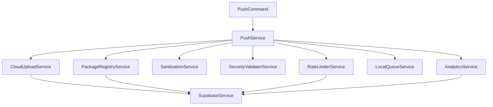

# Push Module Developer Guide

## Table of Contents

- [Getting Started](#getting-started)
- [Architecture Overview](#architecture-overview)
- [Development Setup](#development-setup)
- [Extending the Module](#extending-the-module)
- [Testing Guidelines](#testing-guidelines)
- [Debugging](#debugging)
- [Contributing](#contributing)

## Getting Started

The Push module enables cloud synchronization of Taptik packages with Supabase. This guide helps developers understand, extend, and maintain the module.

### Prerequisites

- Node.js 18+ and pnpm
- Supabase account and project
- TypeScript knowledge
- NestJS familiarity
- Understanding of cloud storage concepts

### Quick Setup

1. Clone the repository:
```bash
git clone https://github.com/taptik/taptik-cli.git
cd taptik-cli
```

2. Install dependencies:
```bash
pnpm install
```

3. Configure environment:
```bash
cp .env.example .env
# Edit .env with your Supabase credentials
```

4. Run tests:
```bash
pnpm run test:run src/modules/push
```

## Architecture Overview

### Module Structure

```
src/modules/push/
├── commands/           # CLI command implementations
│   ├── push.command.ts
│   ├── list.command.ts
│   └── delete.command.ts
├── services/          # Business logic services
│   ├── push.service.ts           # Main orchestrator
│   ├── cloud-upload.service.ts   # Upload handling
│   ├── package-registry.service.ts # Database operations
│   ├── sanitization.service.ts   # Data sanitization
│   ├── security-validator.service.ts # Security checks
│   ├── rate-limiter.service.ts   # Rate limiting
│   ├── local-queue.service.ts    # Offline queue
│   └── analytics.service.ts      # Usage tracking
├── interfaces/        # TypeScript interfaces
│   ├── push-options.interface.ts
│   ├── package-metadata.interface.ts
│   └── upload-progress.interface.ts
├── dto/              # Data transfer objects
│   ├── create-package.dto.ts
│   └── update-package.dto.ts
├── errors/           # Custom error classes
│   └── push.error.ts
├── constants/        # Constants and configs
│   └── push.constants.ts
├── utils/           # Utility functions
│   └── checksum.util.ts
└── tests/           # Test files
    ├── unit/
    ├── integration/
    └── e2e/
```

### Service Dependencies



### Data Flow

1. **Input Validation**: User input validated via DTOs
2. **Security Check**: Content scanned for threats
3. **Sanitization**: Sensitive data removed
4. **Rate Limiting**: User limits checked
5. **Upload**: Package uploaded to storage
6. **Registration**: Metadata saved to database
7. **Analytics**: Event tracked for insights
8. **Audit**: Operation logged for security

## Development Setup

### Local Supabase Development

1. Install Supabase CLI:
```bash
brew install supabase/tap/supabase
```

2. Start local Supabase:
```bash
supabase start
```

3. Apply migrations:
```bash
supabase db push
```

4. Configure local environment:
```bash
# .env.local
SUPABASE_URL=http://localhost:54321
SUPABASE_ANON_KEY=your-local-anon-key
```

### Database Setup

Create required tables and policies:

```sql
-- Run migrations
supabase migration new create_push_tables

-- Add migration content from docs/migrations/
supabase db push
```

### Storage Setup

Configure storage bucket:

```typescript
// scripts/setup-storage.ts
import { createClient } from '@supabase/supabase-js';

const supabase = createClient(
  process.env.SUPABASE_URL,
  process.env.SUPABASE_SERVICE_KEY
);

async function setupStorage() {
  // Create bucket
  const { data, error } = await supabase.storage.createBucket('taptik-packages', {
    public: false,
    fileSizeLimit: 104857600, // 100MB
  });

  if (error) {
    console.error('Error creating bucket:', error);
    return;
  }

  console.log('Bucket created:', data);
}

setupStorage();
```

## Extending the Module

### Adding a New Service

1. Create service file:
```typescript
// src/modules/push/services/my-new.service.ts
import { Injectable } from '@nestjs/common';

@Injectable()
export class MyNewService {
  constructor(
    private readonly supabaseService: SupabaseService,
  ) {}

  async myMethod(): Promise<void> {
    // Implementation
  }
}
```

2. Register in module:
```typescript
// src/modules/push/push.module.ts
@Module({
  providers: [
    // ... existing providers
    MyNewService,
  ],
  exports: [MyNewService],
})
export class PushModule {}
```

3. Add tests:
```typescript
// src/modules/push/services/my-new.service.spec.ts
import { Test } from '@nestjs/testing';
import { MyNewService } from './my-new.service';

describe('MyNewService', () => {
  let service: MyNewService;

  beforeEach(async () => {
    const module = await Test.createTestingModule({
      providers: [MyNewService],
    }).compile();

    service = module.get<MyNewService>(MyNewService);
  });

  it('should be defined', () => {
    expect(service).toBeDefined();
  });
});
```

### Adding a New Command

1. Create command file:
```typescript
// src/modules/push/commands/my-command.command.ts
import { Command, CommandRunner, Option } from 'nest-commander';

@Command({
  name: 'my-command',
  description: 'My new command',
})
export class MyCommand extends CommandRunner {
  constructor(private readonly pushService: PushService) {
    super();
  }

  async run(inputs: string[], options: Record<string, any>): Promise<void> {
    // Implementation
  }

  @Option({
    flags: '-o, --option <value>',
    description: 'My option',
  })
  parseOption(val: string): string {
    return val;
  }
}
```

2. Register command:
```typescript
// src/modules/push/push.module.ts
@Module({
  providers: [
    // ... existing providers
    MyCommand,
  ],
})
export class PushModule {}
```

### Adding a New Validation Rule

1. Add to security validator:
```typescript
// src/modules/push/services/security-validator.service.ts
export class SecurityValidatorService {
  // Add new pattern
  private readonly myPattern = /my-pattern/gi;

  validateInput(input: unknown, fieldName: string): SecurityValidationResult {
    // ... existing validation
    
    // Add new check
    if (this.myPattern.test(String(input))) {
      issues.push({
        type: 'MY_PATTERN_DETECTED',
        field: fieldName,
        message: 'My pattern detected',
        severity: 'high',
      });
    }
    
    return this.createResult(issues);
  }
}
```

2. Add tests:
```typescript
it('should detect my pattern', () => {
  const input = 'text with my-pattern';
  const result = validator.validateInput(input, 'test');
  
  expect(result.isValid).toBe(false);
  expect(result.issues).toContainEqual(
    expect.objectContaining({ type: 'MY_PATTERN_DETECTED' })
  );
});
```

### Adding a New Sanitization Rule

1. Add pattern to sanitizer:
```typescript
// src/modules/push/services/sanitization.service.ts
export class SanitizationService {
  private readonly patterns = {
    // ... existing patterns
    mySecret: /my-secret-[a-z0-9]+/gi,
  };

  private removePattern(
    content: string,
    pattern: RegExp,
    patternName: string
  ): SanitizationResult {
    // Implementation
  }
}
```

2. Test the pattern:
```typescript
it('should remove my secrets', async () => {
  const content = { secret: 'my-secret-12345' };
  const result = await sanitizer.sanitizePackage(
    Buffer.from(JSON.stringify(content)),
    'test.taptik',
    mockPlatform
  );
  
  const sanitized = JSON.parse(result.sanitized.toString());
  expect(sanitized.secret).toBeUndefined();
  expect(result.report.removed).toContain('mySecret');
});
```

## Testing Guidelines

### Unit Testing

Test individual methods in isolation:

```typescript
describe('PackageValidatorService', () => {
  let service: PackageValidatorService;
  let mockDependency: jest.Mocked<Dependency>;

  beforeEach(() => {
    mockDependency = createMock<Dependency>();
    service = new PackageValidatorService(mockDependency);
  });

  it('should validate correct structure', async () => {
    const result = await service.validatePackage(validBuffer, 'test.taptik');
    expect(result.isValid).toBe(true);
  });
});
```

### Integration Testing

Test service interactions:

```typescript
describe('Push Integration', () => {
  let app: INestApplication;
  let pushService: PushService;

  beforeAll(async () => {
    const module = await Test.createTestingModule({
      imports: [PushModule],
    }).compile();

    app = module.createNestApplication();
    await app.init();
    
    pushService = app.get<PushService>(PushService);
  });

  it('should complete upload flow', async () => {
    const result = await pushService.pushPackage(mockOptions);
    expect(result.success).toBe(true);
  });

  afterAll(async () => {
    await app.close();
  });
});
```

### E2E Testing

Test CLI commands:

```typescript
describe('Push Command E2E', () => {
  it('should upload package via CLI', async () => {
    const { stdout, stderr } = await execAsync(
      'pnpm cli push test.taptik --dry-run'
    );
    
    expect(stdout).toContain('Dry run completed');
    expect(stderr).toBe('');
  });
});
```

### Performance Testing

Test with large files and load:

```typescript
describe('Performance', () => {
  it('should handle 100MB file', async () => {
    const largeBuffer = Buffer.alloc(100 * 1024 * 1024);
    const startTime = Date.now();
    
    await uploader.uploadPackage(largeBuffer, 'large.taptik', 'user-123');
    
    const duration = Date.now() - startTime;
    expect(duration).toBeLessThan(60000); // Under 1 minute
  });
});
```

### Security Testing

Test for vulnerabilities:

```typescript
describe('Security', () => {
  it('should prevent SQL injection', () => {
    const maliciousInput = "'; DROP TABLE users; --";
    const result = validator.validateInput(maliciousInput, 'test');
    
    expect(result.isValid).toBe(false);
    expect(result.riskLevel).toBe('critical');
  });
});
```

## Debugging

### Enable Debug Logging

```bash
# Enable all push module logging
DEBUG=taptik:push:* pnpm cli push package.taptik

# Enable specific service logging
DEBUG=taptik:push:upload pnpm cli push package.taptik
DEBUG=taptik:push:sanitize pnpm cli push package.taptik
```

### Common Issues

#### Upload Failures

1. Check network connectivity:
```bash
curl -I https://your-project.supabase.co
```

2. Verify authentication:
```typescript
const { data, error } = await supabase.auth.getUser();
console.log('User:', data, 'Error:', error);
```

3. Check storage permissions:
```sql
SELECT * FROM storage.buckets WHERE name = 'taptik-packages';
SELECT * FROM storage.objects WHERE bucket_id = 'taptik-packages';
```

#### Rate Limiting Issues

1. Check current limits:
```typescript
const result = await rateLimiter.checkLimit(userId, tier);
console.log('Remaining:', result.remaining);
console.log('Reset at:', result.resetAt);
```

2. Clear rate limit (development):
```sql
DELETE FROM rate_limits WHERE user_id = 'user-123';
```

#### Sanitization Issues

1. Test sanitization patterns:
```typescript
const testData = { apiKey: 'sk-test123' };
const result = await sanitizer.sanitizePackage(
  Buffer.from(JSON.stringify(testData)),
  'test.taptik',
  platform
);
console.log('Report:', result.report);
```

2. Bypass sanitization (development only):
```typescript
const options: PushOptions = {
  // ... other options
  skipSanitization: true, // Development only!
};
```

### Performance Profiling

1. Enable timing logs:
```typescript
const startTime = performance.now();
await operation();
const duration = performance.now() - startTime;
console.log(`Operation took ${duration}ms`);
```

2. Memory profiling:
```bash
node --inspect pnpm cli push large-package.taptik
# Open chrome://inspect and profile
```

3. Database query analysis:
```sql
EXPLAIN ANALYZE
SELECT * FROM taptik_packages
WHERE user_id = 'user-123'
ORDER BY created_at DESC
LIMIT 20;
```

## Contributing

### Development Workflow

1. Create feature branch:
```bash
git checkout -b feature/my-feature
```

2. Make changes following TDD:
```bash
# Write test first
pnpm run test:watch src/modules/push/my-feature.spec.ts

# Implement feature
# Test passes automatically
```

3. Run quality checks:
```bash
pnpm run lint src/modules/push
pnpm run typecheck
pnpm run test:run src/modules/push
pnpm run build
```

4. Commit with conventional commits:
```bash
git commit -m "feat(push): add my feature"
```

5. Create pull request with:
   - Clear description
   - Test coverage
   - Documentation updates
   - Breaking change notes

### Code Style

Follow NestJS and TypeScript best practices:

```typescript
// ✅ Good
@Injectable()
export class MyService {
  constructor(
    private readonly dependency: Dependency,
  ) {}

  async myMethod(input: Input): Promise<Output> {
    // Clear, typed implementation
  }
}

// ❌ Bad
export class MyService {
  dependency: any;

  constructor(dep) {
    this.dependency = dep;
  }

  myMethod(input) {
    // Untyped, unclear
  }
}
```

### Testing Requirements

- Minimum 80% code coverage
- All public methods must have tests
- Integration tests for service interactions
- E2E tests for CLI commands
- Security tests for input validation

### Documentation Requirements

- JSDoc comments for public methods
- README updates for new features
- API documentation for new endpoints
- Migration guides for breaking changes

### Security Considerations

- Never log sensitive data
- Always validate user input
- Use parameterized queries
- Implement rate limiting
- Add audit logging
- Regular security reviews

## Advanced Topics

### Custom Upload Strategies

Implement custom chunking:

```typescript
export class CustomChunkStrategy {
  createChunks(buffer: Buffer, chunkSize: number): Buffer[] {
    const chunks: Buffer[] = [];
    let offset = 0;
    
    while (offset < buffer.length) {
      const size = Math.min(chunkSize, buffer.length - offset);
      chunks.push(buffer.slice(offset, offset + size));
      offset += size;
    }
    
    return chunks;
  }
}
```

### Custom Sanitization Providers

Create platform-specific sanitizers:

```typescript
export interface SanitizationProvider {
  name: string;
  patterns: Record<string, RegExp>;
  sanitize(content: string): SanitizationResult;
}

export class VimSanitizationProvider implements SanitizationProvider {
  name = 'vim';
  patterns = {
    vimPassword: /password\s*=\s*["'][^"']+["']/gi,
  };

  sanitize(content: string): SanitizationResult {
    // Vim-specific sanitization
  }
}
```

### Custom Analytics Collectors

Implement custom metrics:

```typescript
export class CustomAnalyticsCollector {
  async collectMetrics(event: AnalyticsEvent): Promise<void> {
    // Custom metrics collection
    const metrics = {
      ...event,
      customField: this.calculateCustomMetric(event),
    };
    
    await this.send(metrics);
  }
  
  private calculateCustomMetric(event: AnalyticsEvent): number {
    // Custom calculation
  }
}
```

### Plugin System

Create extensible plugin architecture:

```typescript
export interface PushPlugin {
  name: string;
  version: string;
  
  beforeUpload?(options: PushOptions): Promise<PushOptions>;
  afterUpload?(result: PushResult): Promise<void>;
  onError?(error: PushError): Promise<void>;
}

export class PluginManager {
  private plugins: PushPlugin[] = [];
  
  register(plugin: PushPlugin): void {
    this.plugins.push(plugin);
  }
  
  async executeBeforeUpload(options: PushOptions): Promise<PushOptions> {
    let modifiedOptions = options;
    
    for (const plugin of this.plugins) {
      if (plugin.beforeUpload) {
        modifiedOptions = await plugin.beforeUpload(modifiedOptions);
      }
    }
    
    return modifiedOptions;
  }
}
```

## Resources

### Internal Documentation

- [API Reference](./API.md)
- [Security Guide](./SECURITY.md)
- [Deployment Guide](./DEPLOYMENT.md)
- [Migration Guide](../README.md#migration-guide)

### External Resources

- [NestJS Documentation](https://docs.nestjs.com)
- [Supabase Documentation](https://supabase.com/docs)
- [TypeScript Handbook](https://www.typescriptlang.org/docs/)
- [Node.js Best Practices](https://github.com/goldbergyoni/nodebestpractices)

### Tools

- [Supabase CLI](https://supabase.com/docs/guides/cli)
- [NestJS CLI](https://docs.nestjs.com/cli/overview)
- [Vitest](https://vitest.dev)
- [ESLint](https://eslint.org)

### Community

- GitHub Issues: [taptik-cli/issues](https://github.com/taptik/taptik-cli/issues)
- Discord: [discord.gg/taptik](https://discord.gg/taptik)
- Documentation: [docs.taptik.com](https://docs.taptik.com)